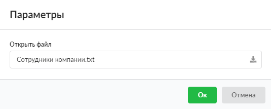
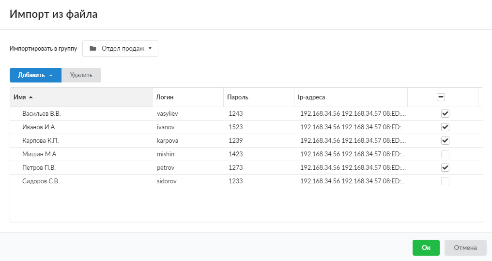
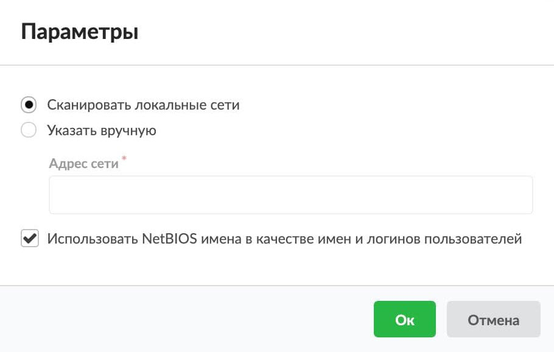
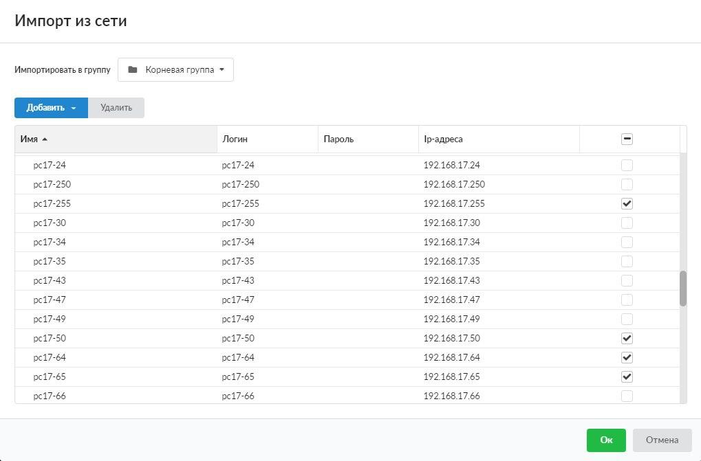
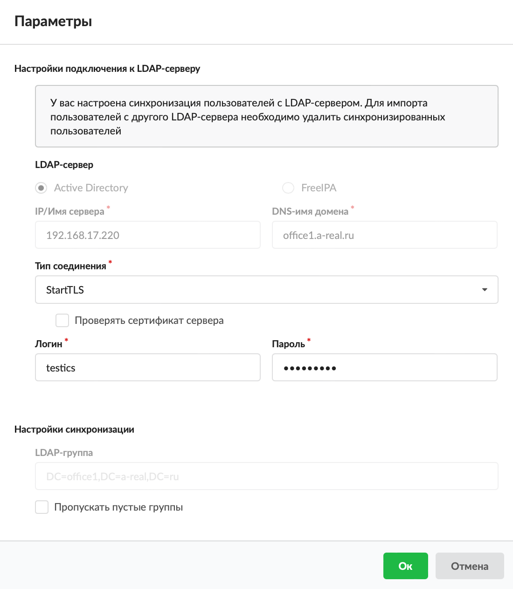
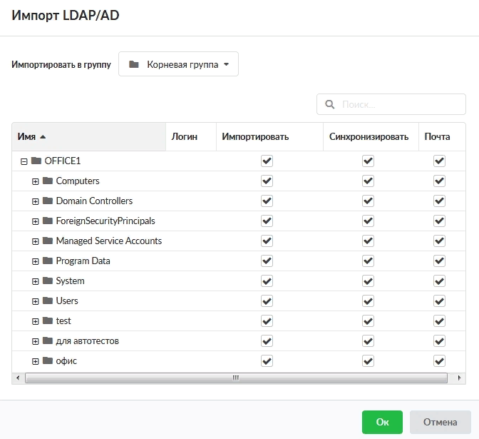

# Импорт пользователей

В ИКС можно не создавать пользователей вручную, а просто импортировать их. Импорт пользователей осуществляется в модуле **Пользователи**, который расположен в меню **Пользователи и статистика > Пользователи**.

Предусмотрено три варианта импорта:

- **из файла** — загрузка пользователей из текстового файла;
- **из сети** — загрузка пользователей (компьютеров) из локальной сети;
- **из LDAP** — импорт доменных пользователей с группировкой их по контейнерам (OU).


---

## Импорт из файла

1. Подготовьте текстовый файл со списком пользователей.

   Для импорта пользователей используется текстовый файл формата `*.txt`. В файле каждый пользователь должен быть указан в отдельной строке со следующими параметрами: имя, логин, пароль, IP-адреса и MAC-адреса, разделенные запятыми. Параметры необходимо перечислить строго в указанном порядке через запятую.

   Пример:

   ```
   Вася, vasya, 123, 192.168.34.56, 192.168.34.57, 08:ED:B9:49:B2:E5, 16-ED-C9-4D-52-E5
   ```

2. Нажмите кнопку **Импорт** и выберите **Из файла** — откроется окно импорта.
3. Загрузите подготовленный текстовый файл кнопкой .

   

4. Нажмите **Ок**.
5. Укажите, в какую **группу** импортировать пользователей.
6. Если необходимо, внесите изменения в параметры двойным кликом по нужному полю. Добавьте новых пользователей (группы) по кнопке **Добавить**.
7. Отметьте флагами пользователей, которых нужно импортировать (по умолчанию установлены все флаги).

   

8. Нажмите **Ок**.

## Импорт из сети

1. Нажмите кнопку **Импорт** и выберите **Из сети** — откроется окно импорта.
2. Выберите **параметры импорта**:
   - сканировать локальные сети — ИКС отобразит в списке все активные в настоящий момент IP-адреса и присвоит им имена и логины в виде pcX-Y (X — это предпоследний октет IP-адреса, а Y — последний октет IP-адреса);
   - указать IP-адреса вручную.

   

3. Для того чтобы использовать **NetBIOS-имена** в качестве имен и логинов пользователей, установите соответствующий флаг.
4. Нажмите **Ок**.
5. Укажите, в какую **группу** загрузить пользователей. Если необходимо, внесите изменения в параметры, добавьте новых пользователей.
6. Отметьте флагами пользователей, которых нужно импортировать (по умолчанию установлены все флаги).

   

7. Нажмите **Ок**.

## Импорт из LDAP

1. Нажмите кнопку **Импорт** и выберите **LDAP** — откроется окно импорта.
2. Выберите **LDAP-сервер**: Active Directory либо FreeIPA.

   > ⚠ Внимание! Начиная с версии 8.4, пользователи, импортированные из FreeIPA, могут авторизоваться в веб-интерфейсе, на прокси-сервере (с использованием [Kerberos](https://doc.a-real.ru/index.php?article=190)) и почтовом сервере. Подключение по VPN таких пользователей на данный момент недоступно. Для импорта пользователей необходимо указать логин пользователя как DN пользователя в LDAP-каталоге (например, `uid=admin,cn=users,cn=accounts,dc=ipa,dc=test`).

3. Укажите:
   - IP/Имя сервера;
   - DNS-имя **домена**;
   - тип соединения (Plain, StartTLS, LDAPS). Если требуется, установите флаг **Проверять сертификат сервера**;
   - **логин** и **пароль** администратора домена, которому разрешено чтение списка пользователей из домена (чаще всего это администратор домена).

   

   Если ранее уже была настроена синхронизация пользователей с LDAP-сервером, для импорта с другого LDAP-сервера сначала удалите синхронизированных пользователей из списка в ИКС, иначе программа не даст произвести импорт.

4. При необходимости:
   - укажите **LDAP-группу**;
   - установите флаг **Пропускать пустые группы**.

   Нажмите **Ок**.
5. Выберите, в какую **группу** загрузить пользователей. В открывшемся окне будут проставлены флаги на тех пользователях, которые были импортированы ранее. Чтобы добавить новых пользователей, установите флаг на корневой группе в столбце **Импортировать**, а затем снимите его.
6. Отметьте флагами необходимые действия для каждого пользователя (группы):
   - **Импортировать** — в ИКС загрузятся имя и логин пользователя;
   - **Синхронизировать** — для синхронизации установите также флаг «Импортировать». При синхронизации любое изменение пользователя (группы) в дереве контроллера домена аналогично отобразится в ИКС (например, изменение имени, логина, группы безопасности — для пользователя, добавление и удаление пользователей — для группы);
   - **Почта** — для импорта почтового ящика пользователя также установите флаги «Импортировать» и «Синхронизировать». Для выбранного пользователя будет создан почтовый ящик с аналогичным именем только в том случае, если в ИКС есть почтовый домен, аналогичный домену из LDAP, и если в домене у пользователя указана почта.

   По умолчанию установлены все флаги.

   

7. Нажмите **Ок**.

> ⚠ Внимание! В ИКС не хранятся пароли пользователей, импортированных из LDAP. Если такому пользователю задать пароль, он сможет авторизоваться на ИКС только по логину и паролю, заданным на ИКС.

> ⚠ Внимание! Начиная с версии 11.4 подключение через LDAPS и StartTLS будет недоступно, если серверный сертификат использует алгоритм хеширования SHA-1. Для обеспечения безопасного соединения рекомендуется перейти на более современные и надежные алгоритмы, такие как SHA-256.

Все **импортированные** пользователи по умолчанию получают одну из ролей:

-  **Администратор** — те пользователи домена, которым соответствуют следующие группы безопасности в LDAP-сервере: «Administrators», «Domain Admins», «Администраторы», «Администраторы домена».
-  **Пользователь** — все остальные пользователи.

Группы можно изменить в [константах](https://doc.a-real.ru/index.php?article=119).

Импортированные и синхронизированные пользователи отмечены дополнительной иконкой . Если пользователь импортирован, но не синхронизирован, значок будет бледно-серым.

Импортированные почтовые ящики также будут иметь иконку  и отобразятся в [меню](https://doc.a-real.ru/index.php?article=87) **Почта > Домены и ящики**.

Для более детальных настроек синхронизации пользователей воспользуйтесь [службой синхронизации](https://doc.a-real.ru/index.php?article=53).

После формирования списка пользователей и групп рекомендуется настроить их [авторизацию](https://doc.a-real.ru/index.php?article=137).

---

**Источник:** [Документация ИКС — Импорт пользователей](https://doc.a-real.ru/index.php?article=131)
