Индивидуальный модуль пользователя (группы) предназначен для просмотра и редактирования различных настроек определенного пользователя (группы).

---

Индивидуальный модуль пользователя (группы) предназначен для просмотра и редактирования различных настроек определенного пользователя (группы).

Чтобы перейти к этим настройкам, откройте модуль **«Пользователи»**, расположенный в меню **Пользователи и статистика > Пользователи**, и нажмите на нужного пользователя (группу). Откроется страница со следующими вкладками:

- Состояние
- Сводный отчет
- IP/MAC-адреса
- Правила и ограничения
- Почта и телефония
- Перенаправления
- OpenVPN
- Приложения
- Статистика
- События

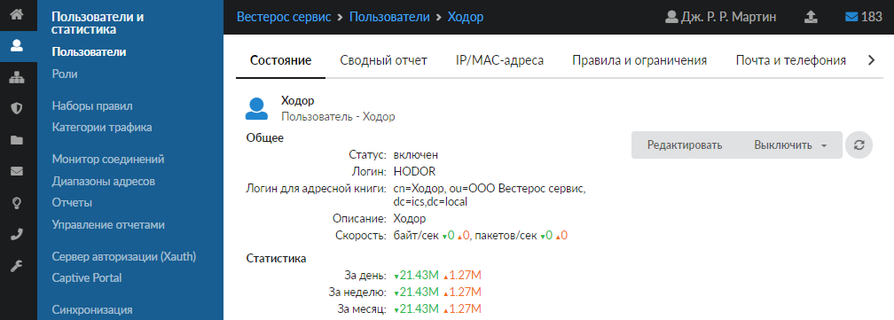

Обновить страницу каждой вкладки можно по кнопке .

Рассмотрим каждую вкладку на примере **индивидуального модуля пользователя**.

## Состояние

Вкладка содержит следующие данные о пользователе:

- статус (включен/выключен);
- логин в ИКС;
- логин для адресной книги;
- [IP-адреса](../../o-dokumentacii/slovar-terminov-3.md), присвоенные пользователю;
- статистика за день, неделю, месяц;
- скорость текущего соединения пользователя (в байт/сек. и пакетов/сек.).

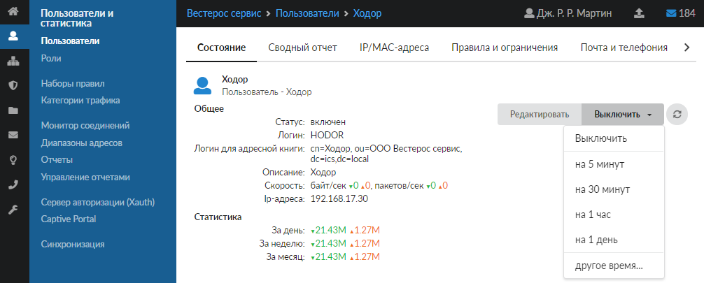

На данной вкладке расположены следующие кнопки:

- **«Выключить»** — выключить пользователя: на 5 минут, 30 минут, 1 час, 1 день или задать дату и время, до которого будет выключен пользователь. Трафик от выключенного пользователя будет блокироваться [межсетевым экраном](../../o-dokumentacii/slovar-terminov-3.md), и данный пользователь не сможет выйти в сеть Интернет;
- **«Редактировать»** — редактировать пользователя (форма по аналогии с [добавлением пользователя](https://doc.a-real.ru/index.php?article=130)).

Редактирование, выключение или удаление синхронизированных пользователей из [LDAP](../../o-dokumentacii/slovar-terminov-3.md) невозможно на стороне ИКС. Все изменения вносятся со стороны сервера AD.

## Сводный отчет

На данной вкладке отображается сводный отчет по пользователю. В отчете выводятся:

- общие данные пользователя: статус, логин в ИКС, логин для адресной книги, IP-адреса, скорость текущего соединения, статистика за день, неделю, месяц;
- статистика по часам входящего/исходящего трафика за текущие сутки;
- топ 5 самых посещаемых IP-адресов или доменов;
- топ 5 категорий, к которым относится наработанный трафик.

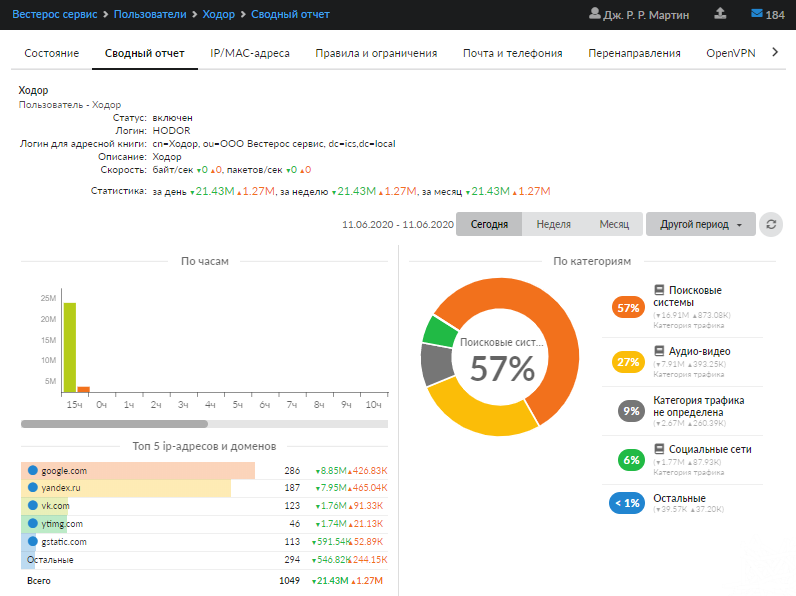

## IP/MAC-адреса

Содержит список IP/[MAC-адресов](../../o-dokumentacii/slovar-terminov-3.md), закрепленных за данным пользователем. Эти адреса могут использоваться для [авторизации пользователя](avtorizaciya-polzovateley-2.md) на ИКС. Одному пользователю можно назначить несколько IP-адресов и несколько MAC-адресов.

> ⚠ Внимание! Статистика на ИКС ведется по пользователям. При составлении отчета в качестве источника можно указать только пользователя, а не его IP-адрес.

На вкладке расположены следующие кнопки:

- **«Добавить»** — задать IP/MAC-адреса данному пользователю. При добавлении IP-адреса, если пользователь активен в сети, ИКС автоматически определит его MAC-адрес;
- **«Редактировать»** — изменить IP/MAC-адрес;
- **«Удалить»**.

Более подробно управление IP/MAC-адресами пользователя описано [здесь](avtorizaciya-polzovateley-2.md).

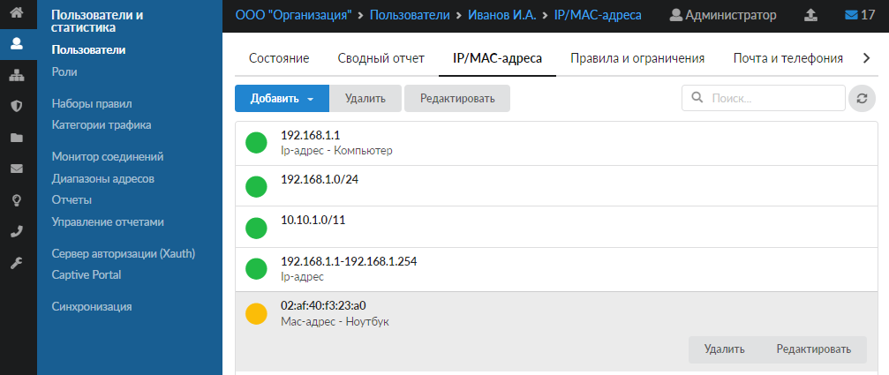

## Правила и ограничения

На вкладке можно управлять [правилами доступа](../polzovatelskie-pravila-dostupa/polzovatelskie-pravila-dostupa-obzor-2.md) пользователя:

- задавать правила и ограничения;
- задавать квоты и маршруты;
- добавлять [наборы правил](https://doc.a-real.ru/index.php?article=45).

По умолчанию установлены правила той роли, к которой относится данный пользователь.

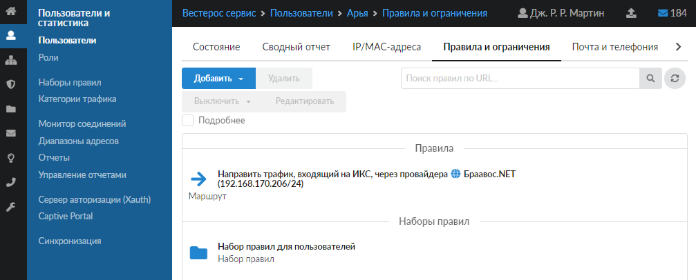

## Почта и телефония

Вкладка предназначена для создания телефонного номера или почтового ящика пользователя. Здесь можно добавить почтовый ящик либо телефонный номер, выключить его, отредактировать или удалить, а также отправить файл по факсу.

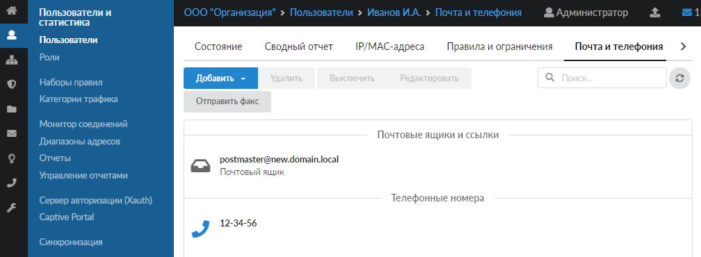

## Перенаправления

На вкладке можно задать действие при неответе на телефонный вызов пользователя.

Если у пользователя создан телефонный номер и в ИКС заданы [перенаправления](../../telefoniya/pravila-telefonii/pravila-telefonii-obzor-2.md), в которых этот номер указан в поле **«При неответе номера»**, на вкладке будут отображены все такие перенаправления. Те перенаправления, в которых этот номер указан как единственный, будут доступны для редактирования.

## OpenVPN

На вкладке показано, доступно ли пользователю использование [OpenVPN-соединения](../../set/vpn/vpn-obzor-2.md).

Если для пользователя было добавлено разрешение на использование [OpenVPN](../../o-dokumentacii/slovar-terminov-3.md)-соединения, станут доступны следующие параметры настройки:

- флаг **«Передать клиенту маршрут по умолчанию»** — устанавливает на подключаемом устройстве ИКС в качестве шлюза по умолчанию;
- поле **«IP клиента (опционально)»** — позволяет указать IP-адрес, который будет получать клиент при подключении к OpenVPN сети;
- поле **«Удаленные сети за клиентом»** — позволяет указать сети в формате IP-адрес/маска, расположенные за OpenVPN-клиентом;
- поле **«Передать клиентам маршруты до сетей»** — позволяет передать пользователю информацию об указанных [LAN](../../o-dokumentacii/slovar-terminov-3.md);
- поле **«Сертификат клиента»** — позволяет выбрать конечный сертификат для пользователя;
- кнопки управления **«Сохранить»**, **«Обновить»** и **«Выгрузить сертификаты»**.

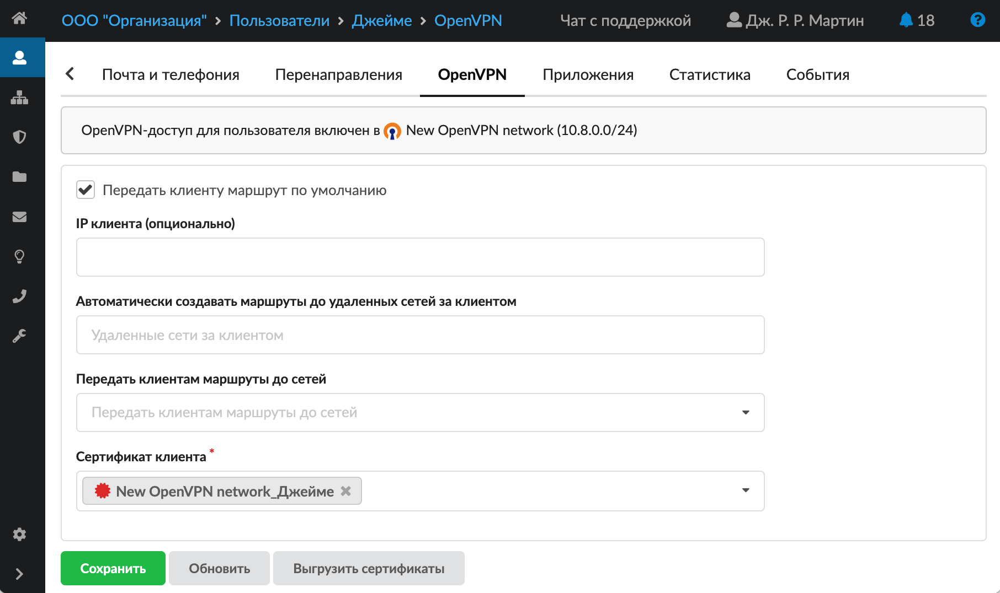

Логика работы поля **«Удаленные сети за клиентом»** зависит от типа сети, к которой относится пользователь:

- Сеть типа **«OpenVPN»**. Для указанных сетей автоматически создается статический маршрут в веб-интерфейсе, направляющий трафик на интерфейс OpenVPN. Одновременно прописывается `iroute` для внутренней маршрутизации OpenVPN-сервера.
- Сеть типа **«OpenVPN DCO»**. В режиме OpenVPN DCO статический маршрут в веб-интерфейсе не создается автоматически, так как маршрутизация осуществляется средствами ядра и для создания маршрута необходимо знать адрес пользователя в этой сети. В связи с этим для организации доступа к сетям, расположенным за клиентом, предусмотрены два способа:
  - Автоматическое создание временного маршрута. Маршруты до сетей, указанных в поле «Удаленные сети за клиентом», создаются автоматически после подключения клиента. Эти маршруты не отображаются [на вкладке](../../set/marshruty/dobavit-marshrut-2.md) **«Сеть > Маршруты > Статические маршруты»**. Просмотреть их можно [на вкладке](../../set/setevye-utility-2.md) **«Сеть > Сетевые утилиты > Таблица маршрутизации»**.
  - Ручное добавление постоянного статического маршрута. За пользователем закрепляется IP-адрес на вкладке **«OpenVPN»** [индивидуального модуля пользователя](individualnyy-modul-polzovatelya-gruppy-2.md). После закрепления IP-адреса необходимо вручную добавить статический маршрут через данный адрес.

Если **OpenVPN-соединение недоступно**, на вкладке отобразится соответствующее сообщение.

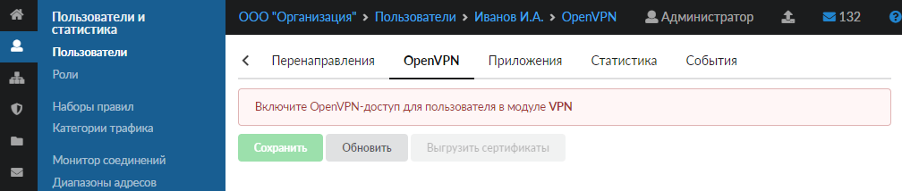

## Приложения

Если пользователь авторизуется с помощью утилиты [Xauth](../server-avtorizacii-xauth/utilita-avtorizacii-xauth-2.md), на данной вкладке показан список приложений, в которых работает пользователь. Отображаются следующие данные:

- приложения и процессы;
- информация о соединении;
- протокол, по которому осуществляется соединение.

Здесь же можно запретить пользователю доступ к приложению.

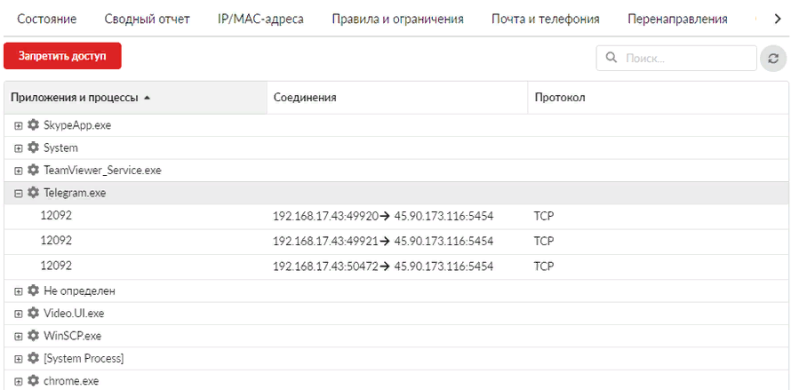

Если пользователь не авторизован на [сервере авторизации (Xauth)](../server-avtorizacii-xauth/server-avtorizacii-xauth-obzor-2.md), на вкладке отобразится соответствующее сообщение.

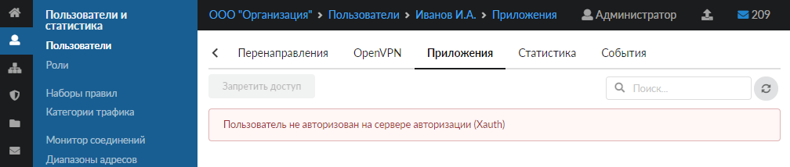

## Статистика

Вкладка является [конструктором отчетов](../upravlenie-otchetami/upravlenie-otchetami-obzor-2.md) и предназначена для формирования отчета по пользователю.

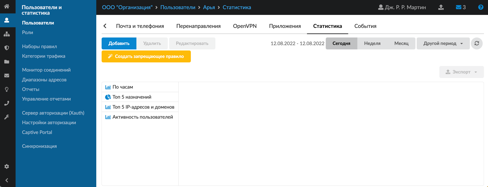

Также на вкладке предусмотрена возможность **создать запрещающее правило** либо **запрещающее правило прокси** для пользователя. Для этого выполните следующие действия:

1. Нажмите на кнопку **«Создать запрещающее правило»** — откроется мастер создания/настройки запрещающего правила.

   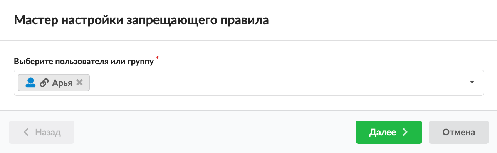

2. В окне мастера при необходимости можно изменить или добавить пользователя (группу). Нажмите кнопку **«Далее»**.

   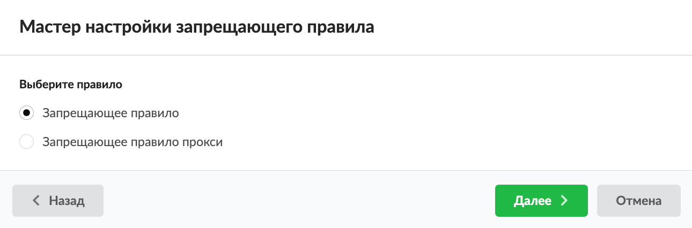

3. Установите переключатель на нужном правиле — запрещающее правило либо запрещающее правило прокси. Нажмите кнопку **«Далее»**.
4. Укажите **адрес назначения** правила.
5. Если требуется, выберите **протокол** и **порт**, укажите **источник**.

   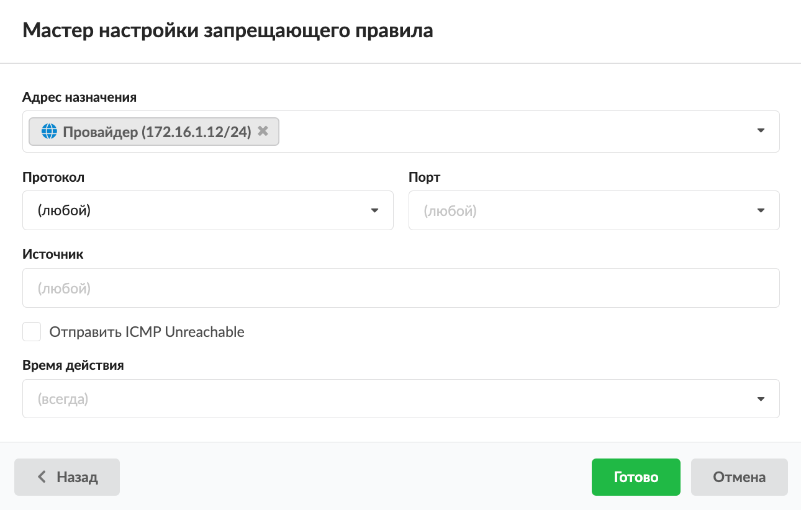

6. При необходимости установите флаг **«Отправить ICMP Unreachable»**.
7. Выберите [время действия](https://doc.a-real.ru/index.php?article=196#time) в отдельном окне.
8. Нажмите кнопку **«Готово»**. Правило будет создано в соответствии с указанными настройками.

## События

На вкладке показан список всех событий пользователя за текущий день, неделю, месяц либо за выбранный период.

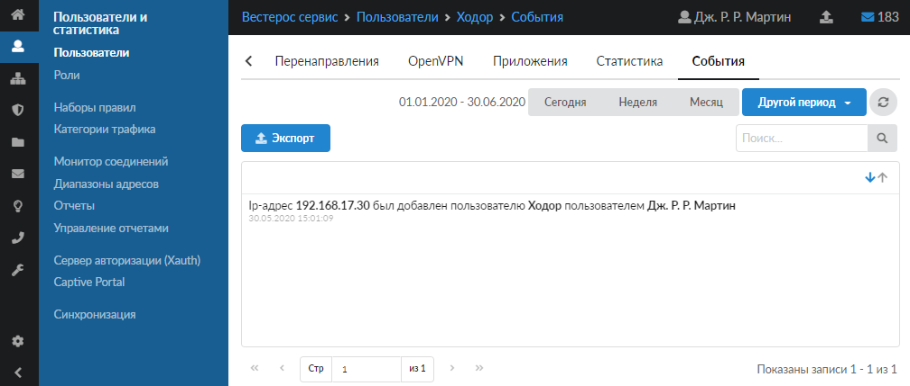

[Журнал](https://doc.a-real.ru/index.php?article=196#summary) является стандартным элементом веб-интерфейса ИКС.
