Мастер создания пользователя (группы) — это удобный инструмент, который позволяет быстро создать пользователя (группу), назначить ему роль и настроить основные параметры. Мастер можно вызвать в модуле **«Пользователи»**, расположенном в меню **Пользователи и статистика &gt; Пользователи**.

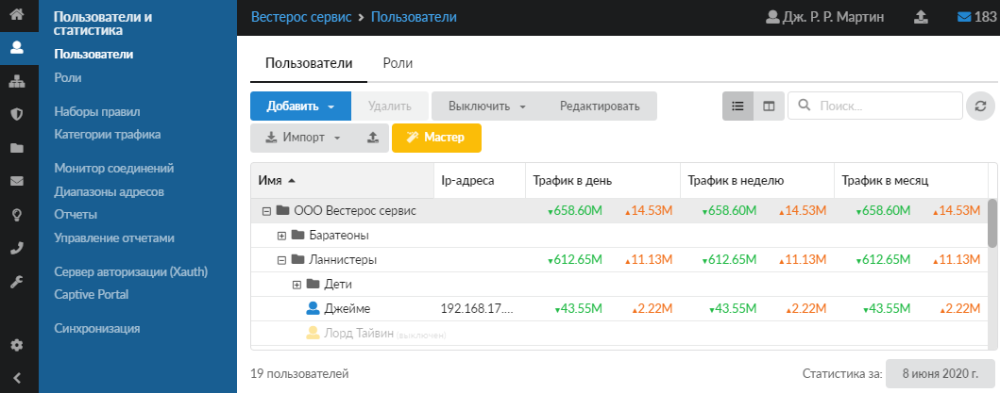

## Мастер создания пользователя

1. На главной странице модуля нажмите **«Мастер»** и в открывшемся окне выберите группу, в которую требуется добавить пользователя.

   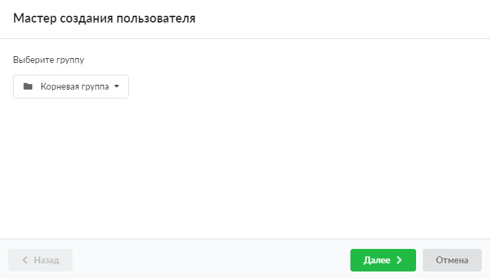

2. Установите переключатель **«Создать пользователя»**. Нажмите **«Далее»**.

   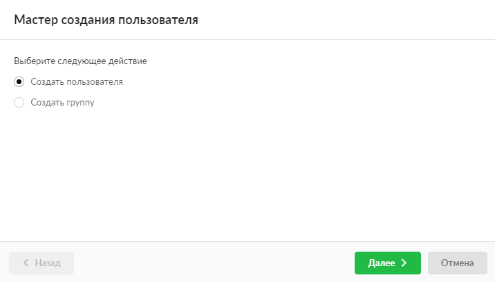

3. Введите уникальное **имя** пользователя и **описание**. Нажмите **«Далее»**.

   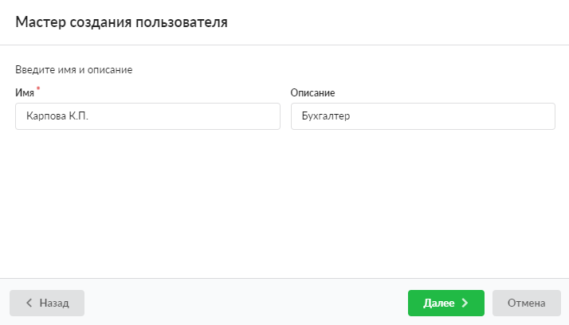

4. Выберите **роль** пользователя. Нажмите **«Далее»**.

   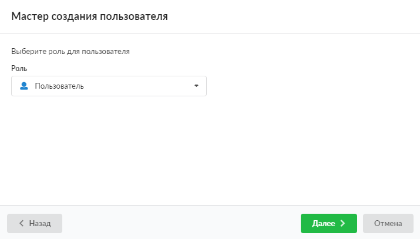

5. Введите параметры авторизации для пользователя (**логин** и **пароль**). Они требуются для входа в систему, подключения по [VPN](/index.php?article=24/#vpn) и др. Сгенерировать случайный пароль можно кнопкой . Нажмите **«Далее»**.

   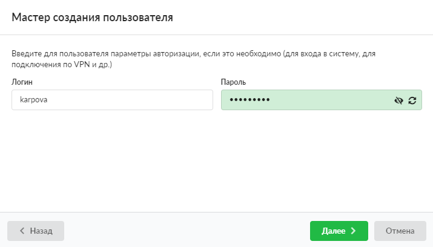

6. Укажите [IP-адреса](/index.php?article=24/#ip-address), принадлежащие данному пользователю (например, IP-адреса рабочего компьютера, сотового телефона и т. д.). Нажмите **«Далее»**.

   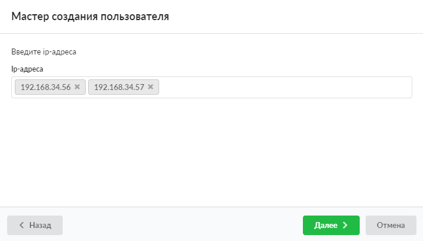

7. Установите флаги рядом с **наборами правил**, созданных в ИКС, если это необходимо. Нажмите **«Далее»**.

   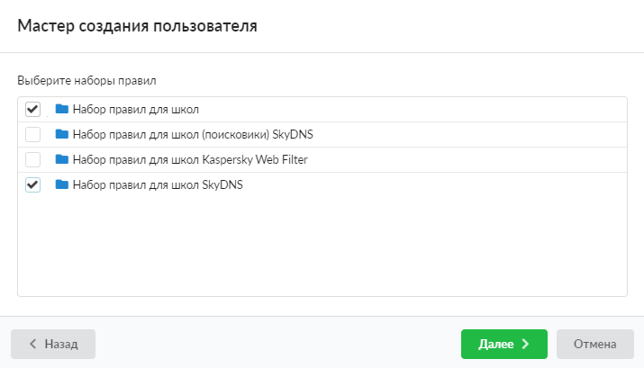

8. Если требуется создать **почтовый ящик** для данного пользователя, установите соответствующий флаг. Имя почтового ящика заполнится автоматически, но его можно редактировать. Введите пароль или сгенерируйте его кнопкой .

   Здесь же можно указать [почтовую квоту](/index.php?article=24/#postal_quota) для данного ящика. Установите соответствующий флаг и введите суммарный объем писем (в Мб).

   Нажмите **«Далее»**.

   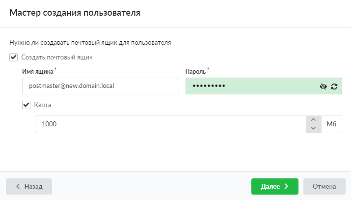

9. В окне с предложением создать почтовый ящик нажмите **«Ок»**.

   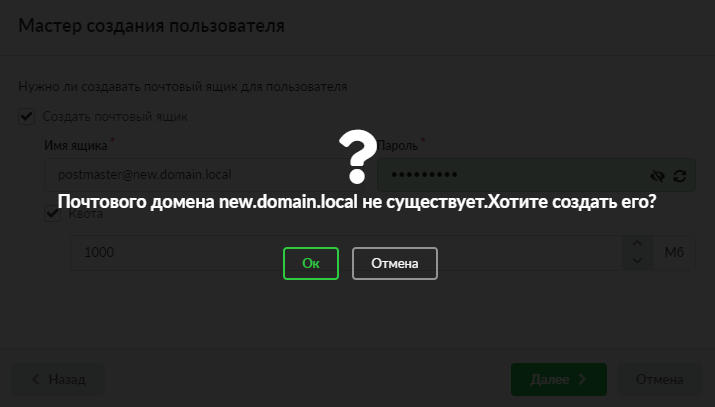

10. Проверьте правильность всех данных пользователя в появившемся окне:

    - если все верно, нажмите **«Готово»** — созданный пользователь появится в списке на главной странице модуля;
    - если требуется изменить данные пользователя, нажмите **«Назад»**, а затем вернитесь к **Шагу 9**.

    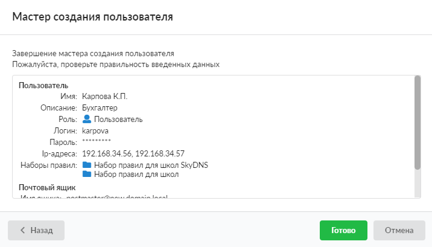

    Если было указано неуникальное имя пользователя, система выдаст ошибку.

    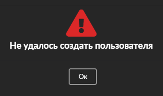

## Мастер создания группы

1. На главной странице модуля нажмите **«Мастер»** и в открывшемся окне выберите группу, в которую требуется добавить новую группу.

   

2. Установите переключатель **«Создать группу»**. Нажмите **«Далее»**.

   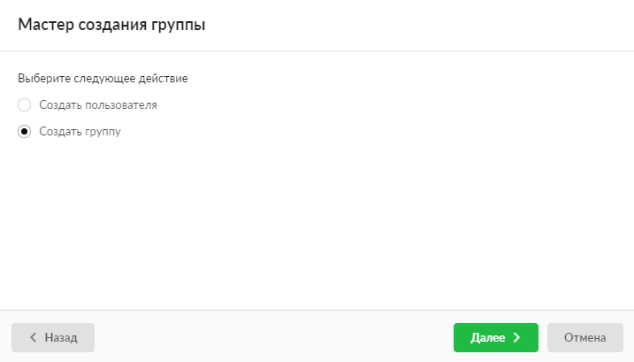

3. Введите уникальное **имя** группы и **описание**. Нажмите **«Далее»**.

   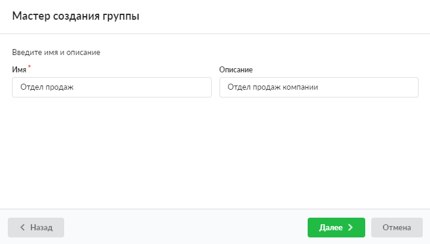

4. Укажите IP-адреса устройств, относящихся к данной группе (например, IP-адреса рабочих компьютеров). Нажмите **«Далее»**.

   

5. Установите флаги рядом с **наборами правил**, созданных в ИКС, если это необходимо. Нажмите **«Далее»**.

   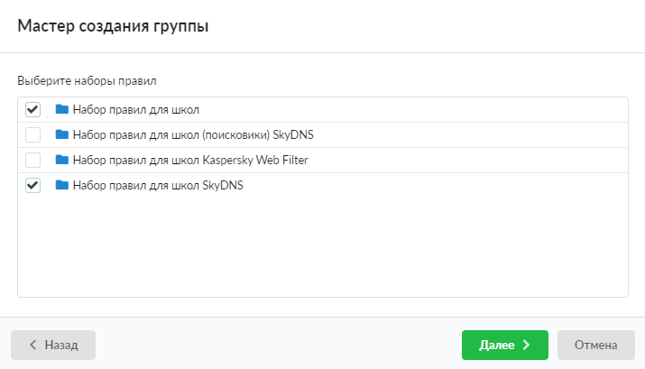

6. Проверьте правильность всех данных группы в появившемся окне:

    - если все верно, нажмите **«Готово»** — созданная группа появится в списке на главной странице модуля;
    - если требуется изменить данные группы, нажмите **«Назад»**, а затем вернитесь к **Шагу 5**.

    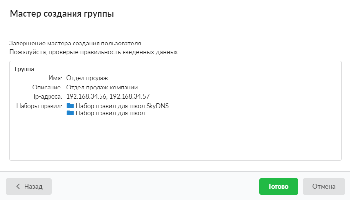

    Если было указано неуникальное имя группы, система выдаст ошибку.

    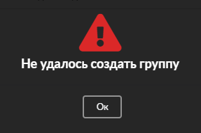
