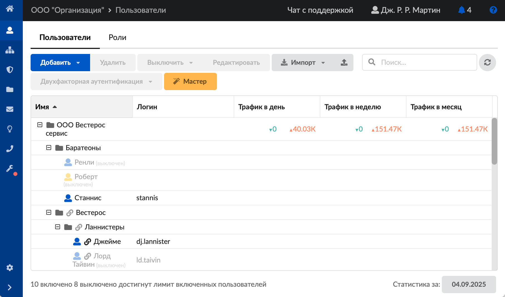
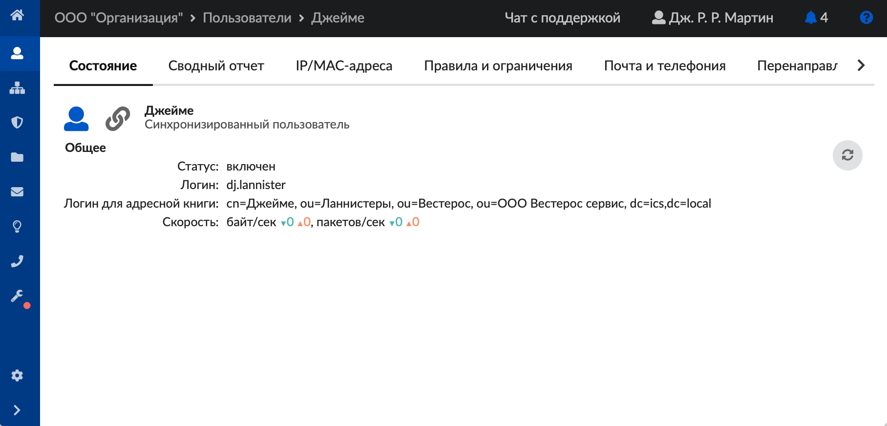

# Пользователи

В ИКС можно создавать **пользователей**, объединять их в **группы** и предоставлять им определенные права доступа к системе.

[Пользователем](https://doc.a-real.ru/index.php?article=24/#iks_user) может быть:

- **Человек**. Если в организации за одним компьютером работают два сотрудника по сменам, то для каждого необходимо завести пользователя в ИКС. Например, «Иванов И.А.», «Петров П.Л.» в группе «Отдел продаж».
- **Компьютер**. Если не важно, кто именно пользуется компьютером, а важно, чтобы компьютер не имел доступа к запрещенным ресурсам, можно завести одного пользователя. Например, «Компьютер 1» в группе «Учебный класс». Такой подход характерен для учебных заведений, библиотек и т. п.

Для управления пользователями откройте модуль «Пользователи», расположенный в **Пользователи и статистика > Пользователи**.

В окне модуля отображается дерево групп и имен пользователей. Для каждой позиции видна статистика за день, неделю и месяц.

В нижнем левом углу указано количество включенных и выключенных пользователей. Если количество пользователей достигло лимита лицензии, то здесь же появится соответствующее сообщение: «9 включено 3 выключено достигнут лимит включенных пользователей».

При нажатии на пользователя (группу) откроется его [индивидуальный модуль](https://doc.a-real.ru/index.php?article=142).

## Управление группами и пользователями

В окне модуля «Пользователи» расположены следующие кнопки управления группами и пользователями:

- **«Добавить»** — [добавить](https://doc.a-real.ru/index.php?article=130) пользователя или группу пользователей.

> ⚠ Внимание! Если сумма включенных пользователей и добавляемых из группы превысит лимит лицензии, то в ИКС будут добавлены только те пользователи, которые войдут в данный лимит.

- **«Удалить»** — удалить пользователя (группу), кроме корневой группы. Стоит учесть, что нельзя удалить последнего пользователя с ролью Администратор.

> ⚠ Внимание! При удалении пользователя (группы) будут показаны зависимые от него объекты (почтовые ящики, телефонные номера и т.д.) на удаление. Но объекты, зависящие от них, не отображаются и будут удалены автоматически. Например, с пользователем связан телефонный номер. При удалении пользователя система предупредит об удалении данного номера. Но если с номером связано правило телефонии, система не предупредит об этом и удалит правило автоматически.

- **«Выключить»** — выключить пользователя (группу) на определенное время (5 минут, 30 минут, 1 час, 1 день или постоянно). При выборе одного из вариантов у пользователя или группы пользователей сразу пропадет доступ к сети Интернет, а также доступ к ИКС.

- **«Редактировать»** — редактировать пользователя (группу). В окне редактирования можно также сменить пароль пользователя, в том числе **пароль Администратора** для входа в систему.

- **«Импорт»** — [импортировать](https://doc.a-real.ru/index.php?article=131) пользователя (группу) из файла, сети или [LDAP](https://doc.a-real.ru/index.php?article=24/#ldap).

  

  > ⚠ Внимание! При экспорте пользователей будет утеряна связка IP с MAC-адресом. Также не будет сохранен комментарий, указанный в IP и MAC-адресах. Чтобы перенести пользователей со всеми их настройками, воспользуйтесь созданием [резервной копии](https://doc.a-real.ru/index.php?article=109#tab1).

- **«Двухфакторная аутентификация»** — становится активной, если активирована [двухфакторная аутентификация](https://doc.a-real.ru/index.php?article=113). Если вторым фактором активирована «Использовать ТОТР», то при нажатии на «Двухфакторная аутентификация» будут доступны функции: «Показать QR-код ТОТР-токена» и «Обновить ТОТР-токен». Если вторым фактором активирована «Использовать Telegram-бот», то при нажатии на «Двухфакторная аутентификация» будут доступны функции: «Скопировать ссылку» и «Обновить ссылку».

- **«Мастер»** — вызвать [мастер](https://doc.a-real.ru/index.php?article=132) создания пользователя (группы) в ИКС.

Для **поиска** пользователя (группы) воспользуйтесь специальной строкой. Здесь же расположена кнопка **обновления окна модуля** — .

В ИКС реализована функция drag-and-drop: зажав пользователя левой кнопкой мыши, можно легко перетащить его в нужную группу.

---

**Источник:** [Документация ИКС — Пользователи](https://doc.a-real.ru/index.php?article=124)
