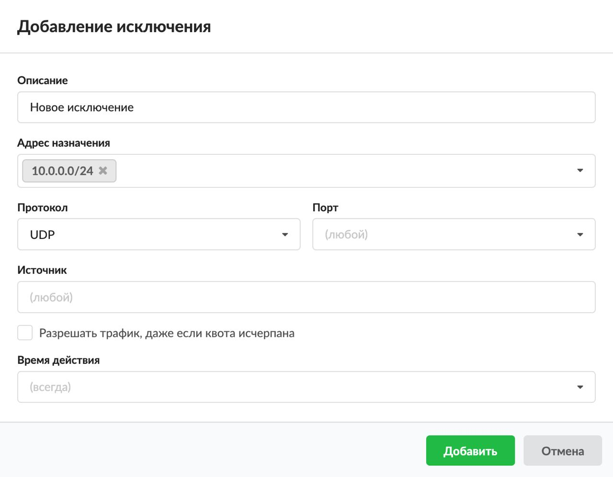

# Исключение

Исключение — это разрешающее правило, которое исключает проверку трафика другими правилами в рамках одного набора правил.

---

Данное правило является разрешающим правилом, но исключает проверку другими правилами в рамках одного [набора правил](https://doc.a-real.ru/index.php?article=45).

Добавить **исключение** можно на вкладке **«Правила и ограничения»** в [индивидуальном модуле пользователя (группы)](https://doc.a-real.ru/index.php?article=142), расположенном в меню **Пользователи и статистика &gt; Пользователи**.

1. Нажмите **«Добавить»** и выберите **«Исключение»** — откроется окно добавления правила.
2. Введите **описание** правила.
3. В раскрывающихся **списках** можно выбрать:
   - адрес назначения;
   - протокол;
   - порт;
   - источник.

   В ИКС можно маршрутизировать входящий и исходящий трафик и фильтровать его по адресу назначения, порту и протоколу. Если поле оставить пустым, по умолчанию у него будет стоять значение «любой» (например, любой порт, любой источник).

   Поэтому если сохранить исключение по умолчанию (все поля со значением «любой») и применить его к пользователю (группе), то **межсетевой экран сделает исключение для всех коммуникаций пользователя (группы) через ИКС**.

   

4. При необходимости установите флаг **«Разрешить трафик даже если пользователь отключен»**. Тогда если пользователь был отключен или превысил [квоту](https://doc.a-real.ru/index.php?article=159) в ИКС, он будет иметь доступ к ресурсам, указанным в данном правиле.

   > ⚠ Внимание! Данное правило фильтрует трафик на уровне протокола [IP](https://doc.a-real.ru/index.php?article=24#ip) и не может фильтровать трафик по [URL](https://doc.a-real.ru/index.php?article=24#url). Для фильтрации по URL используется [исключение прокси](https://doc.a-real.ru/index.php?article=160).

5. Выберите [время действия](https://doc.a-real.ru/index.php?article=196#time) в отдельном окне.
6. Нажмите **«Добавить»** — созданное правило отобразится на вкладке.

---

**Источник:** [Документация ИКС — Исключение](https://doc.a-real.ru/index.php?article=364)
