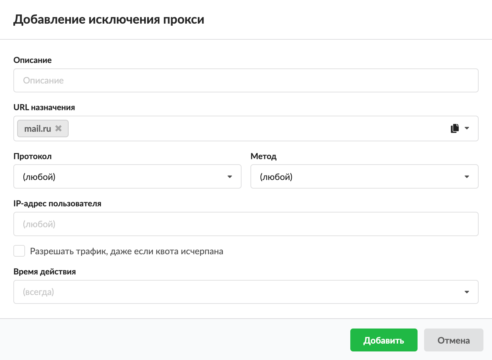

Данное правило является разрешающим правилом прокси, но исключает проверку другими правилами в рамках одного набора правил. Например, если создать исключение для какого-либо домена, этот домен не будет проверяться контент-фильтром.

Добавить исключение прокси можно на вкладке «Правила и ограничения» в индивидуальном модуле пользователя (группы), который расположен в меню Пользователи и статистика > Пользователи.

1. Нажмите «Добавить» и выберите «Исключение прокси» — откроется окно добавления правила.
2. Введите описание правила.
3. В раскрывающихся списках можно выбрать:

   - **URL назначения** — в качестве назначения возможно указывать: IP-адрес; IP/mask; имя домена (например, `ya.ru`); поддомены, исключая основной домен (например, `.google.com` — при обращении на `drive.google.com` авторизация не будет запрошена, но при обращении на `google.com` авторизация запрошена будет); регулярное выражение в формате `/regex/gi` (например, `/.*.ai.\.ru/gi` — разрешит домен `mail.ru` и его поддомены);
   - **протокол**;
   - **метод** — основная операция над ресурсом (подробнее о различных методах обращения к веб-ресурсам);
   - **IP-адрес пользователя**.

   В ИКС через прокси-сервер можно маршрутизировать входящий и исходящий трафик и фильтровать его по URL назначения, протоколу, методу и IP-адресу пользователя. Если поле оставить пустым, по умолчанию у него будет стоять значение «любой» (например, любой протокол, любой метод).

   Поэтому если сохранить исключение прокси по умолчанию (все поля со значением «любой») и применить его к пользователю (группе), **прокси-сервер разрешит все коммуникации, идущие через него** (по протоколам HTTP, HTTPS, FTP и HTTP/HTTPS).

4. При необходимости установите флаг **«Разрешить трафик даже если пользователь отключен»**. Тогда если пользователь был отключен или превысил квоту в ИКС, он будет иметь доступ к ресурсам, указанным в данном правиле.
5. Выберите **время действия** в отдельном окне.
6. Нажмите «Добавить» — созданное правило отобразится на вкладке.

**Полезно знать**

При создании правил прокси-сервера возможно использовать конструкцию типа `<.domain>`. Данная конструкция означает только поддомены. Например, конструкция `.google.com` в запрещающем правиле прокси, разрешит доступ к `google.com`, но запретит доступ к `mail.google.com`, `drive.google.com` и т. д.
