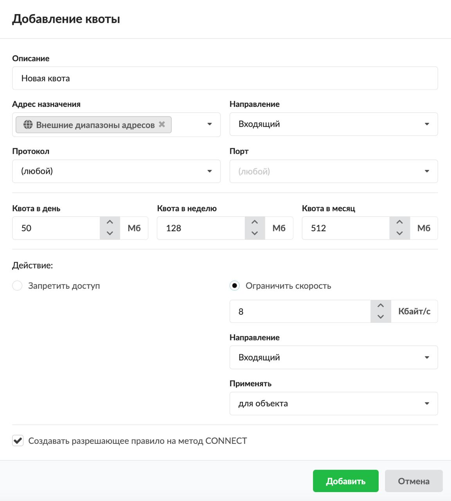
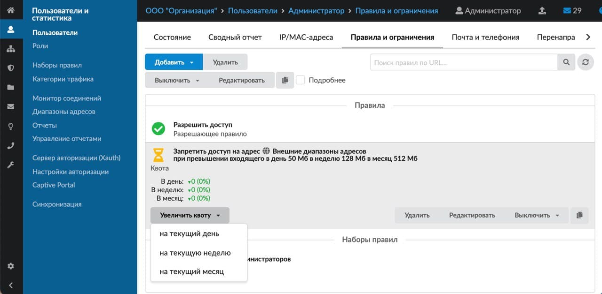

Правило квоты используется для ограничения количества скачиваемой пользователем (группой) информации. При превышении квоты доступ к интернет-ресурсам блокируется или ограничивается скорость.

---

Правило квоты используется для ограничения количества скачиваемой пользователем (группой) информации. Если пользователь (группа) превысит квоту, будет произведено указанное в правиле действие.

При превышении квоты пользователем его доступ к интернет-ресурсам блокируется. При этом если требуется разрешить доступ к [IP-адресу](../../o-dokumentacii/slovar-terminov-3.md), создайте [разрешающее правило](../../set/mezhsetevoy-ekran/razreshayuschee-pravilo-mezhsetevogo-ekrana-2.md) с установленным флагом **«Разрешать трафик, даже если пользователь отключен»**. Если необходимо разрешить доступ к [URL](../../o-dokumentacii/slovar-terminov-3.md), создайте [разрешающее правило прокси](https://doc.a-real.ru/index.php?article=153) с установленным флагом **«Разрешать трафик, даже если пользователь отключен»**.

Также можно не блокировать ресурс, а ограничить скорость до него. Для этого установите соответствующий переключатель в свойствах правила квоты.

Добавить **квоту** можно на вкладке **«Правила и ограничения»** в [индивидуальном модуле пользователя (группы)](../polzovateli/individualnyy-modul-polzovatelya-gruppy-2.md), который расположен в меню **Пользователи и статистика > Пользователи**.

1. Нажмите **«Добавить»** и выберите **«Квота»** — откроется окно добавления правила.
2. Введите **описание** правила.
3. В раскрывающихся **списках** можно выбрать:
   - адрес назначения;
   - протокол;
   - порт.

   В ИКС можно маршрутизировать входящий и исходящий трафик (либо только входящий, только исходящий) и фильтровать трафик по адресу назначения, протоколу и порту. Если поле оставить пустым, по умолчанию у него будет стоять значение «любой» (например, любой протокол, любой порт).
4. Выберите **направление** трафика: входящий, исходящий, входящий и исходящий.

   

5. Укажите **размер квоты** в день, в неделю, в месяц. Если в одном из полей указать значение «0», квота по данному периоду срабатывать не будет.
6. При помощи переключателя выберите **действие**, которое будет срабатывать при превышении квоты:
   - **запретить доступ** — доступ для пользователя (группы) будет заблокирован, при этом останется только доступ до ресурсов, на которые создано [разрешающее правило](razreshayuschee-pravilo-2.md) «разрешить всегда»;
   - **ограничить скорость** — будет ограничена скорость передачи данных (укажите максимально допустимую скорость, направление трафика и для кого применять правило по аналогии с [правилом ограничения скорости](ogranichenie-skorosti-2.md)).
7. Если требуется, установите флаг **«Создавать разрешающее правило на метод CONNECT»**. Тогда пакеты с методом CONNECT будут разрешены для того, чтобы определять URL назначения при действующей [HTTPS](../../o-dokumentacii/slovar-terminov-3.md)-фильтрации. В ином случае URL у HTTPS-трафика не будет определен. Если флаг установлен, то при открытии HTTPS-страницы пользователю будет выдана страница с сообщением: «Квота превышена».
8. Нажмите **«Добавить»** — созданное правило отобразится на вкладке.

## Увеличить квоту

Чтобы увеличить пользователю квоту на текущий период времени, нажмите на правило квоты, а затем — на кнопку **«Увеличить квоту»**. Выберите, на какое время увеличить квоту: на текущий день, на текущую неделю, на текущий месяц. По истечении выбранного периода значение квоты будет восстановлено.

> ⚠ Внимание! Если используется прозрачный прокси с установленным флагом [«Фильтровать без подмены сертификата»](../../set/proksi/rezhimy-raboty-httpsfiltracii-2.md), пользователю не будет выдаваться страница с сообщением: «Квота превышена».

> ⚠ Внимание! Подсчет квоты происходит только на внешние диапазоны адресов, трафик до ИКС и из кэша прокси не входит в подсчет.

> Важно! Если несколько квот применены для одного и того же ресурса, срабатывать всегда будет наименьшая.
