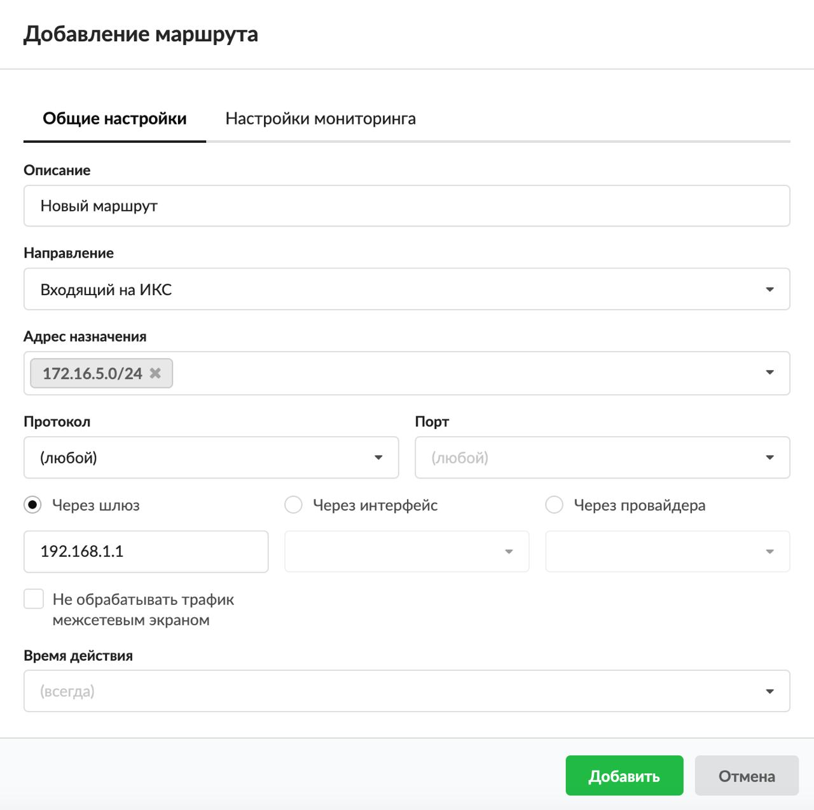
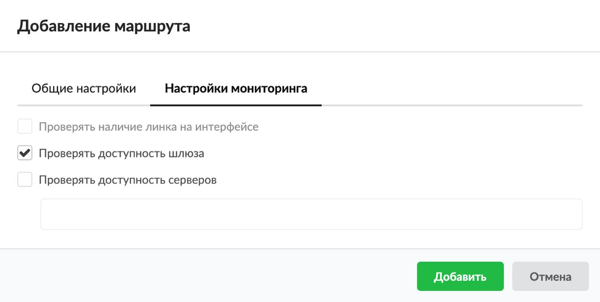

Правило маршрутизации трафика между сегментами сети и перенаправления на различных провайдеров.

---

Правило используется для [маршрутизации](/index.php?article=24/#routing) трафика как между сегментами сети, так и для перенаправления трафика на различных провайдеров.

Добавить **маршрут** можно на вкладке **«Правила и ограничения»** в [индивидуальном модуле пользователя (группы)](/index.php?article=142), который расположен в меню **Пользователи и статистика > Пользователи**.

1. Нажмите **«Добавить»** и выберите **«Маршрут»** — откроется окно добавления правила.
2. Введите **описание** правила.
3. Выберите **направление трафика**: входящий на ИКС, исходящий с ИКС, входящий и исходящий.
4. В раскрывающихся **списках** можно выбрать:
   - адрес назначения;
   - протокол;
   - порт.

В ИКС можно маршрутизировать входящий и исходящий трафик и фильтровать его по адресу назначения, порту и протоколу. Если поле оставить пустым, по умолчанию у него будет стоять значение «любой» (например, любой порт, любой протокол).

5. При помощи переключателя установите, через что **направлять сетевой трафик**:
   - через шлюз — правило маршрута через [IP-адрес](/index.php?article=24/#ip-address) устройства, выполняющего функцию шлюза для заданной сети;
   - через интерфейс — правило маршрута через один из сетевых интерфейсов ИКС (обычно используется для маршрутизации трафика в туннель);
   - через провайдера — правило маршрута через одного из заведенных провайдеров на ИКС.
6. Если требуется, установите флаг **«Не обрабатывать трафик межсетевым экраном»**. Тогда ко всему проходящему трафику через ИКС не будут применяться правила межсетевого экрана. Если данный флаг не установлен и через ИКС проходит [TCP](/index.php?article=24/#tcp)-трафик, то межсетевой экран при простое 30 секунд разорвет данное соединение.
7. Выберите [время действия](/index.php?article=196#time) в отдельном окне.
8. Вкладка **«Настройки мониторинга»** позволяет включить и использовать механизмы мониторинга работоспособности созданного маршрута. В зависимости от выбранного в **Шаге 4** правила (через шлюз, интерфейс, провайдер) будут доступны различные механизмы мониторинга маршрута. Их можно выбрать при помощи **флагов**:
   - «Проверять наличие линка на интерфейсе»;
   - «Проверять доступность шлюза»;
   - «Проверять доступность серверов».

9. Нажмите **«Добавить»** — созданное правило отобразится на вкладке.
