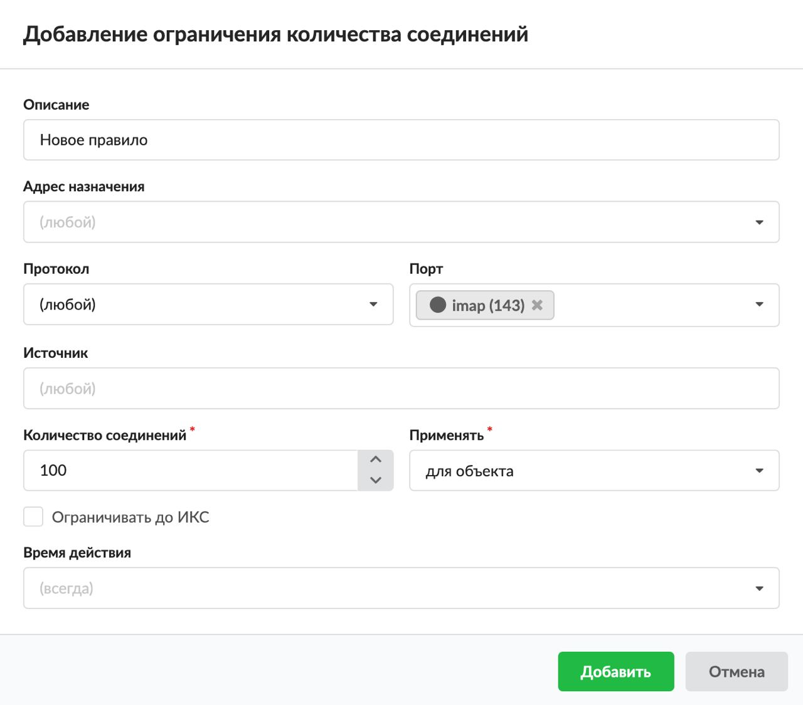

Данное правило нужно, чтобы установить максимально допустимое количество одновременных соединений (например, на определенный порт). Когда количество соединений превысит установленное значение, пакеты

---

Данное правило нужно, чтобы установить максимально допустимое количество одновременных соединений (например, на определенный порт). Когда количество соединений превысит установленное значение, пакеты

Добавить ограничение количества соединений можно на вкладке «Правила и ограничения» в индивидуальном модуле пользователя (группы), который расположен в меню Пользователи и статистика > Пользователи.

1. Нажмите «Добавить» и выберите «Ограничение количества соединений» — откроется окно добавления правила.
2. Введите описание правила.
3. В раскрывающихся списках можно выбрать:

   - адрес назначения;
   - протокол;
   - порт;
   - источник.

   В ИКС можно маршрутизировать входящий и исходящий трафик и фильтровать его по адресу назначения, протоколу, порту и источнику. Если поле оставить пустым, по умолчанию у него будет стоять значение «любой».

4. Укажите максимальное количество соединений.
5. Выберите способ применения правила, применяемого к пользователю или группе:

   - для объекта — правило применяется целиком к объекту. То есть суммарное количество соединений всех членов данного объекта не превысит указанного в правиле. Если правило назначено пользователю, оно ограничивает общее число соединений;
   - для каждого пользователя — назначается группе. Каждый пользователь данной группы будет иметь ограничение количества соединений, указанное в правиле;
   - для каждого IP — назначается группе или пользователю. Если правило установлено на пользователя, ограничивается трафик для каждого IP-адреса, назначенного на пользователя. Если у пользователя несколько IP-адресов, ограничение действует для каждого независимо.

6. При необходимости установите флаг «Ограничивать до ИКС». Тогда в правиле будут учитываться и соединения, входящие на ИКС (например, при доступе к FTP-ресурсу или графическому интерфейсу).
7. Выберите время действия в отдельном окне.
8. Нажмите «Добавить» — созданное правило отобразится на вкладке.

