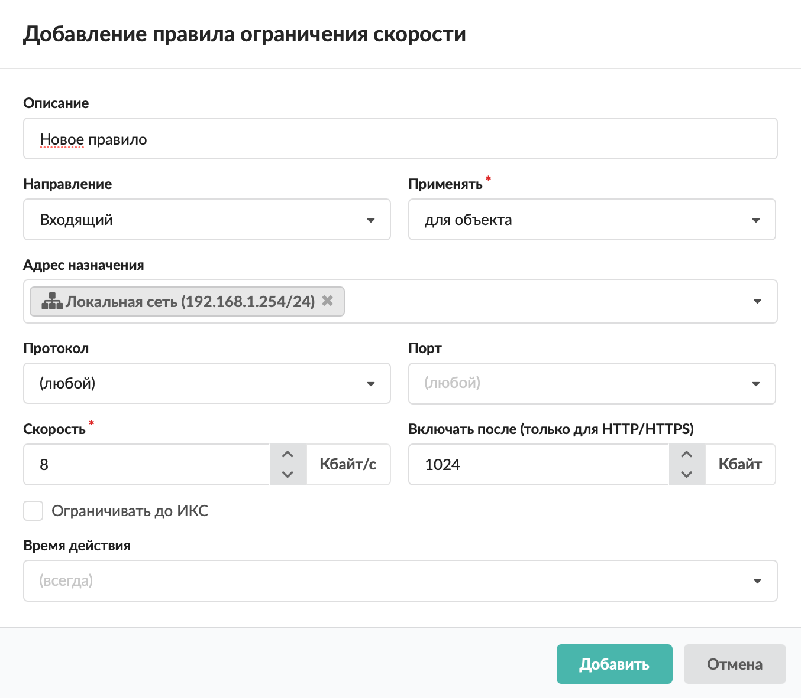

Данное правило устанавливает максимально допустимую скорость передачи данных. Это полезно, например, если интернет-провайдер предоставляет недостаточно широкий интернет-канал или требуется ограничить скорость доступа пользователя к второстепенным сетевым ресурсам.

Добавить **ограничение скорости** можно на вкладке **«Правила и ограничения»** в [индивидуальном модуле пользователя (группы)](../polzovateli/individualnyy-modul-polzovatelya-gruppy-2.md), который расположен в меню **Пользователи и статистика &gt; Пользователи**.

1. Нажмите **«Добавить»** и выберите **«Ограничение скорости»** — откроется окно добавления правила.
2. Введите **описание** правила.
3. Выберите **направление** **трафика**: входящий, исходящий, входящий и исходящий.

4. Выберите **способ применения** правила, применяемого к пользователю или группе. Рассмотрим на примере ограничения скорости 500 Кб/сек:

   - для объекта — если правило назначено пользователю, оно будет ограничивать трафик пользователя (не более 500 Кб/сек); если правило назначено группе, то суммарная скорость группы будет не более 500 Кб/сек;
   - для каждого пользователя — назначается группе. Каждый пользователь данной группы будет иметь ограничение скорости (не более 500 Кб/сек), при этом суммарная скорость значения не имеет;
   - для каждого IP — ограничивает трафик для каждого [IP-адреса](../../o-dokumentacii/slovar-terminov-3.md) (если у пользователя два адреса, каждый будет иметь ограничение в 500 Кб/сек) при назначении как на пользователя, так и на группу.

5. В раскрывающихся **списках** можно выбрать:

   - адрес назначения;
   - протокол;
   - порт.

   В ИКС можно маршрутизировать входящий и исходящий трафик (либо только входящий, только исходящий) и для ограничения скорости фильтровать трафик по адресу назначения, протоколу и порту. Если поле оставить пустым, по умолчанию у него будет стоять значение «любой» (например, любой протокол, любой порт).

   В поле «Адрес назначения» с версии 12.3 появилась возможность добавить исключения. Исключение начинается с символа «!», например: `!5.5.5.5, !5.5.5.0/30, !5.5.5.5-5.5.5.9, !5.5.5.0:255.255.255.252, !ya.ru, !россия.рф`. Если в поле указаны одни исключения, они применяются ко всему диапазону адресов. Исключения всегда имеют приоритет над всеми записями в поле.

6. Укажите максимально допустимую **скорость** передачи данных (в Кбайт/с).
7. Если требуется, укажите, после какого объема данных **включать** ограничение скорости (в Кбайт). Действует только для [HTTP](../../o-dokumentacii/slovar-terminov-3.md)/[HTTPS](../../o-dokumentacii/slovar-terminov-3.md).
8. При необходимости установите флаг **«Ограничивать до ИКС»**. Тогда в правиле будут учитываться и соединения, входящие на ИКС (например, при доступе к [FTP](../../o-dokumentacii/slovar-terminov-3.md)-ресурсу или графическому интерфейсу).
9. Выберите [время действия](https://doc.a-real.ru/index.php?article=196#time) в отдельном окне.
10. Нажмите **«Добавить»** — созданное правило отобразится на вкладке.

> ⚠ Полезно знать
> При использовании явного прокси исходящая скорость не ограничивается, однако есть [обходной путь](https://doc.a-real.ru/index.php?article=235).
