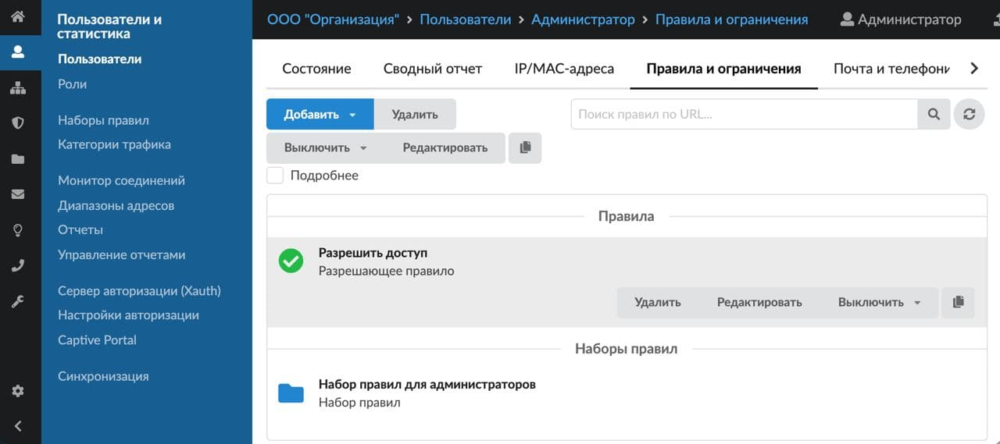

# Пользовательские правила доступа

ИКС может контролировать интернет-трафик пользователей с помощью межсетевого экрана, прокси-сервера, Application Firewall и контент-фильтра.

---

ИКС может контролировать интернет-трафик пользователей. Для этого используются такие службы, как [межсетевой экран](https://doc.a-real.ru/index.php?article=27), [прокси-сервер](https://doc.a-real.ru/index.php?article=62), [Application Firewall](https://doc.a-real.ru/index.php?article=73) и [контент-фильтр](https://doc.a-real.ru/index.php?article=76).

В ИКС можно создавать следующие правила:

- [Запрещающее правило](https://doc.a-real.ru/index.php?article=147)
- [Запрещающее правило Application Firewall](https://doc.a-real.ru/index.php?article=148)
- [Разрешающее правило](https://doc.a-real.ru/index.php?article=158)
- [Исключение](https://doc.a-real.ru/index.php?article=364)
- [Запрещающее правило прокси](https://doc.a-real.ru/index.php?article=150)
- [Разрешающее правило прокси](https://doc.a-real.ru/index.php?article=153)
- [Исключение прокси](https://doc.a-real.ru/index.php?article=160)
- [Ограничение количества соединений](https://doc.a-real.ru/index.php?article=161)
- [Ограничение скорости](https://doc.a-real.ru/index.php?article=162)
- [Выделение полосы пропускания](https://doc.a-real.ru/index.php?article=163)
- [Маршрут](https://doc.a-real.ru/index.php?article=164)
- [Квота](https://doc.a-real.ru/index.php?article=159)
- [Правило контентной фильтрации](https://doc.a-real.ru/index.php?article=166)

Правила или [наборы правил](https://doc.a-real.ru/index.php?article=45) могут принадлежать пользователю, группе пользователей, роли пользователя и определяют возможности доступа к сети Интернет.

Управление правилами осуществляется на вкладке «Правила и ограничения» в [индивидуальном модуле пользователя (группы)](https://doc.a-real.ru/index.php?article=142), который расположен в меню **Пользователи и статистика > Пользователи**.

При создании пользователя ему назначается роль — к пользователю применяется набор правил данной роли. Также пользователю (группе) можно добавлять неограниченное количество отдельно созданных правил и наборов правил. В результате у пользователей (групп) есть следующие правила:

- пользователь: личные правила, наборы правил (как назначенной роли, так и отдельно добавленные);
- группа: личные правила, отдельно добавленные наборы правил.

При анализе трафика для пользователей в ИКС действует следующий **порядок правил**:

1. Личные правила пользователя.
2. Наборы правил, назначенные на пользователя. Если к пользователю прикреплено несколько наборов правил, они объединяются и проверяются как один набор.
3. Правила родительской группы.
4. Наборы правил, назначенные на родительскую группу. Если к группе прикреплено несколько наборов правил, они объединяются и проверяются как один набор.
5. Повторяются **Шаги 3—4** до тех пор, пока не будет достигнута корневая группа.

В каждом шаге правила проверяются в следующем **порядке**:

1. Исключения.
2. Разрешающие.
3. Запрещающие.
4. Контент-фильтр.

При совпадении разрешающего или запрещающего правила проверка всех правил на данном шаге завершается в этот момент, кроме правила контент-фильтра данного шага.

Если совпало правило исключения, проверка **всех** последующих правил на данном шаге пропускается и процесс проверки правил переходит к следующему шагу.

Для того чтобы **скопировать** созданное правило, нажмите на него в списке, а затем — на кнопку

---

**Источник:** [Документация ИКС — Пользовательские правила доступа](https://doc.a-real.ru/index.php?article=146)
