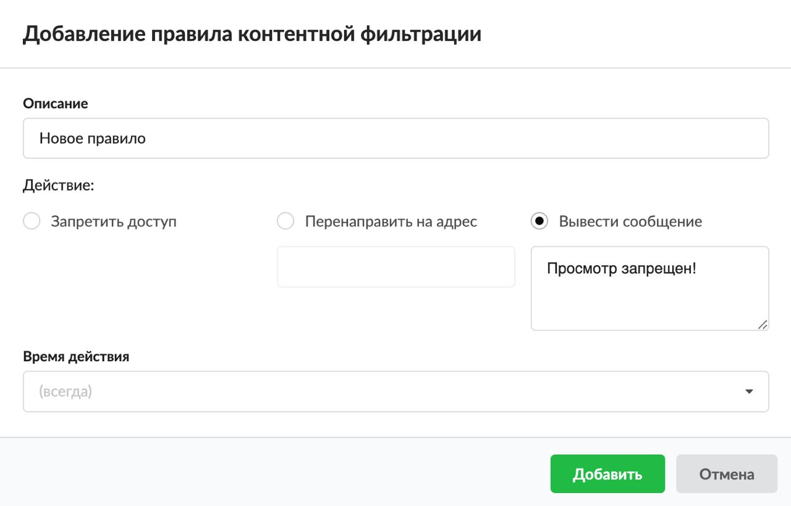

Правило обеспечивает контентную фильтрацию содержимого страниц по словам и регулярным выражениям. Позволяет блокировать видео с запрещёнными словами в названии, независимо от сайта.

---

Данное правило обеспечивает контентную фильтрацию содержимого страниц. Это фильтрация по словам и регулярным выражениям на странице. Правило позволяет блокировать видео, в названии которого содержится заблокированное контент-фильтром слово, независимо от того, на каком сайте находится данное видео.

> ⚠ Внимание! Правило действует, если настроен [контент-фильтр](../../zaschita/kontentfiltr.md). Чтобы блокировать с помощью контент-фильтра зашифрованные [HTTPS](../../o-dokumentacii/slovar-terminov-3.md)-страницы, необходимо [настроить HTTPS-фильтрацию](../../set/proksi/nastroyka-httpsfiltracii-2.md) с подменой сертификата.

Добавить **правило контентной фильтрации** можно на вкладке **«Правила и ограничения»** в [индивидуальном модуле пользователя (группы)](../polzovateli/individualnyy-modul-polzovatelya-gruppy-2.md), который расположен в меню **Пользователи и статистика > Пользователи**.

1. Нажмите **«Добавить»** и выберите **«Правило контентной фильтрации»** — откроется окно добавления правила.
2. Введите **описание** правила.
3. При помощи переключателя выберите **действие**, которое будет срабатывать при попытке соединения с запрещённым ресурсом:
   - запретить доступ — доступ для пользователя (группы) будет заблокирован;
   - перенаправить на адрес — пользователь (группа) будет перенаправлен на указанный адрес;
   - вывести сообщение — пользователю (группе) будет доставлена страница с указанным сообщением.

4. Выберите [время действия](https://doc.a-real.ru/index.php?article=196#time) в отдельном окне.
5. Нажмите **«Добавить»** — созданное правило отобразится на вкладке.
