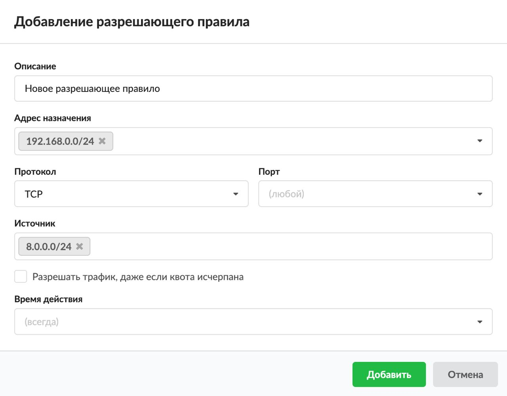

# Разрешающее правило

---

Разрешающее правило нужно для того, чтобы сделать исключение из запрещающего правила, установленного на пользователя или группу.

Добавить **разрешающее правило** можно на вкладке **«Правила и ограничения»** в [индивидуальном модуле пользователя (группы)](https://doc.a-real.ru/index.php?article=142), расположенном в меню **Пользователи и статистика > Пользователи**.

1. Нажмите **«Добавить»** и выберите **«Разрешающее правило»** — откроется окно добавления правила.
2. Введите **описание** правила.
3. В раскрывающихся **списках** можно выбрать:

    - адрес назначения;
    - протокол;
    - порт;
    - источник.

   В ИКС можно маршрутизировать входящий и исходящий трафик и фильтровать его по адресу назначения, порту и протоколу. Если поле оставить пустым, по умолчанию у него будет стоять значение «любой» (например, любой порт, любой источник).

   Поэтому если сохранить разрешающее правило по умолчанию (все поля со значением «любой») и применить его к пользователю (группе), то **межсетевой экран разрешит все коммуникации пользователя (группы) через ИКС**.

   Например, чтобы разрешить движение [HTTP](https://doc.a-real.ru/index.php?article=24#http)/[HTTPS](https://doc.a-real.ru/index.php?article=24#https)-трафика, добавьте разрешающее правило для портов 80 и 443.

4. 

5. При необходимости установите флаг **«Разрешить трафик даже если пользователь отключен»**. Тогда если пользователь был отключен или превысил [квоту](https://doc.a-real.ru/index.php?article=159) в ИКС, он будет иметь доступ к ресурсам, указанным в данном правиле.

    > ⚠ Внимание! Данное правило фильтрует трафик на уровне протокола [IP](https://doc.a-real.ru/index.php?article=24#ip) и не может фильтровать трафик по [URL](https://doc.a-real.ru/index.php?article=24#url). Для фильтрации по URL используется [разрешающее правило прокси](https://doc.a-real.ru/index.php?article=153).

6. Выберите [время действия](https://doc.a-real.ru/index.php?article=196#time) в отдельном окне.
7. Нажмите **«Добавить»** — созданное правило отобразится на вкладке.

---

**Источник:** [Документация ИКС — Разрешающее правило](https://doc.a-real.ru/index.php?article=158)
