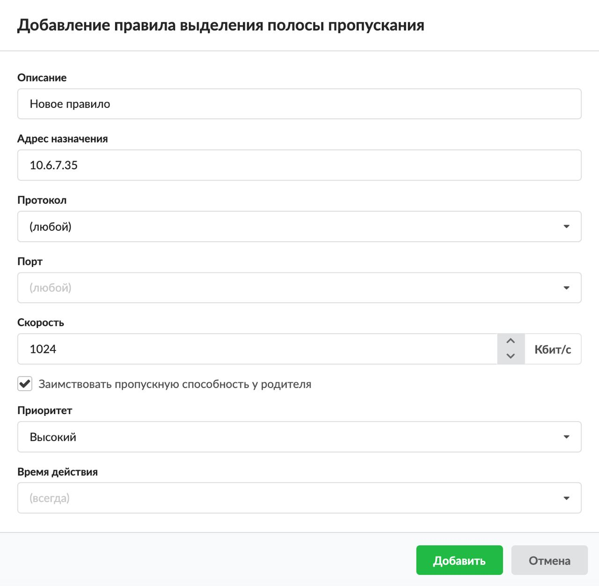

В ИКС предусмотрена возможность присваивать одному виду трафика более высокий приоритет над другим. Например, чтобы перегрузка канала HTTP-трафиком не создавала задержек в работе IP-телефонии, можно зарезервировать часть интернет-канала под VoIP-пакеты.

---

Добавить **правило выделения полосы пропускания** можно на вкладке **«Правила и ограничения»** в **индивидуальном модуле пользователя (группы)**, который расположен в меню **Пользователи и статистика > Пользователи**.


1. Нажмите **«Добавить»** и выберите **«Выделение полосы пропускания»** — откроется окно добавления правила.

2. Введите **описание** правила.

3. В раскрывающихся **списках** можно выбрать:
   - адрес назначения;
   - протокол;
   - порт.

   В ИКС можно маршрутизировать входящий и исходящий трафик и фильтровать его по адресу назначения, порту и протоколу. Если поле оставить пустым, по умолчанию у него будет стоять значение «любой» (например, любой порт, любой протокол).

   Например, для качественной работы IP-телефонии можно задать требуемую скорость полосы пропускания и указать используемые порты IP-телефонии, а затем назначить данное правило на соответствующих пользователей ИКС.

   

4. Укажите **скорость** — требуемую пропускную способность канала (в Кбит/с).

5. Если требуется, установите флаг **«Заимствовать пропускную способность у родителя»**. Тогда трафик, указанный в правиле, может использовать большую полосу пропускания, чем указано в правиле (при условии, что интернет-канал свободен).

6. Укажите **приоритет**: высокий, средний, низкий. При перегрузке канала пропускать трафик с более высоким приоритетом с наименьшей задержкой.

7. Выберите [время действия](../../vebinterfeys-iks/standartnye-elementy-vebinterfeysa.md) в отдельном окне.

8. Нажмите **«Добавить»** — созданное правило отобразится на вкладке.

> ⚠ Важно! Данное правило работает не на всех сетевых картах. На ИКС версии 7 поддерживаются драйверы следующих карт:

```text
ae, age, alc, ale, an, ath, aue, axe, bce, bfe, bge, bxe, cas, cxgbe, dc, de, ed, em, ep, epair, et, fxp, gem, hme, igb, ipw, iwi, ixgbe, jme, le, msk, mxge, my, nfe, nge, npe, qlxgb, ral, re, rl, rum, sf, sge, sis, sk, ste, stge, ti, txp, udav, ural, vge, vr, vte, wi, xl.
```

> ⚠ Внимание! Выделение полосы пропускания не работает с сетями типа OpenVPN DCO.
