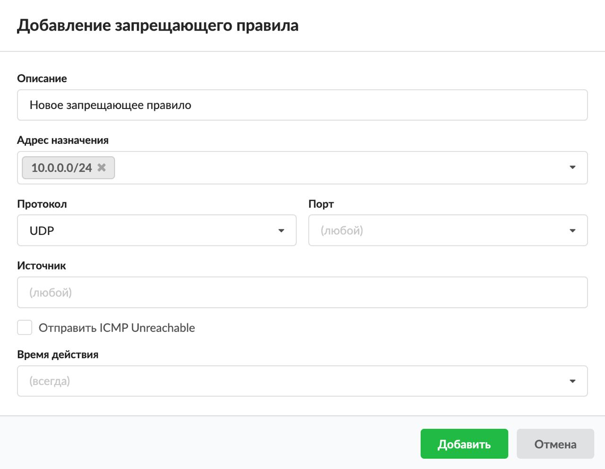

# Запрещающее правило

Запрещающее правило нужно для того, чтобы запретить доступ к какому-либо сервису из внешней или внутренней сети по IP-адресу, протоколу или порту.

---

Запрещающее правило нужно для того, чтобы запретить доступ к какому-либо сервису из внешней или внутренней сети по IP-адресу, протоколу или порту.

Добавить **запрещающее правило** можно на вкладке **«Правила и ограничения»** в [индивидуальном модуле пользователя (группы)](https://doc.a-real.ru/index.php?article=142), который расположен в меню **Пользователи и статистика > Пользователи**.

1. Нажмите **«Добавить»** и выберите **«Запрещающее правило»** — откроется окно добавления правила.
2. Введите **описание** правила.
3. В раскрывающихся **списках** можно выбрать:
   - адрес назначения;
   - протокол;
   - порт;
   - источник.

   В ИКС можно маршрутизировать входящий и исходящий трафик и фильтровать его по адресу назначения, порту, протоколу и источнику. Если поле оставить пустым, по умолчанию у него будет стоять значение «любой» (например, любой порт, любой источник).

   Поэтому если сохранить запрещающее правило по умолчанию (все поля со значением «любой») и применить его к пользователю (группе), то **межсетевой экран полностью заблокирует все коммуникации пользователя (группы) через ИКС**.

4. Установите флаг **«Отправить ICMP Unreachable»**, если требуется. Тогда при попытке одной стороны выполнить команду [ping](https://doc.a-real.ru/index.php?article=57#ping) другой стороны отправится данное сообщение и [ICMP](https://doc.a-real.ru/index.php?article=24/#icmp)-пакет будет заблокирован.
5. Выберите [время действия](https://doc.a-real.ru/index.php?article=196#time) в отдельном окне.
6. Нажмите **«Добавить»** — созданное правило отобразится на вкладке.

> ⚠ Внимание! Данное правило фильтрует трафик на уровне протокола IP и не может фильтровать трафик по URL. Для фильтрации по URL используется [запрещающее правило прокси](https://doc.a-real.ru/index.php?article=150).

Чтобы создать исключение для запрещающего правила, используйте [разрешающее правило](https://doc.a-real.ru/index.php?article=158).

---

**Источник:** [Документация ИКС — Запрещающее правило](https://doc.a-real.ru/index.php?article=147)
