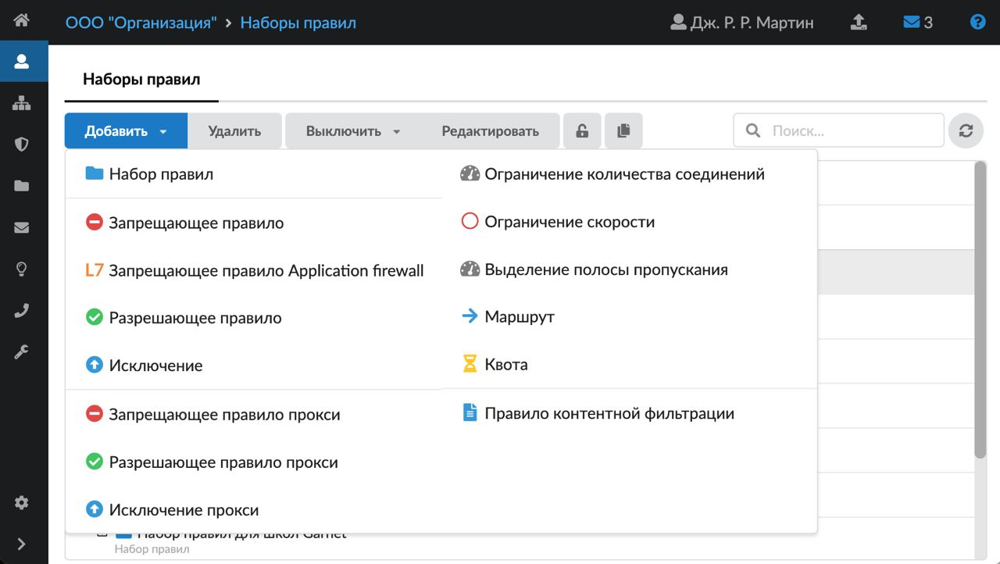
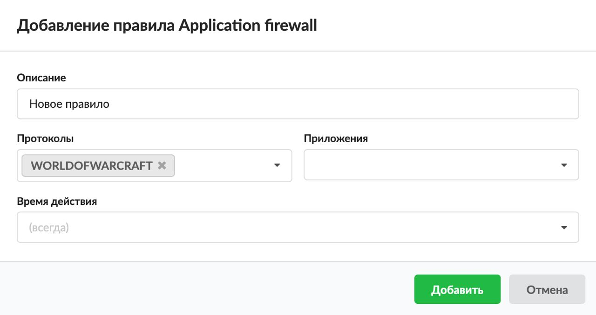

В ИКС есть встроенный модуль контроля приложений. С его помощью администратор корпоративной сети может блокировать активность установленных на пользовательские компьютеры программ. Блокировка осуществляется благодаря Application Firewall, который использует возможности библиотеки nDPI или утилиты Xauth.

Администратор сети может сформировать список блокировки ресурсов и настроить ограничение доступа пользователей к этим ресурсам. Для корпоративных клиентов актуален запрет на посещение социальных медиа, торрент-трекеров, использование ПК- или веб-версий мессенджеров (WhatsApp, Telegram, Viber).

Добавить **запрещающее правило Application Firewall** можно на вкладке **«Правила и ограничения»** в [индивидуальном модуле пользователя (группы)](../polzovateli/individualnyy-modul-polzovatelya-gruppy-2.md), который расположен в меню **Пользователи и статистика → Пользователи**.

1. Нажмите **«Добавить»** и выберите **«Запрещающее правило Application Firewall»** — откроется окно добавления правила.
2. Введите **описание** правила.
3. Обязательным является заполнение одного из полей — «Протоколы» либо «Приложения». В поле **«Протоколы»** в раскрывающемся списке можно выбрать известные протоколы библиотеки nDPI. Данная библиотека поставляется в том виде, в котором ее предоставил разработчик, поэтому работоспособность библиотеки полностью зависит от ее разработчиков. **Если протокол не может быть определен, то соединение не будет заблокировано**.

   

4. **Приложения** можно выбрать в одноименном поле. Этот функционал доступен только при условии авторизации пользователя через утилиту авторизации [Xauth](../server-avtorizacii-xauth/server-avtorizacii-xauth-obzor-2.md). Если пользователь использует Xauth, здесь отобразится список приложений, обнаруженных на рабочем устройстве пользователя. Если пользователь не авторизуется через Xauth, список будет пустым.
5. Выберите [время действия](../../vebinterfeys-iks/standartnye-elementy-vebinterfeysa.md) в отдельном окне.
6. Нажмите **«Добавить»** — созданное правило отобразится на вкладке.

