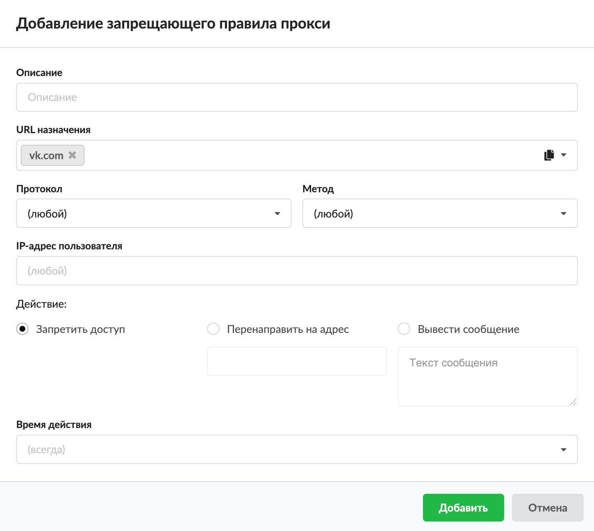

# Запрещающее правило прокси

Прокси-сервер перехватывает все запросы пользователя на доступ к сайтам в сети Интернет, соединяется с ними от его имени, получает и анализирует ответ, а затем пересылает ответ пользователю. При помощи запрещающего правила прокси-сервера можно закрыть доступ к некоторым ресурсам (например, к сайтам социальных сетей).

Добавить **запрещающее правило прокси** можно на вкладке **«Правила и ограничения»** в [индивидуальном модуле пользователя (группы)](https://doc.a-real.ru/index.php?article=142), который расположен в меню **Пользователи и статистика &gt; Пользователи**.

1. Нажмите **«Добавить»** и выберите **«Запрещающее правило прокси»** — откроется окно добавления правила.

2. Введите **описание** правила.

3. В раскрывающихся списках можно выбрать:
   - [URL](https://doc.a-real.ru/index.php?article=24/#url) **назначения** — в качестве назначения возможно указывать: IP-адрес; IP/mask; имя домена (например, `ya.ru`); поддомены, исключая основной домен (например, `.google.com` — при обращении на `drive.google.com` авторизация не будет запрошена, но при обращении на `google.com` авторизация запрошена будет); регулярное выражение в формате `/regex/gi` (например, `/.*.ai.\.ru/gi` — разрешит домен `mail.ru` и его поддомены);
   - **протокол**;
   - **метод** — основная операция над ресурсом (подробнее о различных [методах обращения к веб-ресурсам](https://ru.wikipedia.org/wiki/HTTP#%D0%9C%D0%B5%D1%82%D0%BE%D0%B4%D1%8B));
   - [IP-адрес](https://doc.a-real.ru/index.php?article=24/#ip-address) **пользователя**.

   В ИКС через прокси-сервер можно маршрутизировать входящий и исходящий трафик и фильтровать его по URL назначения, протоколу, методу и IP-адресу пользователя. Если поле оставить пустым, по умолчанию у него будет стоять значение «любой» (например, любой протокол, любой метод).

   Поэтому если сохранить запрещающее правило прокси по умолчанию (все поля со значением «любой») и применить его к пользователю (группе), **прокси-сервер запретит все коммуникации, идущие через него** (по протоколам [HTTP](https://doc.a-real.ru/index.php?article=24/#http), [HTTPS](https://doc.a-real.ru/index.php?article=24/#https), [FTP](https://doc.a-real.ru/index.php?article=24/#ftp) и HTTP/HTTPS). Если не был создан сертификат, запрещающее правило прокси не будет действовать на HTTPS-трафик.

4. Выберите **действие** (ответ пользователю) при помощи переключателя:
   - запретить доступ — пользователю будет отображен логотип ИКС и сообщение: «Доступ запрещен»;
   - перенаправить на адрес — соединение будет перенаправлено на заданный адрес;
   - вывести сообщение — пользователю будет отображен логотип ИКС и сообщение: «Доступ запрещен» с заданной надписью.

> ⚠ Важно! Для корректной работы действий «Запретить доступ» и «Вывести сообщение» необходимо, чтобы метод CONNECT был разрешен. То есть при создании запрещающего правила прокси, если в поле «Метод» указано «любой», необходимо создать [разрешающее правило прокси](https://doc.a-real.ru/index.php?article=153), в котором указать в поле «Метод» значение CONNECT. Также прокси-сервер должен работать в режиме «Расшифровка трафика с подменой сертификата».

5. Выберите [время действия](https://doc.a-real.ru/index.php?article=196#time) в отдельном окне.

6. Нажмите **«Добавить»** — созданное правило отобразится на вкладке.

**Полезно знать**

При создании правил прокси-сервера возможно использовать конструкцию типа `&lt;.domain&gt;`. Данная конструкция означает только поддомены. Например, конструкция `.google.com` в запрещающем правиле прокси, разрешит доступ к `google.com`, но запретит доступ к `mail.google.com`, `drive.google.com` и т. д.

---

**Источник:** [Документация ИКС — Запрещающее правило прокси](https://doc.a-real.ru/index.php?article=150)
