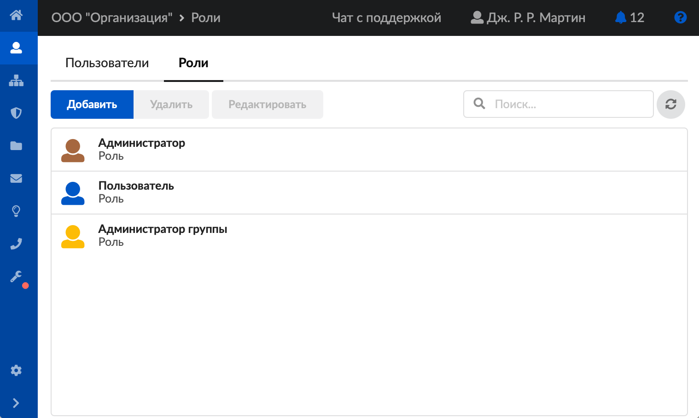
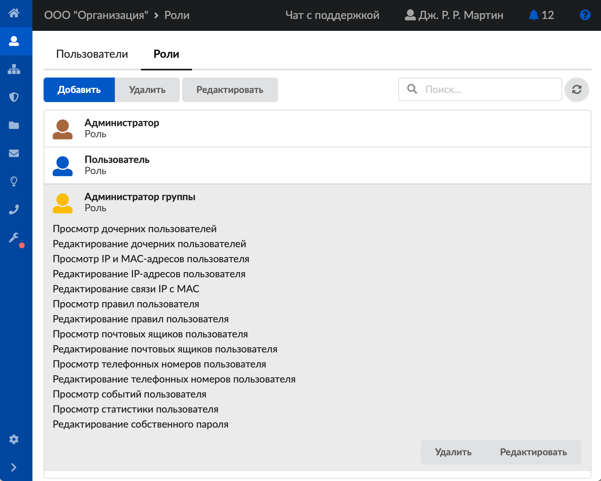
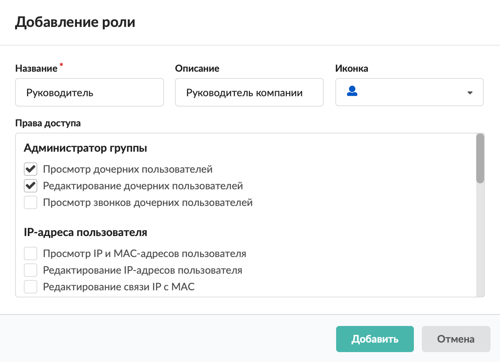

# Роли

Роль определяет права пользователя ИКС на управление программой.

---

Роль определяет права [пользователя](https://doc.a-real.ru/index.php?article=124) ИКС на управление программой.

Для управления ролями откройте модуль **«Роли»**, расположенный в меню **Пользователи и статистика &gt; Роли**.

В окне модуля отображается список всех ролей, которые заведены в программе.

По умолчанию в ИКС доступны следующие роли:

-  **«Администратор»** — пользователь ИКС имеет полный доступ ко всем функциям веб-интерфейса ИКС;
-  **«Пользователь»** — пользователь ИКС имеет доступ только к своей персональной странице, может менять собственный пароль, просматривать статистику;
-  **«Администратор группы»** — пользователь ИКС может создавать, удалять, редактировать, назначать правила, квоты, просматривать статистику пользователей, объединенных в группу (при этом администратор также находится в данной группе).

В программе можно добавлять собственные роли и настраивать их в соответствии с функциями сотрудников компании.

При нажатии на роль отобразится список ее прав. Каждую роль, кроме ролей «Администратор» и «Пользователь», можно отредактировать или удалить.

## Добавить роль

1. Нажмите кнопку **«Добавить»** — откроется окно добавления роли.
2. Введите **название** и **описание** роли.
3. Выберите **иконку** для обозначения роли.
4. Установите флаги рядом с **привилегиями** (правами), которые получит пользователь ИКС с данной ролью.

   

5. Нажмите **«Добавить»** — новая роль появится в списке.

После создания роли в модуле **«Наборы правил»** автоматически добавится пустой [набор правил](https://doc.a-real.ru/index.php?article=45), закрепленный за данной ролью. Его также можно редактировать.

---

**Источник:** [Документация ИКС — Роли](https://doc.a-real.ru/index.php?article=44)
