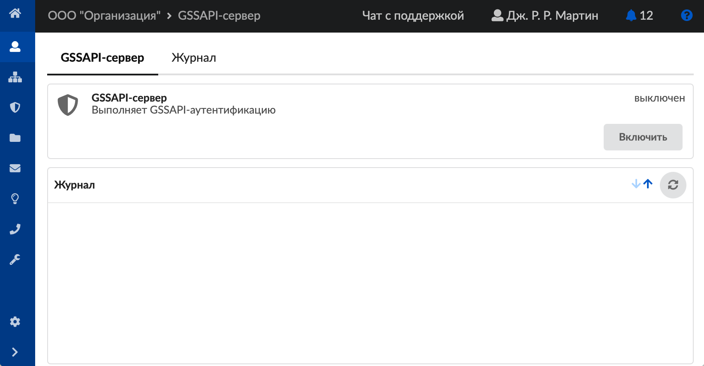
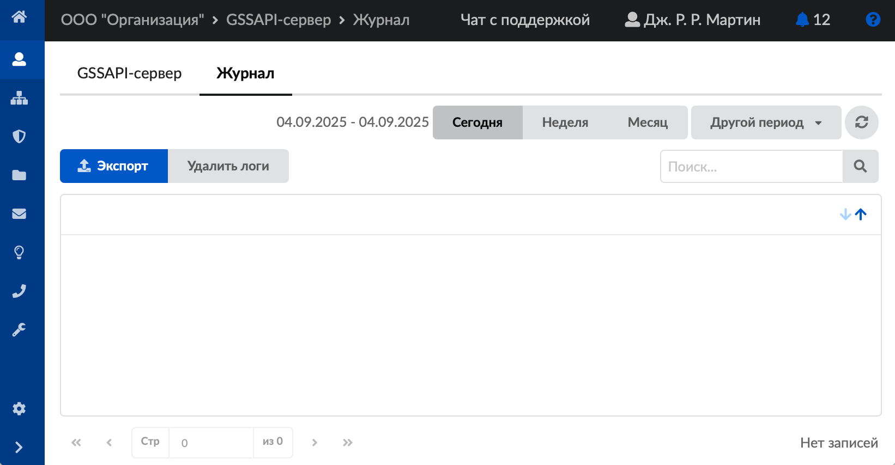

# GSSAPI

GSSAPI сервер — это служба, обеспечивающая безопасный единый вход (Single Sign On). Основная задача сервера заключается в проверке подлинности пользователей путем обмена специальными криптографическими токенами. Служба поддерживает взаимную аутентификацию, когда не только сервер проверяет клиента, но и клиент может удостовериться в подлинности сервера. GSSAPI-аутентификация доступна для Windows-клиентов Xauth, начиная с версии 4.11.2.2, при включении соответствующей [настройки Xauth](https://doc.a-real.ru/index.php?article=51#tab2).

Для открытия модуля перейдите в меню **Пользователи > GSSAPI-сервер**.

В модуле расположены следующие вкладки:

- GSSAPI-сервер
- Журнал

## GSSAPI-сервер

На данной вкладке отображаются следующие сведения о GSSAPI-сервере:

- статус службы (**запущен**, **остановлен**, **выключен**, **не настроен**);
- кнопка **«Включить»** (**«Выключить»**) — позволяет запустить или остановить службу;
- журнал последних событий.

## Журнал

На данной вкладке отображается сводка всех системных сообщений GSSAPI-сервера с указанием даты и времени.

Журнал является стандартным элементом веб-интерфейса ИКС.

---

**Источник:** [Документация ИКС — GSSAPI](https://doc.a-real.ru/index.php?article=436)
