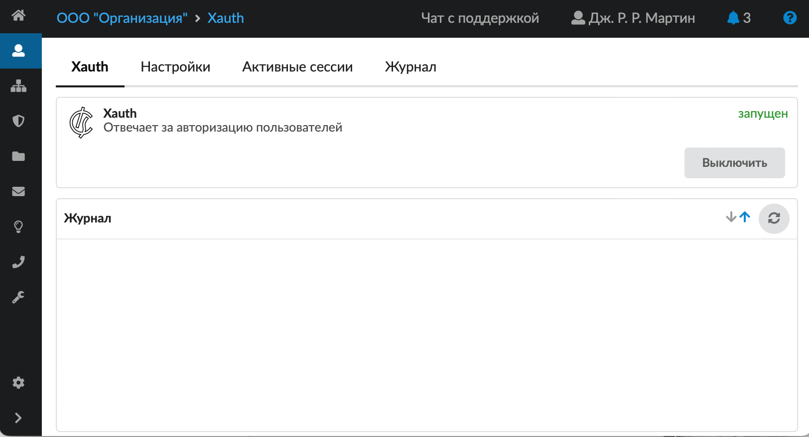
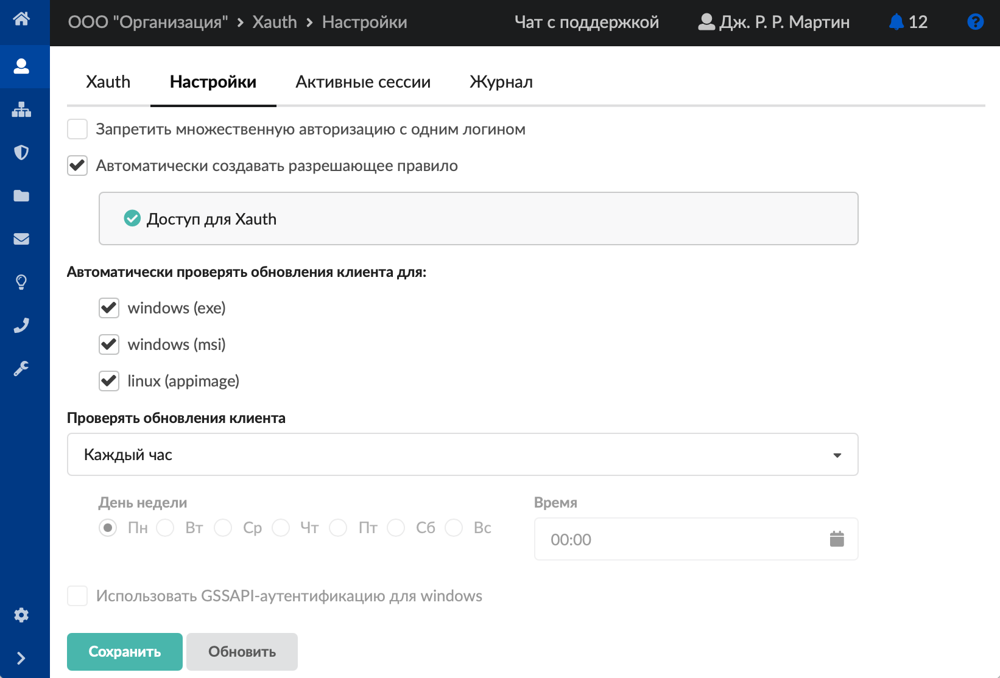
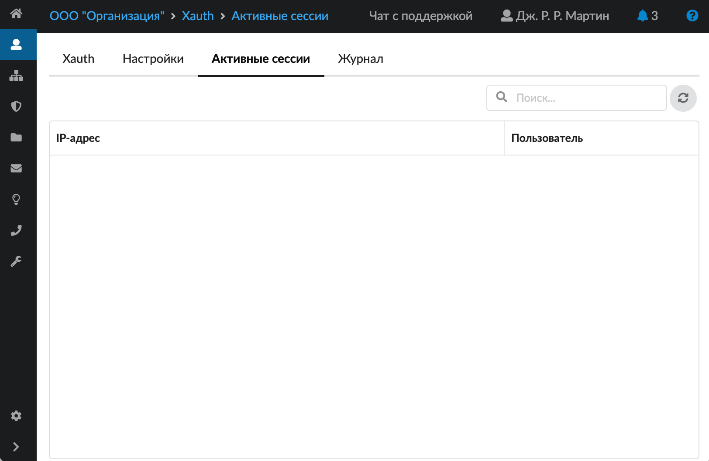
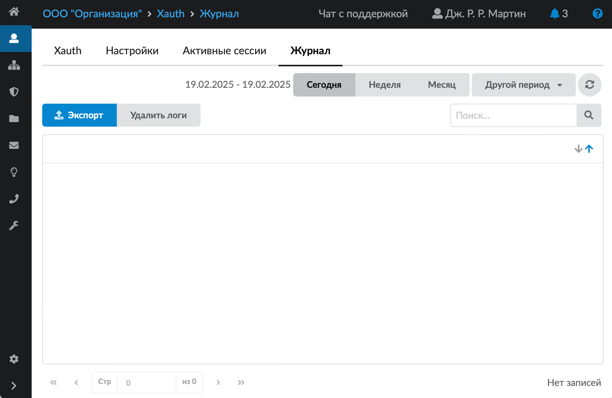

Пользователи могут авторизоваться на ИКС через утилиту авторизации Xauth. Модуль «Сервер авторизации (Xauth)» расположен в меню **Пользователи и статистика > Сервер авторизации (Xauth)**.

Данный модуль содержит следующие вкладки:

- Xauth
- Настройки
- Активные сессии
- Журнал

## Xauth

На данной вкладке отображаются:

- статус сервера (запущен, остановлен, выключен, не настроен);
- кнопка **«Включить»** (**«Выключить»**) — позволяет запустить или остановить сервер авторизации. По умолчанию сервер авторизации запущен;
- журнал событий за текущую дату.

## Настройки

На данной вкладке можно задать ряд настроек для работы Xauth.

1. Установить **флаги**:

   - **«Запретить множественную авторизацию с одним логином»**. Если флаг установлен, то пользователь, использующий конкретный логин, не сможет одновременно авторизоваться при помощи утилиты Xauth с различных устройств (IP-адресов). Аналогичная опция присутствует в настройках [Captive Portal](../captive-portal/captive-portal-obzor-2.md), однако действие этих опций не перекрывается и каждая из них влияет только на соответствующую службу.
   - **«Автоматически создавать разрешающее правило»**. Если флаг установлен, то в разрешающих правилах [межсетевого экрана](../../set/mezhsetevoy-ekran/mezhsetevoy-ekran-obzor-3.md) будет добавлено правило «Доступ для программы авторизации» (Направление – Входящие на ИКС; Источник – Локальные сети, DMZ сети; Назначение – self; Протокол – TCP; Порт назначения – Порт программы авторизации; Интерфейс – Внутренние интерфейсы, VPN-интерфейсы, DMZ). Если флаг не установлен, то данное правило будет удалено из разрешающих правил межсетевого экрана.

2. Задать автоматическую **проверку обновлений клиента** для:

   - windows (exe) — проверять обновление для exe-установщика;
   - windows (msi) — проверять обновление для msi-установщика;
   - linux (appimage) — проверять обновление для appimage-клиента.

3. Поле **«Проверять обновления клиента»** позволяет задать частоту проверок обновлений установщиков. Доступна настройка проверки обновлений по дням недели, а также в определённое время.

4. Для выполнения аутентификации по [протоколу GSSAPI](gssapi-2.md) установите флаг **«Использовать GSSAPI-аутентификацию для windows»**. Если флаг включён, то перед доменной авторизацией Windows-клиенты должны пройти аутентификацию по протоколу GSSAPI. GSSAPI-аутентификация доступна для Windows-клиентов с версии 4.11.2.2 и выше.

## Активные сессии

На вкладке отображаются активные сессии подключённых по Xauth пользователей. При нажатии на кнопку **«Отключить»** сессия пользователя закрывается.

## Журнал

На данной вкладке отображается сводка всех системных сообщений модуля с указанием даты и времени.

[Журнал](https://doc.a-real.ru/index.php?article=196#summary) является стандартным элементом веб-интерфейса ИКС.
