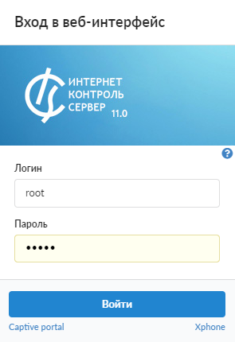
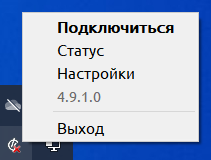
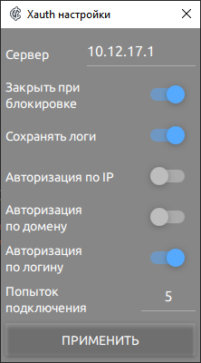
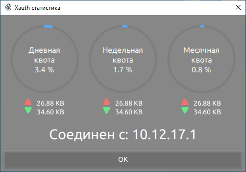
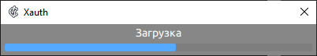
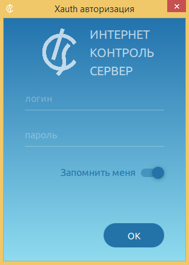

# Утилита авторизации Xauth

Утилита авторизации Xauth (клиент Xauth) предназначена для авторизации пользователей на ИКС.

---

Утилита авторизации
[**Xauth**](https://doc.a-real.ru/index.php?article=24#xauth)
(**клиент Xauth**) предназначена для авторизации пользователей на ИКС.

Рассмотрим следующие операции:

- Установка и запуск в Windows
- Подключение к серверу авторизации
- Статистика пользователя
- Обновление клиента Xauth
- Авторизация пользователя
- Ключи запуска клиента Xauth
- Установка и запуск в Linux

> ⚠ Внимание! Утилита Xauth после версии 3 существует только в виде установщика. Утилиту Xauth можно установить только на 64-разрядные версии операционных систем.

## Установка и запуск в Windows

Скачайте пакет с утилитой для Windows ([msi-пакет](https://storage.yandexcloud.net/a-real-pictures/files/xauth.msi)).

1. [Скачайте](https://storage.yandexcloud.net/a-real-pictures/files/xauth.exe) и запустите установщик.

2. Выберите параметры установки и дождитесь ее окончания.
3. Запустите клиент Xauth.

При запуске операционная система Windows может отобразить окно с предупреждением о том, что приложение имеет неизвестного издателя. Данное предупреждение можно проигнорировать нажатием кнопки **«Запустить»**. Чтобы подавить дальнейшее появление данного предупреждения на устройстве пользователя, снимите флаг **«Всегда спрашивать при открытии этого файла»**.

Утилита не требует установки и поставляется непосредственно в виде исполняемого файла.

> ⚠ Внимание! Если при запуске приложения выдается сообщение об ошибке графического адаптера и недоступности библиотек, проверьте, обновлены ли драйвер графического адаптера и операционная система до последней версии. Если обновлены, а ошибка все равно воспроизводится, скачайте архив по [ссылке](https://storage.yandexcloud.net/a-real-pictures/documentation/users_statistics/xauth/libs.zip) и положите файлы из архива (`D3DCompiler_47.dll`, `libEGL.dll`, `libGLESv2.dll`) в ту же папку, в которой расположен исполняемый файл утилиты авторизации `xauth.exe`.

4. После запуска при загрузке на короткое время появится логотип ИКС.

Программа начнет работу в минимизированном виде в трее и будет отображаться иконкой .

## Подключение к серверу авторизации

Для подключения к серверу авторизации клиент Xauth по умолчанию попытается использовать маршрут до шлюза по умолчанию.

Чтобы изменить адрес сервера авторизации и другие настройки по умолчанию, выполните следующие действия:

1. Нажмите правой кнопкой мыши на иконку клиента Xauth в трее.
2. Выберите **«Settings»** (меню настройки).

3. Измените **адрес** в строке ввода.

4. В окне настроек можно изменить поведение программы по умолчанию:

- включить логирование — действие аналогично использованию ключа `--logs`;
- отключить закрытие программы при блокировке пользователя ОС — `--noClose`;
- выбрать способы авторизации — отключение действует аналогично ключам `--noAuto`, `--noDomain`, `--noManual`;
- количество попыток переподключения — сколько раз программа авторизации будет пытаться подключиться к серверу (значение «0» — пытаться бесконечное количество раз).

5. Нажмите **«ОК»**.
6. Переподключитесь к новому серверу. Для этого нажмите **«Отключиться»** (Disconnect) и **«Подключиться»** (Connect) в том же меню.

> ⚠ Важно! Если утилита запускается с какими-либо ключами, которые дублируются настройками, то ключи имеют приоритетное значение.

## Статистика пользователя

Окно статистики позволяет отслеживать количество трафика, переданного и принятого пользователем, а также процент израсходованной квоты, если она установлена. Все данные предоставляются за следующие периоды: день, неделя, месяц. Отсчет начинается с календарного дня, недели и месяца соответственно.

## Обновление клиента Xauth

При подключении к серверу клиент Xauth проверит наличие обновлений. Если обновлений не обнаружится, программа продолжит работу. В противном случае автоматически запустится процесс загрузки новой версии. Обычно этот процесс не занимает много времени и зависит от скорости подключения к серверу. Во время процесса скачивания появляется полоса прогресса, которая показывает текущий процент загруженных данных.

После загрузки программа автоматически завершится, осуществит обновление и снова включится.

## Авторизация пользователя

Клиент Xauth позволяет провести авторизацию тремя **способами**:

- по IP-адресу устройства, на котором запущен клиент Xauth;
- с использованием доменной авторизации;
- по логину и паролю пользователя.

В первую очередь происходит попытка авторизации **по IP-адресу**. Такой способ авторизации используется, если в ИКС существует пользователь, которому назначен IP-адрес устройства, на котором запущен клиент Xauth.

Если авторизация по IP-адресу не была осуществлена, происходит попытка авторизации **через домен**. Для данного типа авторизации должен быть настроен домен.

Если оба вышеперечисленных способа не были осуществлены, пользователю будет предложено ввести **логин и пароль** для авторизации, которые были назначены ему при [создании](https://doc.a-real.ru/index.php?category=29) в ИКС.

## Ключи запуска клиента Xauth

Клиент Xauth может быть запущен без дополнительных параметров. В таком случае поведение программы будет совпадать с описанным выше.

Однако в некоторых ситуациях может требоваться иное поведение программы (например, при автоматическом и (или) удаленном запуске). В таких случаях утилиту можно запускать с одним или несколькими **ключами**:

- **`--server`** `[server ip]`: задать сервер авторизации;
- **`--noexit`**: отключить пункт меню «Выход»;
- **`--nologout`**: отключить пункт меню «Отключиться»;
- **`--noupdate`**: отключить обновление на новые версии;
- **`--noauto`**: отключить авторизацию [по IP-адресу](#author_user);
- **`--nodomain`**: отключить авторизацию [через домен](#author_user);
- **`--nomanual`**: отключить авторизацию [по логину и паролю](#author_user);
- **`--nosave`**: не сохранять данные, введенные на форме авторизации через логин и пароль;
- **`--nomonitor`**: не посылать информацию о соединениях клиента;
- **`--delay`**: задержка между сканированиями соединений в миллисекундах (значение по умолчанию «1000»);
- **`--logs`** `[NONE, DEBUG, INFO]`: уровень логирования. Если уровень логирования отличается от NONE (по умолчанию), то создается папка logs в той же директории, что и исполняемый файл, и туда помещаются логи работы утилиты;
- **`--noclose`**: не отключать утилиту авторизации при блокировании ОС и (или) смене пользователя;
- **`--help`**: показать это окно.

## Установка и запуск в Linux

Поддерживаемые операционные системы:

- Astra Linux;
- Rosa OS;
- Alt OS;
- Ubuntu;
- Debian.

1. Скачайте пакет с утилитой ([zip-архив](https://storage.yandexcloud.net/a-real-pictures/files/xauth-x86_64.AppImage) AppImage), разархивируйте его.
2. Запустите `xauth-x86_64.AppImage`.

Если при запуске возникла ошибка, запустите приложение с ключом `--appimage-extract`.

> ⚠ Функция «Закрыть при блокировке» работает в графических оболочках gnome, fly, unity, kde, mate, x-cinnamon. В lxde, xfce, lxqt и остальных не работает.

---

**Источник:** [Документация ИКС — Утилита авторизации Xauth](https://doc.a-real.ru/index.php?article=187)
