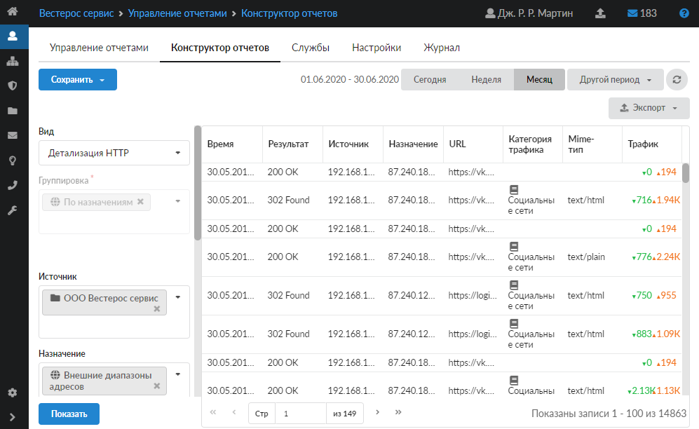

# Просмотр детализированной статистики

Для просмотра детализированного списка обращений пользователя к доменам перейдите на вкладку «Конструктор отчетов» в меню Пользователи и статистика > Управление отчетами и выполните следующие настройки в конструкторе.

---

1. В поле «Вид» выберите «Детализация HTTP».

2. В поле «Источник» выберите пользователя (группу), по которому необходимо вывести статистику.

3. В поле «Назначение» укажите «Внешние диапазоны адресов».

4. Укажите начальную и конечную дату временного периода, за который требуется вывести статистику.

5. Нажмите кнопку «Показать» — отчет будет показан в правой части вкладки.

Внимание! При большом объеме статистики построение отчета за длительный промежуток времени потребует значительных ресурсов системы. Если ресурсов не хватит, график может не отобразиться. Поэтому для составления отчетов детализированной статистики не рекомендуется выставлять большие временные промежутки.

---

**Источник:** [Документация ИКС — Просмотр детализированной статистики](https://doc.a-real.ru/index.php?article=50)
