# Управление отчетами

Модуль «Управление отчетами» позволяет управлять и настраивать службы «Статистика» и «Счетчики», а также предоставляет возможность формирования отчетов работы данных служб как в произвольной форме, так и в предустановленных формах.

---

Модуль <strong>«Управление отчетами»</strong> позволяет управлять и настраивать службы «Статистика» и «Счетчики», а также предоставляет возможность формирования отчетов работы данных служб как в произвольной форме, так и в предустановленных формах. Модуль расположен в меню <strong>Пользователи и статистика → Управление отчетами</strong>.

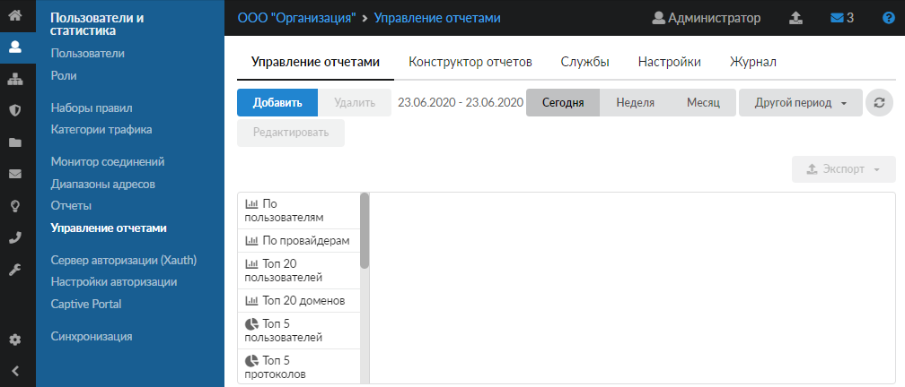

Данный модуль содержит следующие вкладки:

- [Управление отчетами](#tab1)
- [Конструктор отчетов](#tab2)
- [Службы](#tab3)
- [Настройки](#tab4)
- [Журнал](#tab5)

**Временной период** (день, неделя, месяц, другой период) можно выбрать в правом верхнем углу отчета. Настройка доступна только для вкладок «Управление отчетами», «Конструктор отчетов» и «Журнал». По умолчанию выводятся данные за текущий день.

При необходимости можно сохранить данные отчета в файл (кроме вкладок «Службы» и «Настройки»). Для этого нажмите кнопку <strong>«Экспорт»</strong> и выберите нужный формат файла (`csv`, `txt` или `xls`) либо отправьте файл на печать (доступно только для конструктора отчетов).

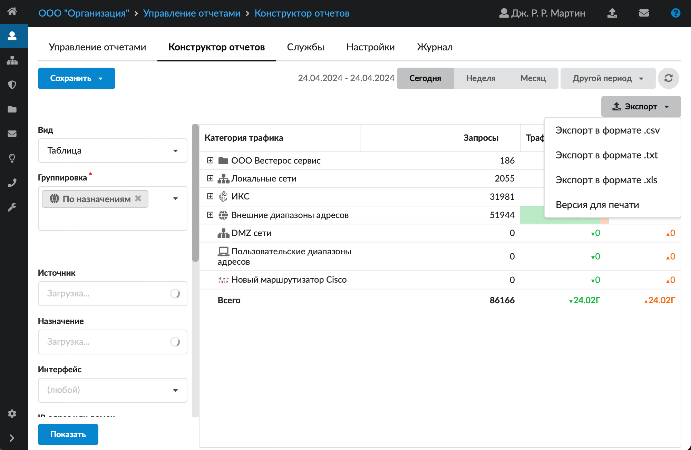

Чтобы <strong>обновить</strong> данные на вкладке, нажмите кнопку .

## Управление отчетами

В левой части вкладки отображается список всех отчетов: предустановленных системой и созданных пользователем ИКС с [ролью](https://doc.a-real.ru/index.php?article=44) «Администратор». Нажмите на название нужного отчета — он отобразится в правой части вкладки.

Предустановленные отчеты нельзя редактировать или удалить.

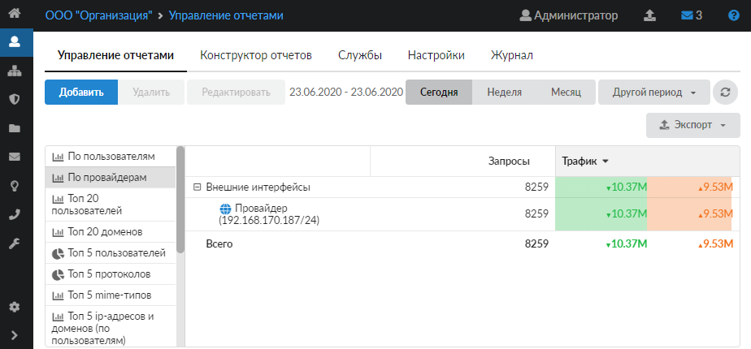

На вкладке расположены кнопки управления:

- <strong>«Добавить»</strong> — откроется вкладка <strong>«Конструктор отчетов»</strong>;
- <strong>«Редактировать»</strong> — откроется вкладка <strong>«Конструктор отчетов»</strong> с заполненными полями в соответствии с выбранным отчетом;
- <strong>«Удалить»</strong>.

## Конструктор отчетов

Данная вкладка позволяет создавать отчеты по заданным параметрам фильтров, которые можно применять к общей статистике в любых комбинациях для отображения необходимых статистических данных.

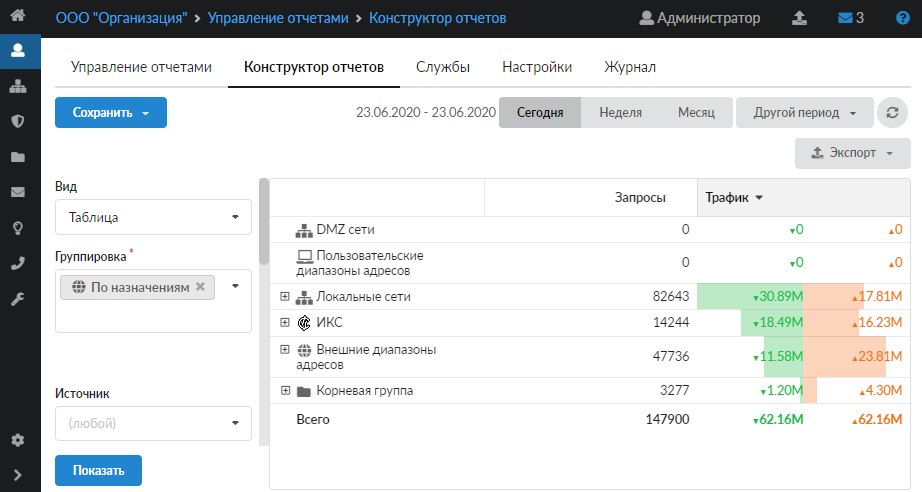

В левой части вкладки задаются параметры фильтрации статистики:

- <strong>Название</strong> — доступно в случае редактирования ранее созданного отчета. Позволяет изменить название отчета.
- <strong>Вид</strong> — позволяет задать один из возможных вариантов отображения:
  - детализация IP — отображает таблицу со статистикой всех соединений, прошедших через ИКС, по [IP-адресам](https://doc.a-real.ru/index.php?article=24/#ip-address);
  - детализация HTTP — отображает таблицу со статистикой по [HTTP](https://doc.a-real.ru/index.php?article=24/#http)/[HTTPS](https://doc.a-real.ru/index.php?article=24/#https)-трафику, полученную от [прокси-сервера](https://doc.a-real.ru/index.php?article=24/#proxi-server);
  - таблица — отображает отчет в виде таблицы, в зависимости от настроек фильтрации статистики;
  - круг — отображает отчет в виде круговых диаграмм, в зависимости от настроек фильтрации статистики;
  - столбцы — отображает отчет в виде гистограммы, в зависимости от настроек фильтрации статистики;
  - пузыри — отображает отчет в виде кругов, в зависимости от настроек фильтрации статистики.
- <strong>Группировка</strong> — группирует все элементы выводимых данных по выбранной области: назначению, источнику, интерфейсу, IP-адресам и доменам, протоколам, портам, MIME-типам, времени. При этом в каждой области можно задать более узкую группировку. Группировать выводимые данные можно по нескольким категориям при условии отображения в виде таблицы. Группировка производится по следующему принципу: первый уровень отображения в дереве группируется по первому значению из данного поля, второй уровень — по второму значению и т. д.

> Группа является единственным обязательным параметром для составления отчета.

- <strong>Источник</strong> — фильтрует сгруппированную статистику по источнику генерации. В качестве источника указывается диапазон адресов или IP-адрес, заведенный в ИКС.
- <strong>Назначение</strong> — фильтрует сгруппированную статистику по назначению. В качестве назначения указывается диапазон адресов или IP-адрес, заведенный в ИКС.
- <strong>Интерфейс</strong> — фильтрует сгруппированную статистику по интерфейсу, заведенному в ИКС. В качестве интерфейса возможно указать: туннели, [DMZ](https://doc.a-real.ru/index.php?article=24/#dmz), [VPN](https://doc.a-real.ru/index.php?article=24/#vpn), внешние и внутренние интерфейсы.
- <strong>IP-адрес, домен, категория трафика</strong> — фильтрует сгруппированную статистику по IP-адресу, домену или категории трафика.
- <strong>Категории трафика</strong> — позволяет выводить статистику по выбранным категориям трафика.
- <strong>Протокол</strong> — фильтрует сгруппированную статистику по одному из протоколов: [IP](https://doc.a-real.ru/index.php?article=24/#ip), [ICMP](https://doc.a-real.ru/index.php?article=24/#icmp), [TCP](https://doc.a-real.ru/index.php?article=24/#tcp), [UDP](https://doc.a-real.ru/index.php?article=24/#udp), [GRE](https://doc.a-real.ru/index.php?article=24/#gre), [IPIP](https://doc.a-real.ru/index.php?article=24/#ipip), [L2TP](https://doc.a-real.ru/index.php?article=24/#l2tp).
- <strong>Порт</strong> — фильтрует сгруппированную статистику по порту: используемому службой ИКС, общепринятому или любому указанному.
- <strong>MIME-тип</strong> — фильтрует сгруппированную статистику по одному из предустановленных [MIME-типов](https://doc.a-real.ru/index.php?article=24/#mime-type).
- <strong>Результат</strong> — фильтрует сгруппированную статистику по коду ответа от стороннего веб-сервера.
- <strong>Время</strong> — фильтрует сгруппированную статистику, относящуюся только к выбранному временному периоду, шаг указывается в часах.

Выберите необходимые фильтры и нажмите кнопку <strong>«Показать»</strong> — справа отобразится соответствующий отчет.

### Сохранить фильтр

Чтобы запомнить выбранный набор фильтров и в дальнейшем не настраивать его заново, выполните следующие действия:

1. Нажмите кнопку <strong>«Сохранить отчет»</strong> и выберите <strong>категорию</strong> отчета: общий или пользовательский отчет.

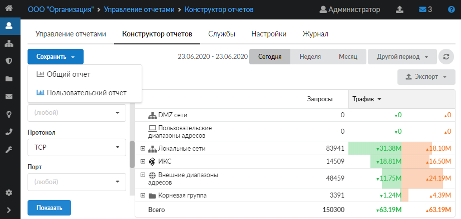

2. Введите <strong>название</strong> нового отчета.

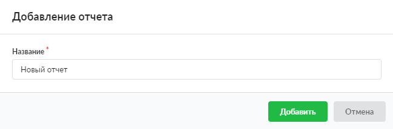

3. Для общего отчета также есть возможность настроить <strong>автоматическую выгрузку</strong>. Выберите параметры: период, день недели и время выгрузки, формат, папка назначения. Если требуется, настройте <strong>автоматическое удаление</strong> отчета.

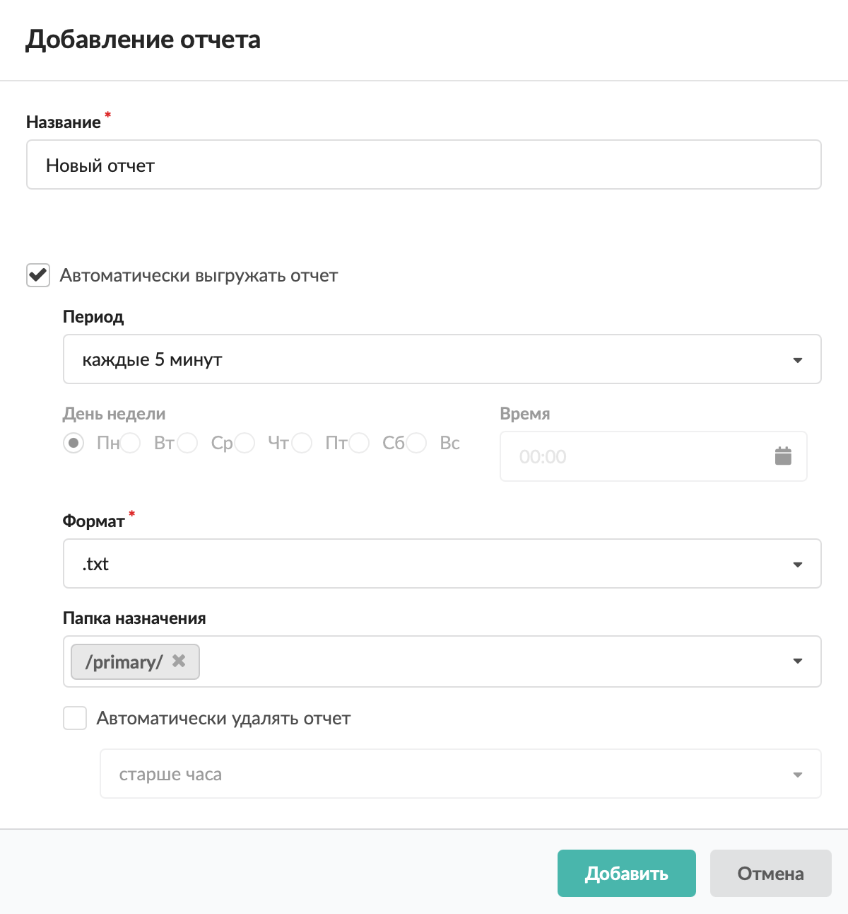

4. Нажмите <strong>«Добавить»</strong> — созданный отчет будет доступен на вкладке «Управление отчетами».

### Особенности отчета в виде таблицы

В таблице можно управлять видимостью столбцов, порядком отображения и форматом выводимых данных.

При экспорте отчета-таблицы откроется окно «Настройки», в котором будет предложено выбрать, как экспортировать таблицу: все страницы либо в виде дерева с выбором уровня вложенности детализации в дерево.

### Особенности отчета в виде круговых диаграмм

Круговые диаграммы при экспорте будут преобразованы в табличный вид.

**Пример. Просмотр объема трафика за определенный период**

Чтобы вывести суммарное значение выбранного трафика без использования стандартных отчетов за выбранный период времени, выполните в конструкторе отчетов следующие действия:

1. В поле <strong>«Группировка»</strong> выберите <strong>«По источникам»</strong>.
2. В поле <strong>«Назначение»</strong> выберите <strong>«Внешние диапазоны адресов»</strong>.
3. Укажите начальную и конечную дату <strong>временного периода</strong>, за который требуется вывести статистику пользователей.
4. Нажмите кнопку <strong>«Показать»</strong> — отчет будет показан в правой части вкладки.

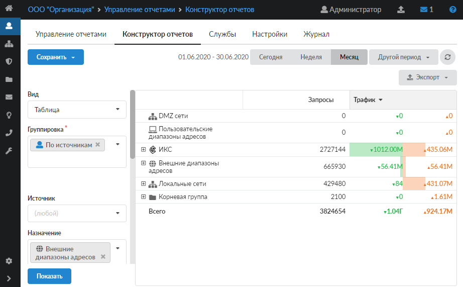

## Службы

На данной вкладке отображаются состояния служб <strong>«Статистика»</strong> и <strong>«Счетчики»</strong> с возможностью выключить либо включить последние сообщения в журнале.

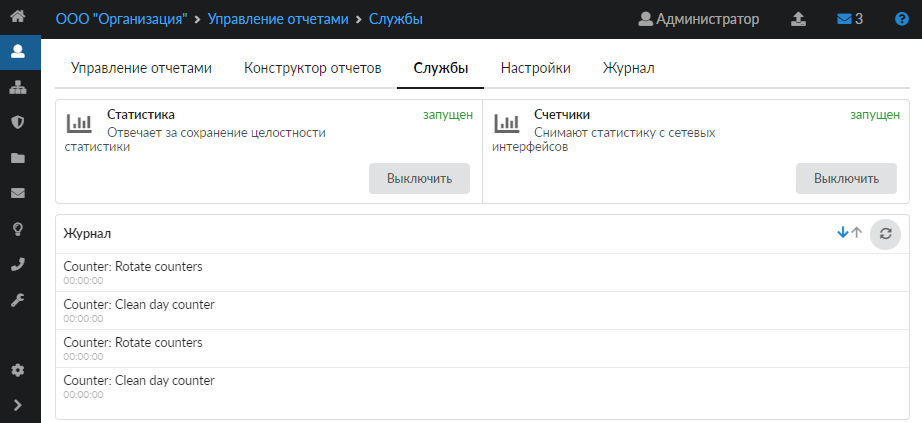

## Настройки

На данной вкладке можно определить параметры отображения и хранения журналов вышеописанных служб и записей статистики.

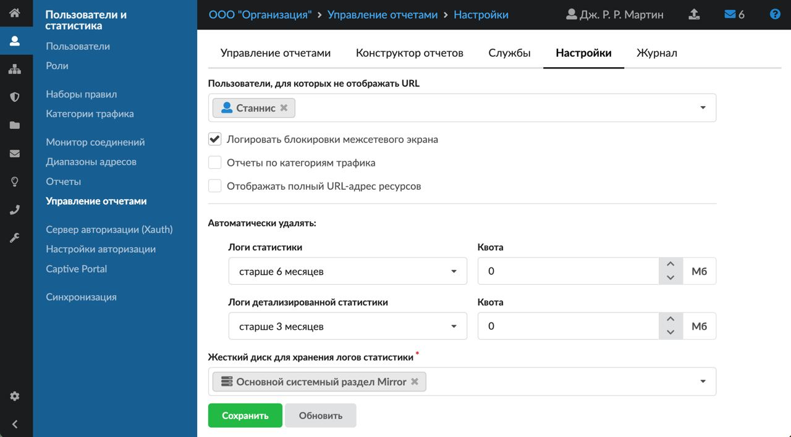

- В поле <strong>«Пользователи, для которых не отображать URL»</strong> можно задать пользователей и (или) группы пользователей, для которых при формировании отчета не будет отображаться [URL](https://doc.a-real.ru/index.php?article=24/#url) посещенных ресурсов. Вместо этого в отчете будет указано: «URL для пользователя скрыт». Данное отображение начнет работать только с момента его применения и только для новых запросов от указанных пользователей.
- При установке флага <strong>«Логировать блокировки межсетевого экрана»</strong> в отчетах, кроме обычных запросов, также будут отображаться блокировки, произведенные [межсетевым экраном](https://doc.a-real.ru/index.php?article=24/#firewall). Для их отображения на вкладке <strong>«Конструктор отчетов»</strong> можно задать: в поле <strong>вид</strong> — «Детализация IP», в поле <strong>результат</strong> — «403 Forbidden».
- Если установлен флаг <strong>«Отчеты по категориям трафика»</strong>, в отчете, у которого выбран <strong>вид</strong> «Детализация HTTP», будет указана категория, к которой относится соответствующий URL.

> ⚠ Внимание! Использование отчетов по категориям трафика увеличит нагрузку на сервер. Это может замедлить его работу.

- При установке флага <strong>«Отображать полный URL-адрес ресурсов»</strong> в отчете URL-адреса будут отображаться в полном виде.

> ⚠ Внимание! При отображении полных URL-адресов ресурсов статистика займет больше места на жестком диске, а также увеличится нагрузка на сервер, что может замедлить его работу.

- Блок <strong>«Автоматически удалять»</strong> позволяет установить <strong>временные рамки</strong> или <strong>квоту</strong> на хранение данных статистики и детализированной статистики. Данные рамки также можно [настроить](https://doc.a-real.ru/index.php?article=107) в модуле «Система».
- Поле <strong>«Жесткий диск для хранения логов статистики»</strong> позволяет переместить логи статистики и записать их на отдельный жесткий диск.

## Журнал

На данной вкладке отображается сводка всех системных сообщений модуля с указанием даты и времени.

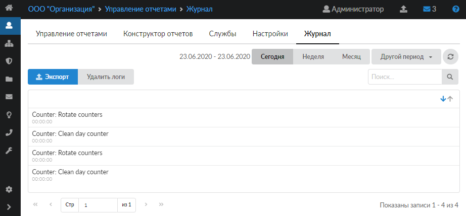

[Журнал](https://doc.a-real.ru/index.php?article=196#summary) является стандартным элементом веб-интерфейса ИКС.

---

**Источник:** [Документация ИКС — Управление отчетами](https://doc.a-real.ru/index.php?article=144)
