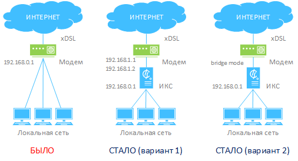

Линия xDSL — достаточно популярный вариант для провайдеров, одновременно являющимися операторами телефонной связи.

Поскольку полностью исключить устройство преобразования данных (модем) из схемы невозможно, внедрение ИКС в сеть возможно двумя способами.

## Вариант 1

В первом варианте настройки подключения к провайдеру на модеме остаются неизменными, а внутренний адрес модема изменяется таким образом, чтобы он находился в подсети, отличной от локальной. После чего на ИКС создается локальная сеть с бывшим адресом модема (192.168.0.1/24) и провайдер с адресом из подсети с новым адресом модема (192.168.1.2) и новый адрес модема указывается в качестве шлюза.

Преимущества первого варианта подключения:

- Не требуется перенастройка провайдера на модеме.
- ИКС находится в локальной сети модема, что обеспечивает дополнительную безопасность.

## Вариант 2

Второй вариант более предпочтителен в том случае, если ИКС обеспечивает работу сервисов во внешнюю сеть. Модем переводится в режим моста (bridge mode), после чего на ИКС создается локальная сеть (192.168.0.1/24) и провайдер с настройками, выданными провайдером xDSL (обычно это подключение по протоколу PPPoE).

Преимущества второго варианта подключения:

- Полноценный доступ к системе (на ИКС настроен внешний адрес провайдера).
- Контроль за подключением ведет сам сервер.
