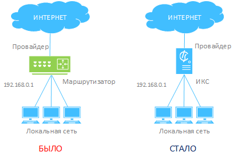
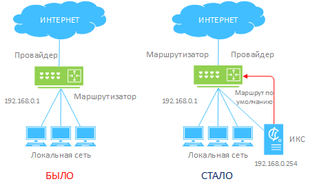

ИКС может быть размещен в качестве выделенной линии либо выделенного сервиса. Описаны два варианта установки: в качестве сетевого шлюза и как рядовой член локальной сети.

---

Выделенная линия — самый простой вариант установки.

Изначальная схема сети предполагает аппаратный маршрутизатор (шлюз), к которому подключается кабель выделенной линии провайдера.

Внедрение ИКС в такую сеть в большинстве случаев заменяет маршрутизатор и несет на себе все его функции.

В ИКС создается локальная сеть с адресом 192.168.0.1/24 и провайдер нужного типа (статический, DHCP или PPPoE).

## Выделенный сервис

В некоторых случаях нет необходимости размещать ИКС в качестве сетевого шлюза. Он может быть рядовым членом локальной сети и отвечать за работу отдельных сервисов, таких как прокси-сервер, почтовый сервер или веб-сервер.

В случае размещения ИКС таким образом достаточно одного сетевого интерфейса.

В приведенном выше примере ИКС устанавливается в локальную сеть так же, как и обычный пользовательский компьютер. На нем создается локальная сеть с любым свободным адресом из пространства существующей сети.

Затем в модуле Маршруты создается маршрут по умолчанию через текущий сетевой шлюз. В качестве назначения в нем указывается 0.0.0.0/0, выбирается тип условия — через шлюз, и в поле прописывается IP-адрес маршрутизатора (192.168.0.1). В настройках маршрута также рекомендуется установить флажок «Использовать NAT».

Таким образом, вы можете, к примеру, указать ИКС в качестве прокси-сервера для браузера и получать доступ в интернет.
