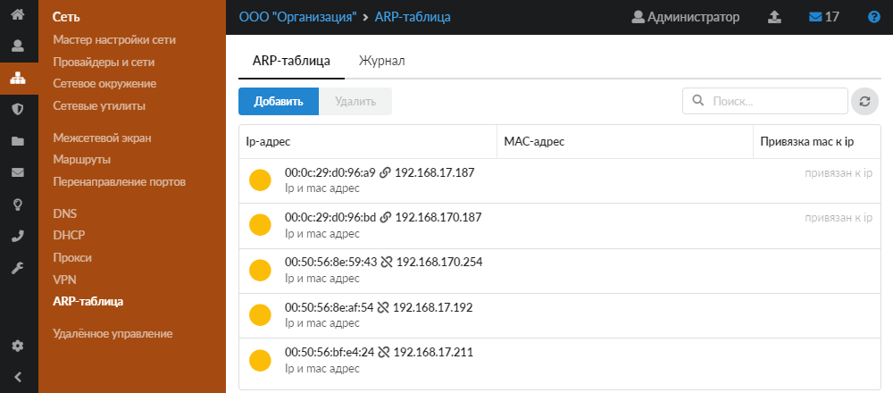
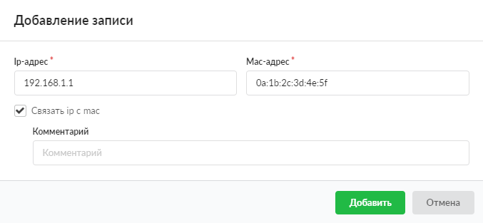
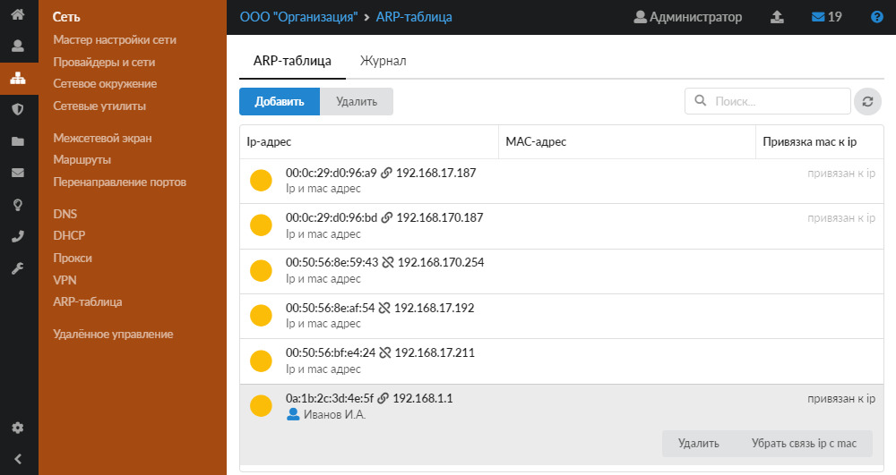
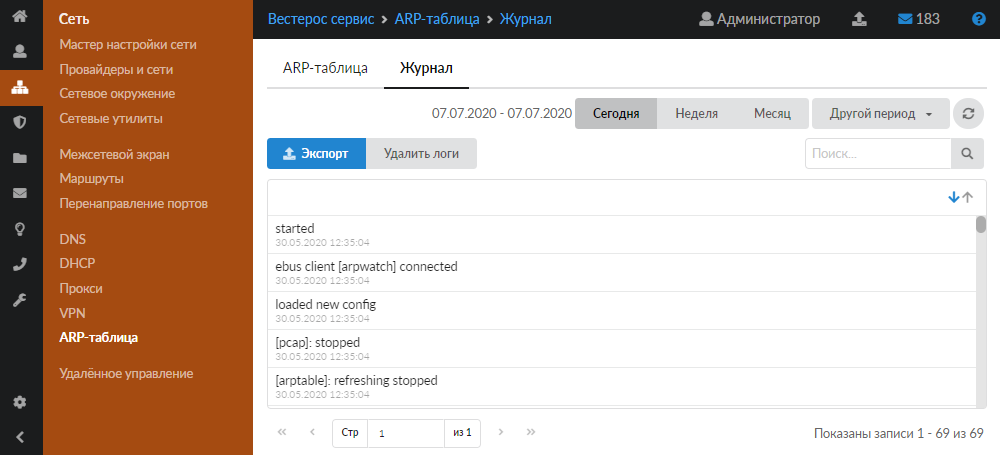

ARP-таблица отображает IP-адреса и MAC-адреса подключённых к серверу сетевых устройств. Модуль «ARP-таблица» расположен в меню **Сеть > ARP-таблица**.

---

В модуле находятся следующие вкладки:

- [ARP-таблица](#tab1)
- [Журнал](#tab2)

## ARP-таблица

В большинстве случаев в ИКС используется проверка прав доступа на основе IP-адреса пользователя. Однако пользователь может самостоятельно изменить IP-адрес своего компьютера (например, чтобы получить доступ к запрещённым для него ресурсам). В свою очередь MAC-адрес является уникальным идентификатором сетевого устройства, и изменить его гораздо сложнее.

Чтобы предотвратить ситуацию несанкционированной смены IP-адреса, необходимо **задать соответствие** между MAC-адресом сетевой карты и IP-адресом. Для этого выполните следующие действия:

1. Нажмите **«Добавить»**.
2. В появившемся окне IP-адрес и MAC-адрес заполнятся автоматически.
3. Установите флаг **«Связать IP с MAC»**. Если необходимо, введите комментарий.

4. Нажмите **«Добавить»**. Если добавленный IP-адрес сопоставлен с пользователем ИКС, то в строке с данным IP-адресом будет показано его имя. При нажатии на имя пользователя откроется его [индивидуальный модуль](../polzovateli-i-statistika/polzovateli/individualnyy-modul-polzovatelya-gruppy-2.md).

Задать соответствие между MAC-адресом сетевой карты и IP-адресом можно также в [индивидуальном модуле](../polzovateli-i-statistika/polzovateli/individualnyy-modul-polzovatelya-gruppy-2.md) пользователя.

> ⚠ ARP-таблица отображает записи в том случае, когда на интерфейсе есть MAC-адрес и IP-адрес. Например, для локальной сети, DMZ-сети, провайдеров и т.д. Поэтому если в ИКС попытаться добавить запись с IP-адресом несуществующей сети или провайдера, такая запись не будет добавлена.

Сопоставления из ARP-таблицы также используются [DHCP-сервером](dhcp-2.md). Именно по MAC-адресу [DHCP-сервер](../o-dokumentacii/slovar-terminov-3.md) определяет, какой IP-адрес назначить сетевому устройству.

> ⚠ Например, в ARP-таблице пользователю был определён MAC-адрес `0a:1b:2c:3d:4e:5f` и соответствующий ему IP-адрес `192.168.1.1`. Через некоторое время IP-адрес был изменён на другой (например, на `10.0.0.1`). В ИКС для данного пользователя будет отображаться два IP-адреса, связанных с одним MAC-адресом `0a:1b:2c:3d:4e:5f`, так как в системной таблице ARP будут существовать обе записи. Некорректная запись в ARP-таблице будет удалена автоматически не позднее 1200 секунд.

## Журнал

На данной вкладке отображается сводка всех системных сообщений модуля с указанием даты и времени.

[Журнал](../vebinterfeys-iks/standartnye-elementy-vebinterfeysa.md) является стандартным элементом веб-интерфейса ИКС.
