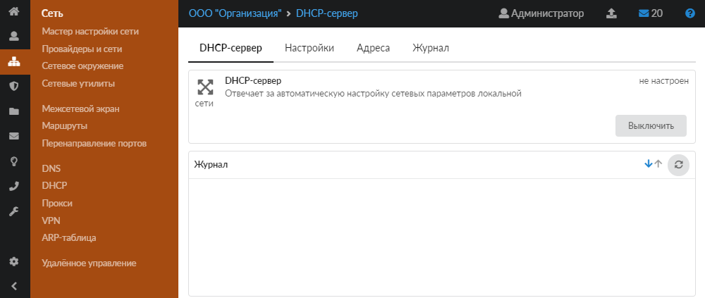
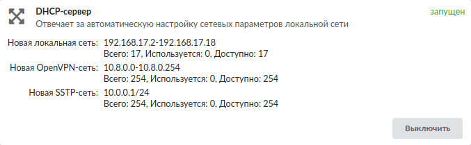
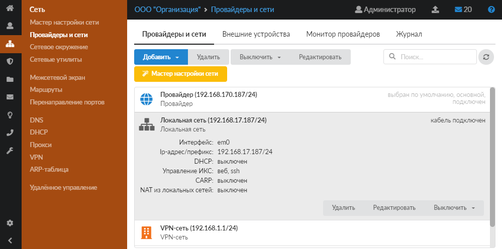
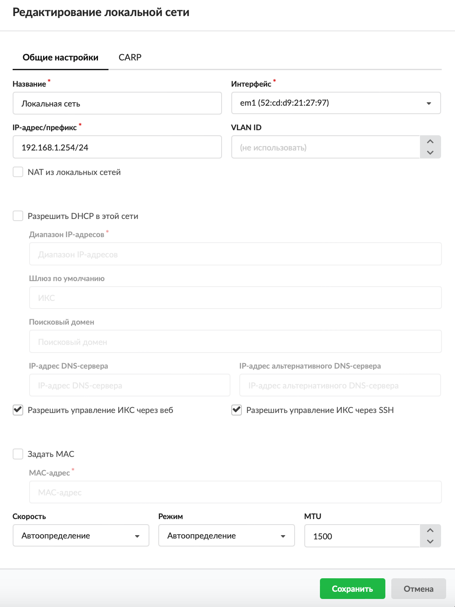
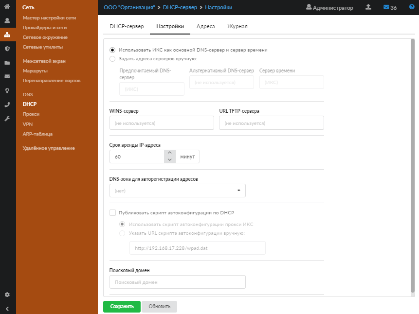
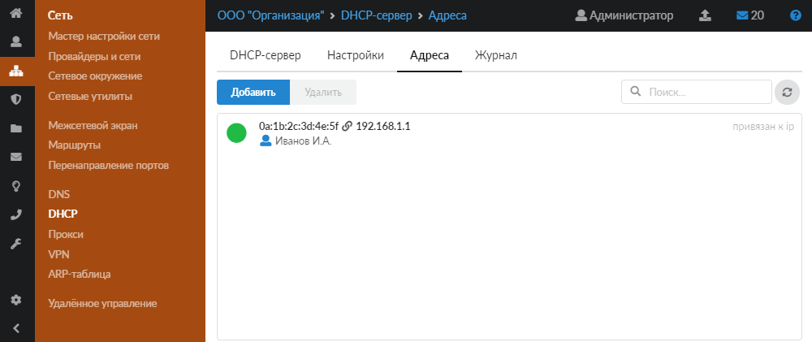
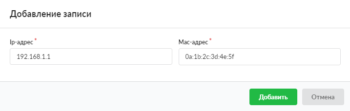
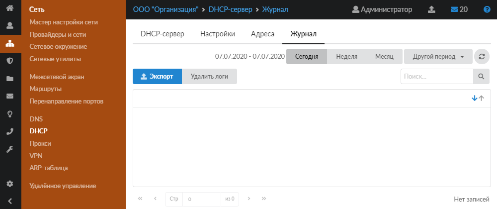

Модуль **DHCP** предназначен для настроек протокола DHCP. Для открытия данного модуля перейдите в меню **Сеть > DHCP**.

В модуле расположены следующие вкладки:

- DHCP-сервер
- Настройки
- Адреса
- Журнал

## DHCP-сервер

На данной вкладке отображаются:

- статус службы (запущен, остановлен, выключен, не настроен). Если ни на одной из локальных или внутренних сетей не выбрана опция DHCP, модуль находится в состоянии «не настроен»;
- кнопка **«Включить»** («Выключить») — позволяет запустить или остановить службу;
- журнал последних событий.

Также на данной вкладке можно ознакомиться со статистикой по выданным IP-адресам. На каждый диапазон адресов выводится отдельный счетчик.

DHCP настраивается индивидуально для каждой локальной или внутренней сети. Внутренняя сеть используется, если DHCP-сервер находится в одной сети, а клиент — в другой, с DHCP Relay агентом. DHCP Relay агент — это любой узел, маршрутизатор или коммутатор, который настроен для передачи пакетов DHCP между клиентом и сервером, находящихся в разных сетях, и выполняет функцию посредника для обмена сообщениями между клиентом и сервером в формате адресных пакетов. Для настройки DHCP выполните следующие действия:

1. Перейдите в меню **Сеть > Провайдеры и сети**.
2. Выберите нужную локальную или внутреннюю сеть и нажмите **«Редактировать»**.

3. Установите флаг «Разрешить DHCP в этой сети» и задайте диапазоны адресов, которые будут раздаваться DHCP-сервером (в виде 192.168.1.1-192.168.1.100 или 192.168.1.1/16). При необходимости задайте альтернативные настройки шлюза, домена, DNS для данной сети.

4. Нажмите **«Сохранить»**.

## Настройки

Данная вкладка предназначена для настройки протокола DHCP.

1. Выберите, что будет использоваться в качестве DNS-сервера и сервера времени для всех пользователей, получающих адреса автоматически. Установите переключатель:

- «Использовать ИКС как основной DNS-сервер и сервер времени»;
- «Задать адреса серверов вручную:». В этом случае будут использоваться сторонние серверы. Укажите: предпочитаемый DNS-сервер, альтернативный DNS-сервер, сервер времени.

2. В поле **«WINS-сервер»** можно указать выдаваемый клиентам WINS-сервер для разрешения NetBIOS-имен.
3. Поле **«URL TFTP-сервера»** позволяет указать выдаваемый клиентам TFTP, с которого может быть произведена загрузка тонкого клиента.
4. Задайте **срок аренды IP-адреса** (в минутах). По истечении указанного периода, если клиент с данным адресом отсутствует в сети, запись о выдаче адреса очищается — адрес может быть выдан новому клиенту (если не задано сопоставление IP и MAC-адресов).
5. В поле **«DNS-зона для авторегистрации адресов»** можно указать одну из предварительно созданных DNS-зон. В данной зоне новые пользователи, получившие адреса по протоколу DHCP, будут регистрироваться как А-записи вида `<имя_хоста>.<имя_зоны>`.
6. При необходимости установите флаг **«Публиковать скрипт автоконфигурации по DHCP»** и выберите, каким образом будут переданы пользователю автоматические настройки прокси-сервера:

- автоматически (переключатель **«Использовать скрипт автоконфигурации прокси ИКС»**);
- вручную, из адреса, по которому находится файл с настройками (переключатель **«Указать URL скрипта автоконфигурации вручную:»**).

7. Если требуется, укажите **поисковый домен**.
8. Нажмите **«Сохранить»**.

## Адреса

На данной вкладке можно увидеть всех пользователей, которые в данный момент получили адреса по DHCP.

Чтобы одному и тому же компьютеру каждый раз выдавался один и тот же IP-адрес, необходимо **задать соответствие** между MAC-адресом сетевой карты и IP-адресом. Это делается по аналогии с [ARP-таблицей](/index.php?article=64#tab1).

Связи из [ARP-таблицы](/index.php?article=64) также будут использоваться DHCP-сервером для выдачи адресов.

## Журнал

На данной вкладке отображается сводка всех системных сообщений модуля с указанием даты и времени.

[Журнал](/index.php?article=196#summary) является стандартным элементом веб-интерфейса ИКС.
