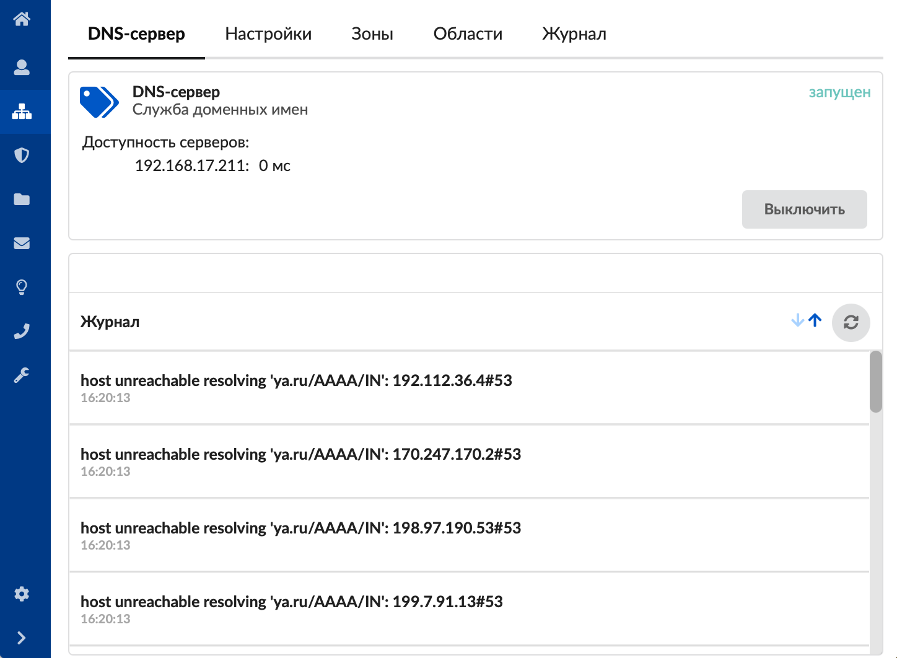
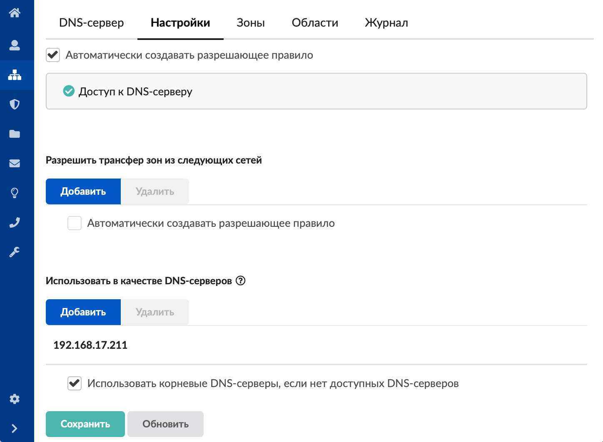
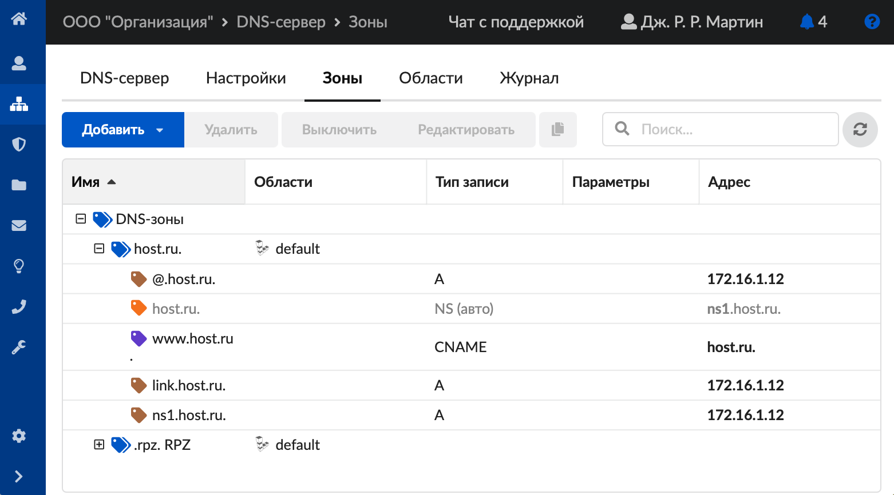
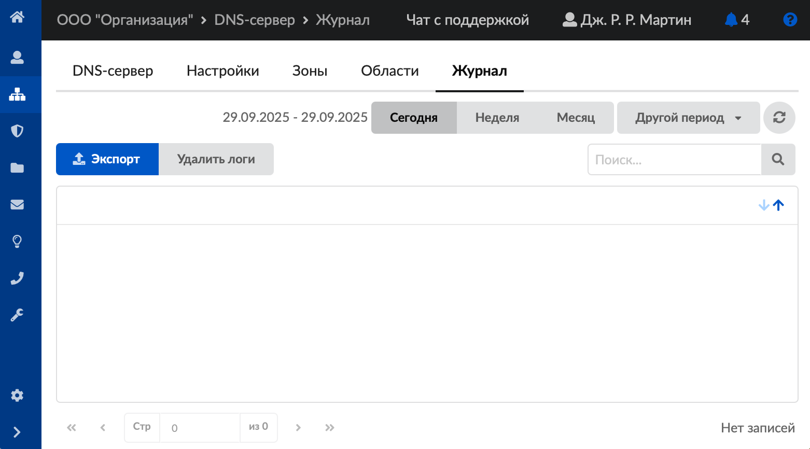

DNS чаще всего используется для получения IP-адреса по имени хоста (компьютера или устройства), получения информации о маршрутизации служб и обслуживающих узлов для протоколов в домене (SRV-запись).

---

DNS обладает иерархической структурой. Каждый сервер, отвечающий за доменное имя или зону, может делегировать ответственность за дальнейшую часть домена другому серверу, что позволяет возложить ответственность за актуальность информации на серверы различных организаций, отвечающих только за свою часть доменного имени.

В ИКС за DNS-сервер отвечает модуль **«DNS»**. Для открытия модуля перейдите в меню **Сеть > DNS**.

В модуле расположены следующие вкладки:

- DNS-сервер
- Настройки
- Зоны
- Области
- Журнал

## DNS-сервер

На данной вкладке отображаются сведения о свободном программном обеспечении bind, которое исполняет функции DNS-сервера в ИКС.

- статус службы (запущен, остановлен, выключен, не настроен);
- кнопка **«Включить»** («Выключить») — позволяет запустить или остановить службу;
- для доступных серверов отображается время, за которое выполняется запрос по протоколу UDP на получение А записей для домена ya.ru;
- журнал последних событий.

## Настройки

Данная вкладка предназначена для настройки DNS-сервера.

1. Если требуется, установите флаг **«Автоматически создавать разрешающее правило»**.
2. Основной внешний параметр DNS-сервера — это список разрешений для **трансфера зон**. По кнопке **«Добавить»** можно внести в список адреса других DNS-серверов, которые имеют право получать записи зон от ИКС.

   Здесь также можно установить флаг **«Автоматически создавать разрешающее правило»**.

   

3. Если в ИКС не создано ни одного провайдера, в данной вкладке можно вписать DNS-серверы, которые будет использовать ИКС. Для этого нажмите кнопку **«Добавить»**.
4. При необходимости установите флаг **«Использовать корневые DNS-серверы, если нет доступных DNS-серверов»**.
5. Нажмите **«Сохранить»**.

## Зоны

На данной вкладке можно создавать DNS-зоны для работы различных служб ИКС, таких как веб-сервер, почтовый сервер и Jabber-сервер.

Существуют следующие **типы DNS-зон**:

- DNS-зона
- Вторичная DNS-зона
- Обратная DNS-зона
- Перенаправление DNS-зоны
- DNS-зона RPZ

## Области

На данной вкладке можно добавлять DNS-области.

## Журнал

На данной вкладке отображается сводка всех системных сообщений модуля с указанием даты и времени.

Журнал является стандартным элементом веб-интерфейса ИКС.
