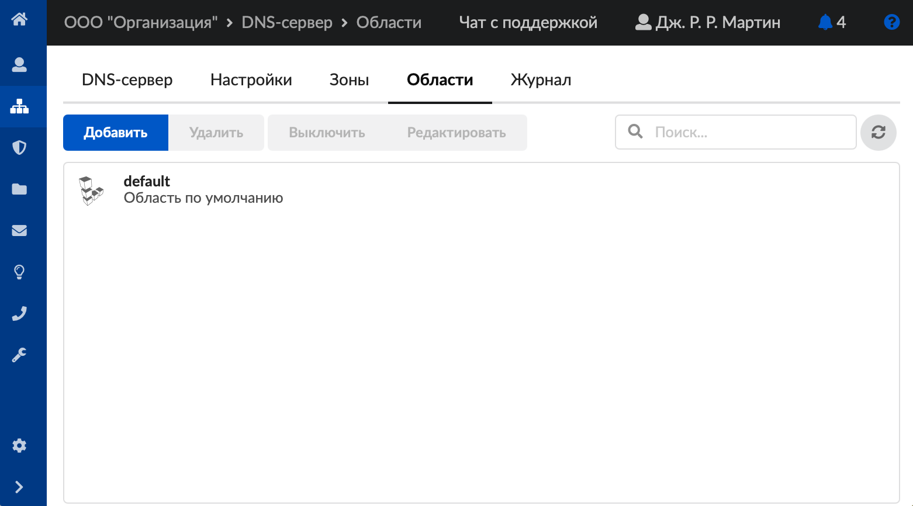
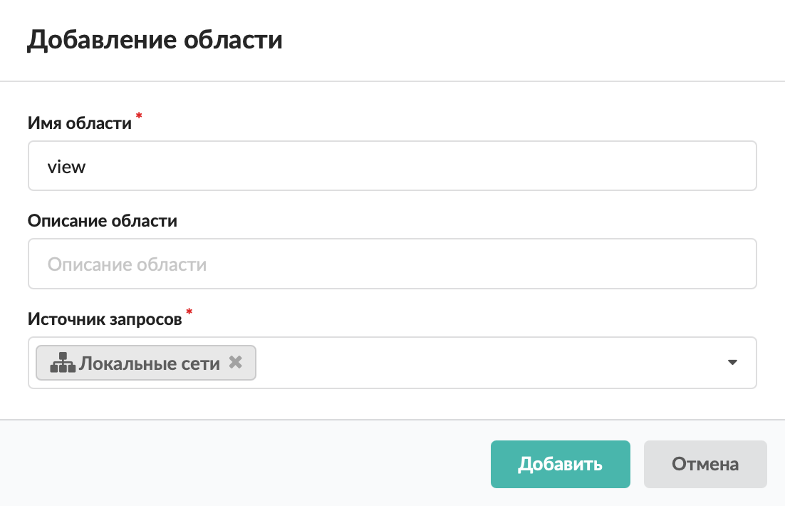

Области предназначены для разделения ответов сервера в зависимости от адреса источника запроса.

---

Области обрабатываются сервером сверху вниз. При совпадении адреса источника запроса с содержимым поля «Источник запросов» данные запроса обрабатываются содержимым только этой области.

Необходимо правильно установить порядок областей, для этого в ИКС предусмотрена возможность перетаскивания областей.

Области содержат зоны. Одна область может содержать зоны только с уникальными именами. Одна зона может входить в состав любого количества областей. Записи зон с повторяющимися именами могут входить в состав только разных областей — это одна зона, разделение выполнено только для корректировки ответов сервера в зависимости от адреса источника запроса. Для дублирования содержимого зоны, с дальнейшей корректировкой записей, отображаемых в другую область, добавлена возможность копирования.

Добавить DNS-область можно в
[меню](https://doc-new.a-real.ru/index.php?article=60)
**Сеть &gt; DNS &gt; Области**. Для этого выполните следующие действия.

1. Нажмите на кнопку **«Добавить»**.
   
2. Укажите **имя области**.
3. При необходимости введите **описание области**.
4. Выберите **источник запросов**.
   
5. Нажмите на кнопку **«Добавить»** — новая область появится в списке.

Каждую область можно редактировать, выключить или удалить.
