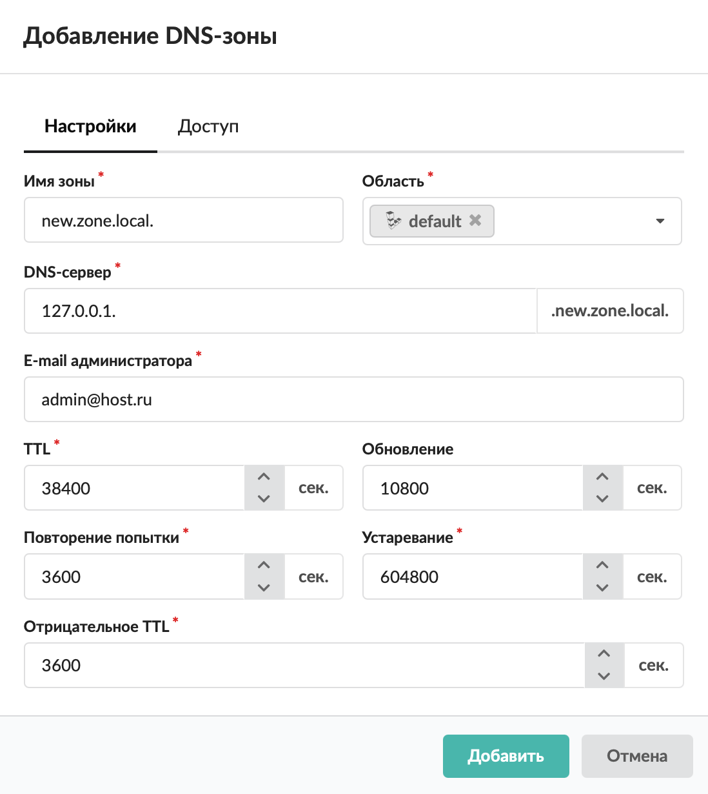
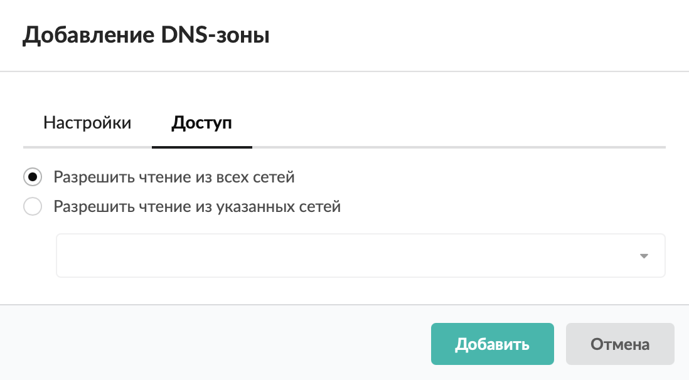

DNS-зона представляет собой файл, в котором описано соответствие хостов домена и их IP-адресов.

---

DNS-зона представляет собой файл, в котором описано соответствие хостов домена и их IP-адресов.

За каждую DNS-зону отвечает не менее двух серверов. Один из них является первичным (primary), остальные — вторичными (secondary). Первичный сервер содержит оригинальные файлы с базой данных DNS для своей зоны. Вторичные серверы получают эти данные по сети от первичного сервера и периодически запрашивают первичный сервер на предмет обновления данных. Если данные на первичном сервере обновлены, вторичный сервер запрашивает «передачу зоны» («zone transfer»), то есть базы данных требуемой зоны. Передача зоны происходит с помощью протокола TCP, порт 53 (в отличие от запросов, которые направляются на UDP/53).

Изменения в базу данных DNS могут быть внесены только на первичном сервере. С точки зрения обслуживания клиентских запросов первичный и вторичные серверы идентичны, все они выдают авторитативные ответы (ответы, которые приходят от серверов, являющихся ответственными за зону).

Рекомендуется, чтобы первичный и вторичные серверы находились в разных сетях. Это нужно для увеличения надежности обработки запросов на случай, если сеть одного из серверов становится недоступной. Серверы DNS не обязаны находиться в том домене, за который они отвечают.

Добавить DNS-зону можно в меню **Сеть > DNS** > **Зоны**. Для этого выполните следующие действия:

1. Нажмите **«Добавить»** и выберите **«Зона > DNS-зона»**.

> ⚠ Внимание! Если вы не являетесь опытным системным администратором, не изменяйте временные параметры, установленные по умолчанию! Данные настройки подходят для подавляющего большинства создаваемых DNS-зон.

2. На вкладке **«Настройки»** можно указать следующие параметры:

   - **имя зоны** — имя домена, за который отвечает данная зона ≠-сервера;
   - **область** — настройка, предназначенная для разделения ответов сервера в зависимости от адреса источника запроса;
   - **DNS-сервер** — имя сервера, который отвечает за данную зону (соответствующая NS-запись появится в списке записей зоны автоматически);
   - **e-mail администратора** — почтовый адрес администратора, который отвечает за данную зону;
   - **TTL** — допустимое время хранения данной ресурсной записи в кеше неответственного DNS-сервера (в секундах);
   - **обновление** — временной интервал, через который вторичный сервер будет проверять необходимость обновления информации (в секундах);
   - **повторение попытки** — временной интервал, через который вторичный сервер будет повторять обращения при неудаче (в секундах);
   - **устаревание** — временной интервал, через который вторичный сервер будет считать имеющуюся у него информацию устаревшей (в секундах);
   - **отрицательное TTL** — значение времени жизни информации на кеширующих серверах (TTL в последующих записях ресурсов).

> ⚠ Внимание! Если вы не являетесь опытным системным администратором, не изменяйте временные параметры, установленные по умолчанию! Данные настройки подходят для подавляющего большинства создаваемых DNS-зон.

3. На вкладке **«Доступ»** определите внешние адреса, имеющие право доступа к информации данной зоны. По умолчанию разрешено чтение из всех сетей.

4. Нажмите **«Добавить»** — новая DNS-зона появится в списке.

После создания DNS-зоны можно перейти к добавлению записей.
