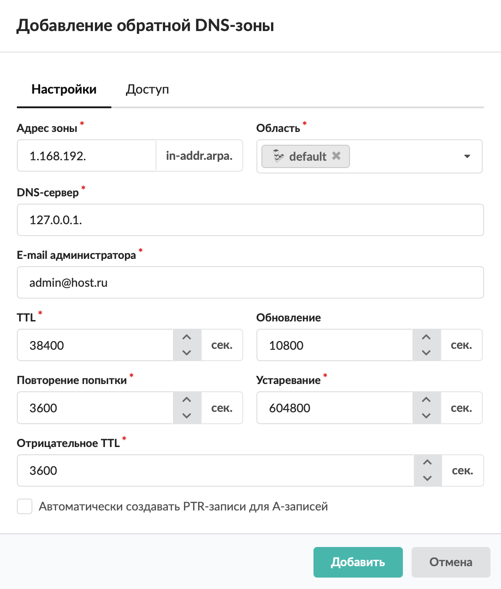
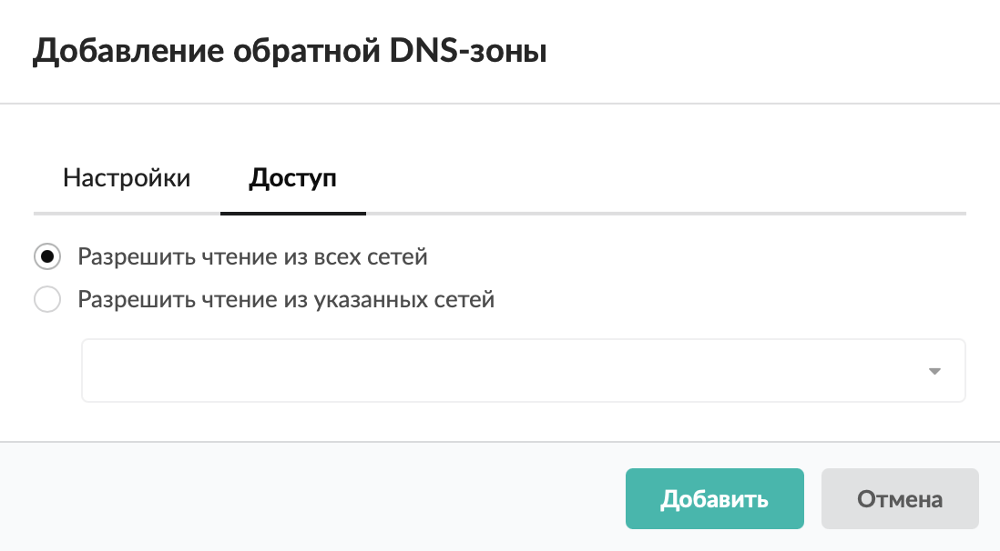

Обратная DNS-зона — специальная доменная зона для определения имени хоста по его IP-адресу с помощью PTR-записи.

---

Обратная DNS-зона — это специальная доменная зона. Она предназначена для определения имени хоста по его IP-адресу с помощью PTR-записи. Адрес хоста AAA.BBB.CCC.DDD транслируется в обратной нотации и превращается в DDD.CCC.BBB.AAA.in-addr.arpa. Благодаря иерархической модели управления именами появляется возможность делегировать управление зоной владельцу диапазона IP-адресов. Для этого в записях авторитативного DNS-сервера указывают, что за зону CCC.BBB.AAA.in-addr.arpa (то есть за сеть AAA.BBB.CCC.DDD/24) отвечает отдельный сервер.

Добавить обратную DNS-зону можно в меню **Сеть > DNS > Зоны**. Для этого выполните следующие действия:

1. Нажмите **«Добавить»** и выберите **«Зона > Обратная DNS-зона»**.

2. На вкладке **«Настройки»** можно указать следующие **параметры**:

- адрес зоны — вводится в формате CCC.BBB.AAA. Это первые три октета подсети AAA.BBB.CCC.DDD/24 (в обратном порядке), в которой располагается домен;
- [область](dnsoblast-2.md) — настройка, предназначенная для разделения ответов сервера в зависимости от адреса источника запроса;
- DNS-сервер — имя сервера, который отвечает за данную зону (соответствующая NS-запись появится в списке записей зоны автоматически);
- e-mail администратора — почтовый адрес администратора, который отвечает за данную зону;
- TTL — допустимое время хранения данной ресурсной записи в кеше неответственного DNS-сервера (в секундах);
- обновление — временной интервал, через который вторичный сервер будет проверять необходимость обновления информации (в секундах);
- повторение попытки — временной интервал, через который вторичный сервер будет повторять обращения при неудаче (в секундах);
- устаревание — временной интервал, через который вторичный сервер будет считать имеющуюся у него информацию устаревшей (в секундах);
- отрицательное TTL — значение времени жизни информации на кеширующих серверах (TTL в последующих записях ресурсов).

> ⚠️ Внимание! Если вы не являетесь опытным системным администратором, не изменяйте временные параметры, установленные по умолчанию! Данные настройки подходят для подавляющего большинства создаваемых DNS-зон.

3. При необходимости установите флаг **«Автоматически создавать PTR-записи для А-записей»**.

4. На вкладке **«Доступ»** определите внешние адреса, имеющие право доступа к информации данной зоны. По умолчанию разрешено чтение из всех сетей.

5. Нажмите **«Добавить»** — обратная DNS-зона появится в списке.

После создания обратной DNS-зоны можно перейти к [добавлению записей](zapisi-dnszony-4.md).
