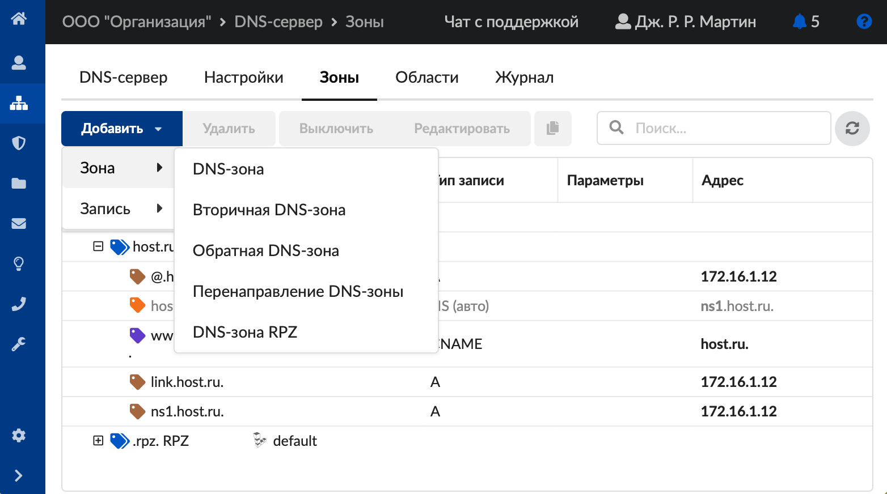
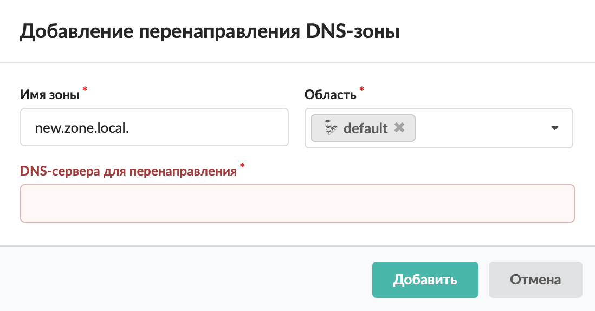

# Перенаправление DNS-зоны

Перенаправление позволяет посылать запросы для данного домена на конкретный DNS-сервер.

---

Добавить перенаправление DNS-зоны можно в меню **Сеть > DNS > Зоны**. Для этого выполните следующие действия:

1. Нажмите **«Добавить»** и выберите **«Зона > Перенаправление DNS-зоны»**.

   

2. В открывшемся окне введите **имя зоны**. Это имя домена, за который отвечает данная зона DNS-сервера.

3. Укажите [область](/index.php?article=437). Это настройка, предназначенная для разделения ответов сервера в зависимости от адреса источника запроса.

4. Укажите **DNS-серверы для перенаправления**.

   

5. Нажмите **«Добавить»** — перенаправление DNS-зоны появится в списке.

---

**Источник:** [Документация ИКС — Перенаправление DNS-зоны](https://doc.a-real.ru/index.php?article=228)
