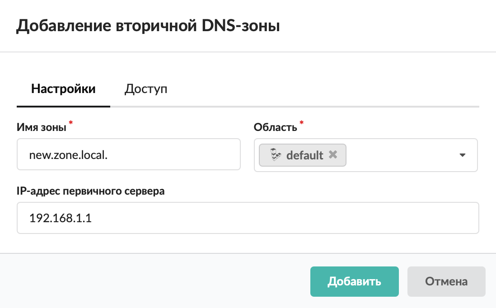
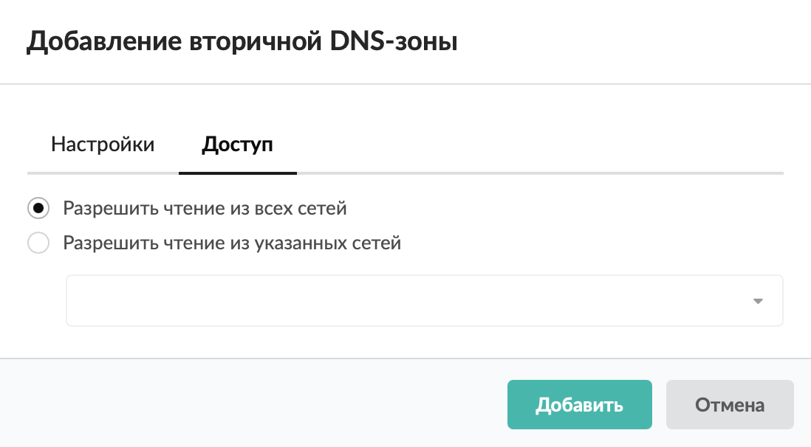

# Вторичная DNS-зона

Вторичная DNS-зона позволяет настроить ИКС в качестве вторичного DNS-сервера для репликации файла зоны с первичного сервера.

---

Вторичный сервер имен поддерживает локальную копию файла зоны [DNS](/index.php?article=24#dns). Для обработки запросов за пределами зоны сервер использует адреса корневых серверов или переадресующий сервер.

Если ИКС выступает в качестве вторичного сервера зоны, добавьте вторичную [DNS-зону](/index.php?article=24#dns-zone) в [меню](/index.php?article=60) **Сеть > DNS > Зоны**. Для этого выполните следующие действия:

1. Нажмите **«Добавить»** и выберите **«Зона > Вторичная DNS-зона»**.

2. На вкладке **«Настройки»** введите **имя зоны**. Это имя домена, за который отвечает данная зона DNS-сервера.

3. Укажите [область](/index.php?article=437). Это настройка, предназначенная для разделения ответов сервера в зависимости от адреса источника запроса.

4. Если требуется, измените [IP-адрес](/index.php?article=24#ip-address) **первичного сервера**, в котором хранится файл зоны. Из данного файла вторичный сервер получает данные.

5. На вкладке **«Доступ»** определите внешние адреса, имеющие право доступа к информации данной зоны. По умолчанию разрешено чтение из всех сетей.

6. Нажмите **«Добавить»** — вторичная DNS-зона появится в списке.

После создания вторичной DNS-зоны можно перейти к [добавлению записей](/index.php?article=229).

---

**Источник:** [Документация ИКС — Вторичная DNS-зона](https://doc.a-real.ru/index.php?article=226)
