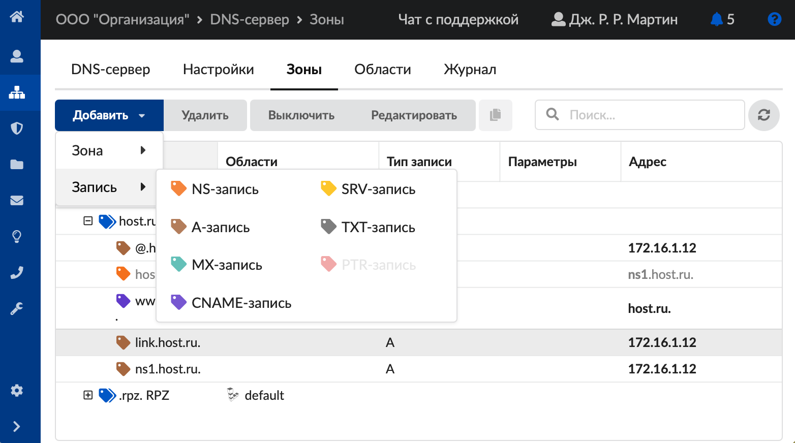
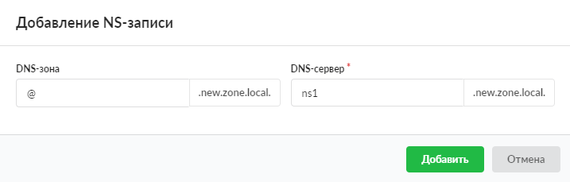
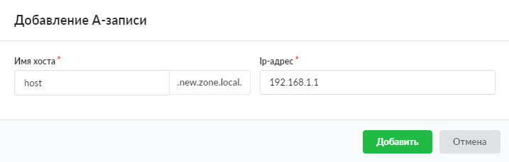
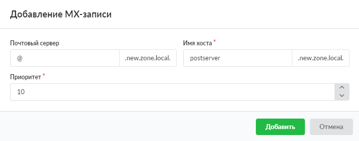
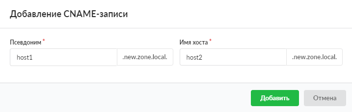
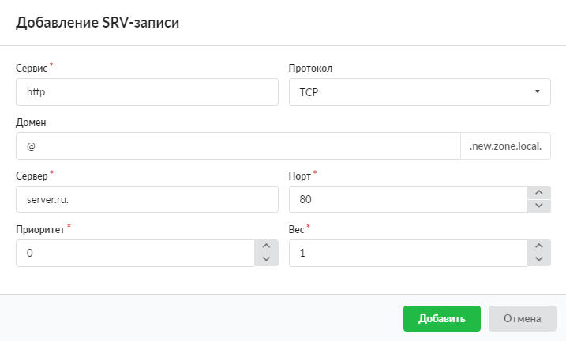
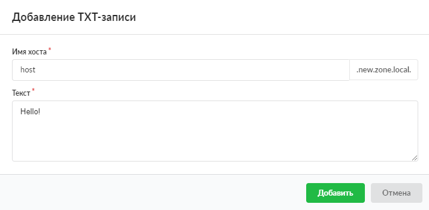
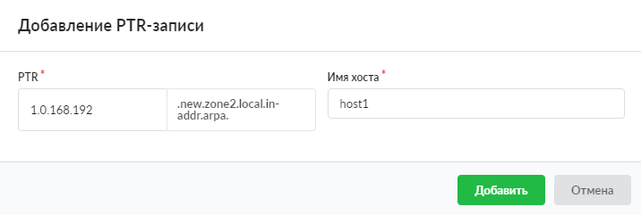

---

Записи DNS-зоны

[DNS](../../o-dokumentacii/slovar-terminov-3.md)-записи домена представляют собой записи в системе доменных имен о соответствии имени и служебной информации о сервере, на которое это имя должно указывать. Каждая такая запись необходима для работы определенной службы. Например, в DNS-запись типа MX вносятся данные для корректной работы электронной почты на домене.

Добавить запись [DNS-зоны](../../o-dokumentacii/slovar-terminov-3.md) можно в [меню](dns-obzor-2.md) **Сеть > DNS > Зоны**. Нажмите **«Добавить > Запись»** и выберите нужный объект.

В ИКС можно добавить следующие типы записей:

- [NS-запись](#ns)
- [A-запись](#a)
- [MX-запись](#mx)
- [CNAME-запись](#cname)
- [SRV-запись](#srv)
- [TXT-запись](#txt)
- [PTR-запись](#ptr)

## NS-запись

Запись NS (name server) указывает на DNS-сервер для данного домена.

При создании записи можно указать следующие **параметры**:

- DNS-зона — домен, за который отвечает данный сервер. Имена доменов следует писать без точки, таким образом к ним прибавляется имя зоны. Чтобы обозначить всю зону целиком, укажите символ «@»;
- DNS-сервер — имя DNS-сервера, который отвечает за домен.

Нажмите **«Добавить»** — созданная запись появится в списке.

## A-запись

Запись A (address record), или запись адреса, связывает имя хоста с [IP-адресом](../../o-dokumentacii/slovar-terminov-3.md).

При создании записи можно указать следующие **параметры**:

- имя хоста — имя хоста в домене. Имена хостов следует писать без точки, таким образом к ним прибавляется имя зоны. Чтобы обозначить домен целиком, укажите символ «@»;
- IP-адрес — IP-адрес сервера, на котором расположен данный хост.

Нажмите **«Добавить»** — созданная запись появится в списке.

## MX-запись

Запись MX (mail exchange), или почтовый обменник, указывает сервер(ы) обмена почтой для данного домена.

При создании записи можно указать следующие **параметры**:

- почтовый сервер — имя почтового сервера в домене. Имена серверов следует писать без точки, таким образом к ним прибавляется имя зоны. Чтобы обозначить домен целиком, укажите символ «@»;
- имя хоста — имя хоста, на котором расположен почтовый сервер;
- приоритет — используется для равномерного распределения нагрузки в случае нескольких почтовых серверов в домене. Более низкое значение показывает более высокий приоритет.

Нажмите **«Добавить»** — созданная запись появится в списке.

## CNAME-запись

Запись CNAME (canonical name record), или каноническая запись имени (псевдоним), используется для перенаправления запроса на другое имя.

При создании записи можно указать следующие **параметры**:

- псевдоним — псевдоним хоста;
- имя хоста — официальное имя хоста в домене.

Нажмите **«Добавить»** — созданная запись появится в списке.

## SRV-запись

Запись SRV (server selection) указывает на серверы для сервисов. Используется, в частности, для [Jabber](../../jabber/sluzhba-jabber-2.md) и [Active Directory](../../o-dokumentacii/slovar-terminov-3.md).

При создании записи можно указать следующие **параметры**:

- сервис — имя сервиса согласно RFC-3232 (IANA Assigned Port Numbers);
- протокол — протокол, по которому предоставляется сервис ([TCP](../../o-dokumentacii/slovar-terminov-3.md), [UDP](../../o-dokumentacii/slovar-terminov-3.md));
- домен — имя домена, на котором расположен данный сервис;
- сервер — доменное имя, услуги по которому предоставляет сервис. Точка в конце обязательна, иначе к имени будет автоматически добавлен домен используемой зоны;
- порт — порт работы сервиса;
- приоритет — используется для равномерного распределения нагрузки в случае нескольких серверов одного вида сервиса в домене. Более низкое значение показывает более высокий приоритет;
- вес — число в диапазоне от 0 до 65535. Учитывается в случае наличия нескольких SRV-записей с одинаковым приоритетом. С помощью данного значения осуществляется балансировка: значение определяет, какая доля запросов направляется на хост.

Нажмите **«Добавить»** — созданная запись появится в списке.

## TXT-запись

Запись TXT содержит текстовые данные любого вида. Применяется редко и специфическим образом.

При создании записи можно указать следующие **параметры**:

- имя хоста — имя хоста, для которого добавляется запись;
- текст — многострочное поле, позволяющее вводить произвольный текст.

Нажмите **«Добавить»** — созданная запись появится в списке.

## PTR-запись

Запись PTR (pointer), или запись указателя, связывает IP хоста с его каноническим именем. Запрос в домене in-addr.arpa на IP хоста в reverse-форме вернет имя (FQDN) данного хоста.

Чтобы уменьшить объем нежелательной корреспонденции (спама), многие серверы-получатели электронной почты могут проверять наличие PTR-записи для хоста, с которого происходит отправка. В этом случае PTR-запись для IP-адреса должна соответствовать имени отправляющего почтового сервера, которым он представляется в процессе [SMTP](../../o-dokumentacii/slovar-terminov-3.md)-сессии.

Данная запись применяется при создании [обратной DNS-зоны](obratnaya-dnszona.md).

При создании записи можно указать следующие **параметры**:

- PTR — IP-адрес хоста в зоне in-addr-arpa;
- имя хоста — имя хоста, расположенного на данном IP-адресе.

Нажмите **«Добавить»** — созданная запись появится в списке.
