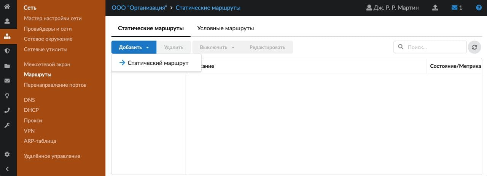
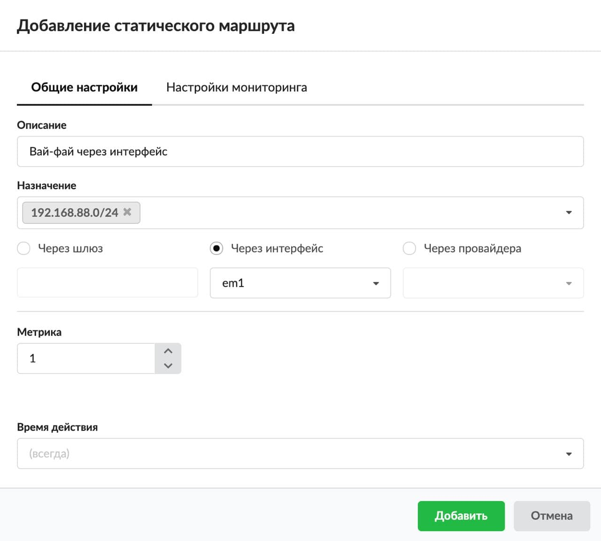
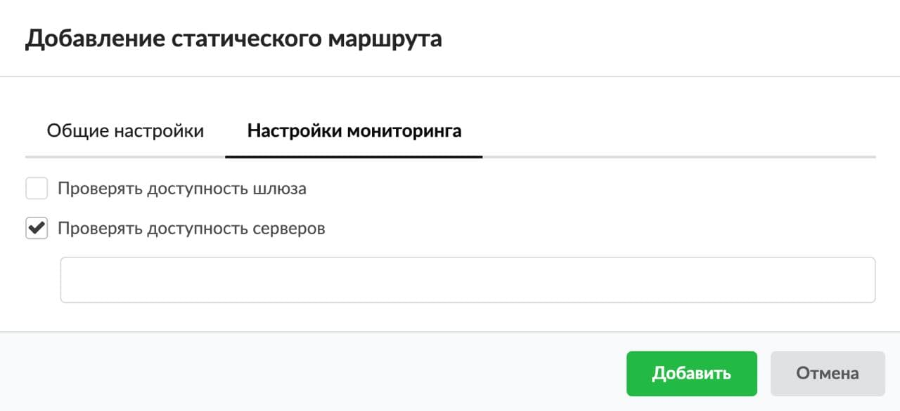
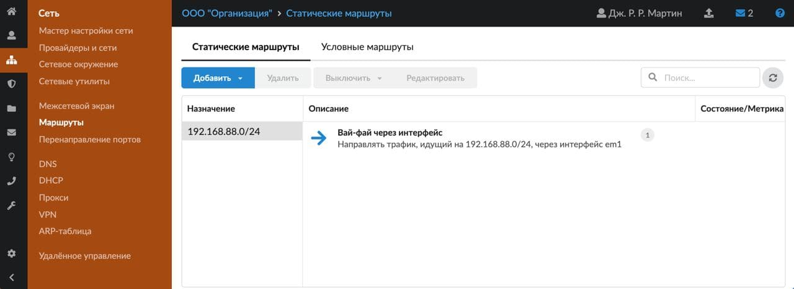
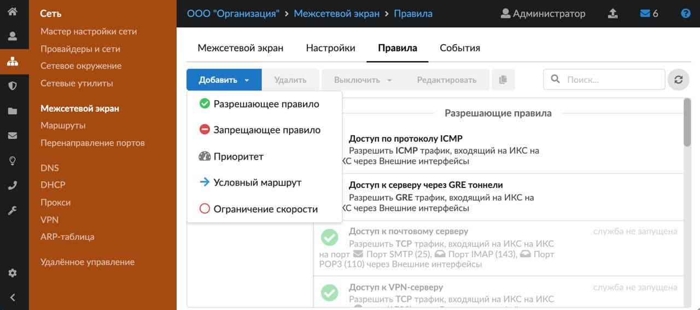
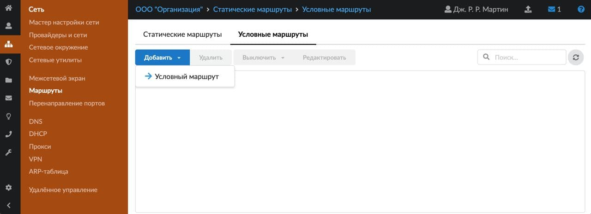
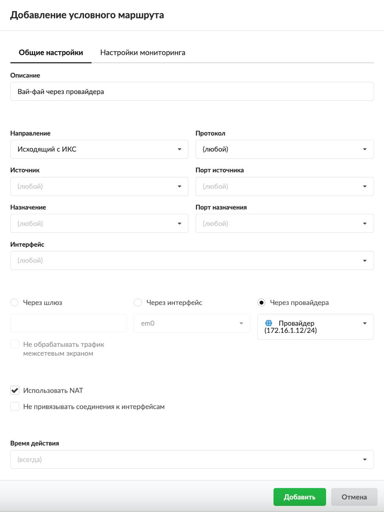
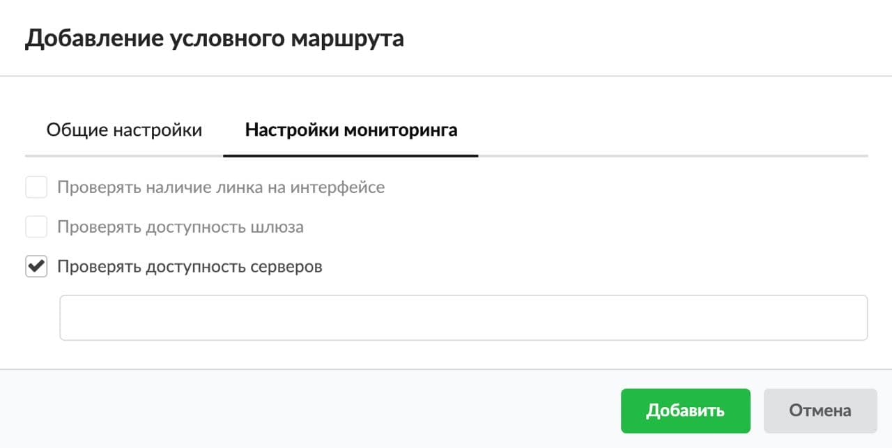
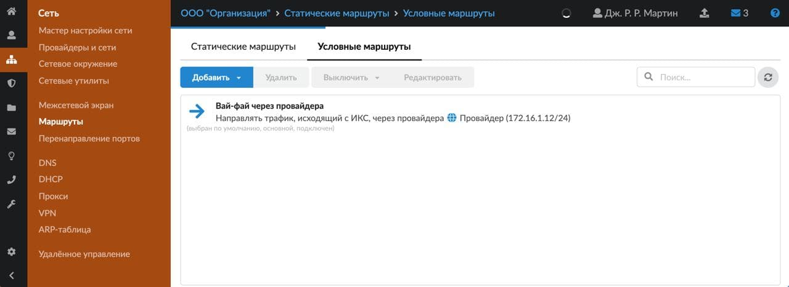

Маршруты необходимы, чтобы задать правила, какой трафик по какому направлению движется.

---

Маршруты создаются по аналогии с [пользовательскими маршрутами](../../polzovateli-i-statistika/polzovatelskie-pravila-dostupa/marshrut-2.md), но могут иметь дополнительные опции: источник, порт источника, интерфейс, флаг «Использовать [NAT](../../o-dokumentacii/slovar-terminov-3.md)».

В ИКС можно добавить следующие маршруты:

- [Статический маршрут](#static)
- [Условный маршрут](#conditional)

## Статический маршрут

Статические маршруты — это наиболее простой способ настройки маршрутизации в общем случае. Именно этими маршрутами проще всего настроить сеть. В них можно указать только назначение и шлюз.

Статические маршруты добавляются в таблицу маршрутизации операционной системы. Если межсетевой экран отключен, статический маршрут продолжит работать.

Для добавления статического маршрута выполните следующие действия.

1. Откройте меню **Сеть &gt; Маршруты &gt; Статические маршруты** и нажмите **Добавить** **&gt; Статический маршрут**:

   

2. На вкладке **«Общие настройки»** можно задать описание и назначение маршрута.

   Таким образом, в ИКС можно маршрутизировать входящий и исходящий трафик и фильтровать его по адресу назначения (пустое поле означает «любой»).

   

   > ⚠ Внимание! Статический маршрут можно создать, только если указать в качестве назначения хост, IP-адрес или сеть.

3. При помощи переключателя установите, через что **направлять сетевой трафик**:
   - через шлюз — правило маршрута через IP-адрес устройства, выполняющего функцию шлюза для заданной сети;
   - через интерфейс — правило маршрута через один из сетевых интерфейсов ИКС (обычно используется для маршрутизации трафика в туннель);
   - через провайдера — правило маршрута через одного из заведенных провайдеров на ИКС.

4. Если требуется, укажите **метрику**. Это числовой показатель, который задает предпочтительность маршрута. Чем ниже данное значение, тем более предпочтителен маршрут.

   > ⚠ Внимание!
   > - По умолчанию выбирается минимальная метрика.
   > - Если установлены опции мониторинга и хотя бы один из мониторингов не прошел проверку, маршрут удаляется из таблицы маршрутизации.

5. Выберите [время действия](https://doc.a-real.ru/index.php?article=196#time) в отдельном окне.

6. Вкладка **«Настройки мониторинга»** позволяет включить и использовать механизмы мониторинга работоспособности созданного маршрута. В зависимости от выбранного в **Шаге 2** правила (через шлюз, интерфейс, провайдер) будут доступны различные механизмы мониторинга маршрута. Их можно выбрать при помощи **флагов**:
   - «Проверять доступность шлюза»;
   - «Проверять доступность серверов».

   

   Не доступные для редактирования механизмы мониторинга в маршрутах не учитываются. Например, если в маршруте выбрано правило для маршрутизации через провайдера, то при удалении провайдера система предложит удалить связанные с ним маршруты.

   > ⚠ Внимание! Маршрут отметится как нерабочий, если будет недоступен хотя бы один хост для мониторинга.

7. Нажмите **«Добавить»** — созданный статический маршрут появится в списке.

   

Если выделить назначение и нажать на кнопку **«Удалить»** либо **«Включить/Выключить»**, будут удалены (включены/выключены) все возможные для удаления, включения и выключения маршруты.

## Условный маршрут (Policy-based Routing)

Условные маршруты необходимы в том случае, если не хватает возможностей статических маршрутов. В них можно указать такие параметры, как источник и порт источника. Условные маршруты можно использовать, например, чтобы часть IP-адресов выходила в сеть Интернет с резервного провайдера, или в других сложных случаях.

Для добавления условного маршрута выполните следующие действия:

1. Откройте окно добавления маршрута одним из способов:
   - в меню **Сеть &gt; Межсетевой экран &gt; Правила** по кнопке **Добавить &gt; Условный маршрут**:

     

   - в меню **Сеть &gt; Маршруты &gt; Условные маршруты** по кнопке **Добавить** **&gt; Условный маршрут**:

     

2. На вкладке **«Общие настройки»** можно задать:
   - описание;
   - направление трафика: входящий на ИКС, исходящий с ИКС, входящий и исходящий;
   - протокол;
   - источник;
   - порт источника;
   - назначение;
   - порт назначения;
   - интерфейс.

   Таким образом, в ИКС можно маршрутизировать входящий и исходящий трафик и фильтровать его по адресу назначения, порту и протоколу (пустое поле означает «любой»).

   

3. При помощи переключателя установите, через что **направлять сетевой трафик**:
   - через шлюз — правило маршрута через IP-адрес устройства, выполняющего функцию шлюза для заданной сети;
   - через интерфейс — правило маршрута через один из сетевых интерфейсов ИКС (обычно используется для маршрутизации трафика в туннель);
   - через провайдера — правило маршрута через одного из заведенных провайдеров на ИКС.

4. Если требуется, установите флаг **«Не обрабатывать трафик межсетевым экраном»**. Тогда ко всему проходящему трафику через ИКС не будут применяться правила межсетевого экрана. Если данный флаг не установлен и через ИКС проходит TCP-трафик, то межсетевой экран при простое 30 секунд разорвет данное соединение.

5. На вкладке можно установить флаг **«Использовать NAT»** (доступен при выборе правила через шлюз).

6. Если установлен флаг **«Не привязывать соединения к интерфейсам»**, то при поверке стейтов в таблице состояний в межсетевом экране не будут учитываться интерфейсы.

7. Выберите [время действия](https://doc.a-real.ru/index.php?article=196#time) в отдельном окне.

8. Вкладка **«Настройки мониторинга»** позволяет включить и использовать механизмы мониторинга работоспособности созданного маршрута. В зависимости от выбранного в **Шаге 2** правила (через шлюз, интерфейс, провайдер) будут доступны различные механизмы мониторинга маршрута. Их можно выбрать при помощи **флагов**:
   - «Проверять наличие линка на интерфейсе»;
   - «Проверять доступность шлюза»;
   - «Проверять доступность серверов».

   

   Не доступные для редактирования механизмы мониторинга в маршрутах не учитываются. Например, если в маршруте выбрано правило для маршрутизации через провайдера, то при удалении провайдера система предложит удалить связанные с ним маршруты.

9. Нажмите **«Добавить»** — созданный условный маршрут появится в списке.

   
