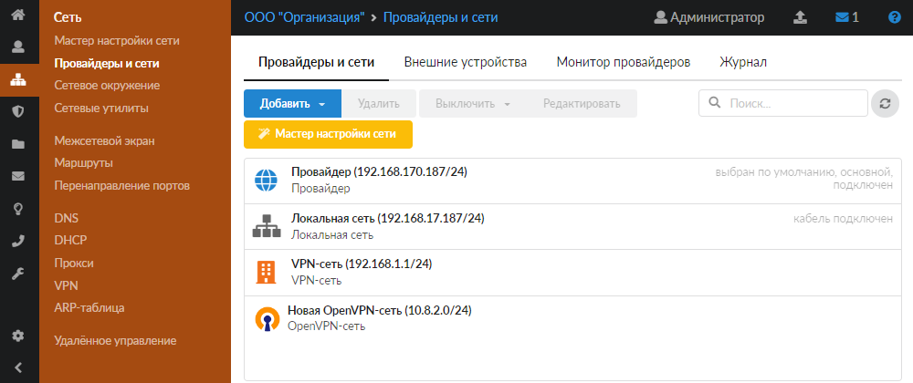
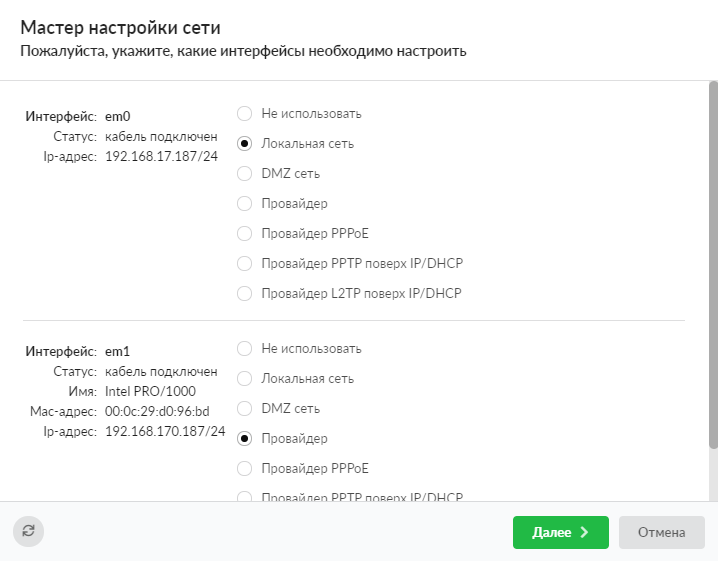
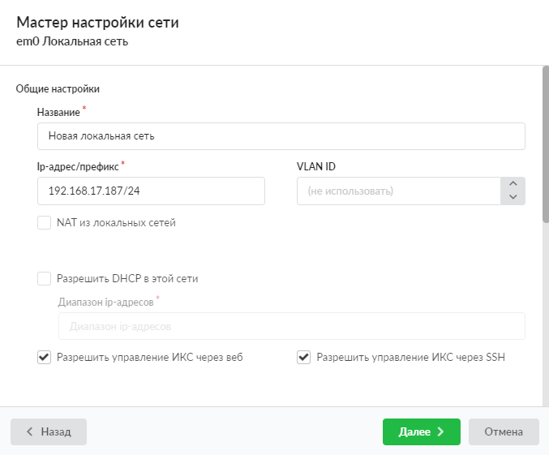
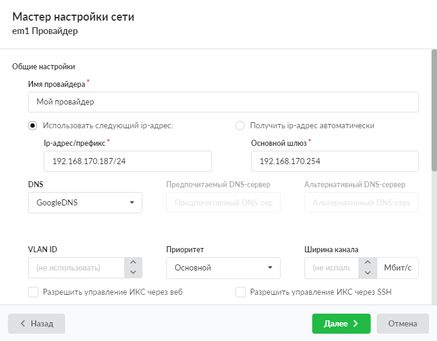
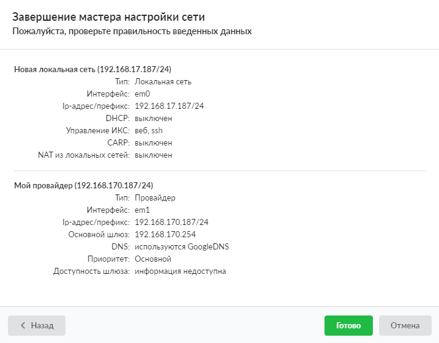

Пошаговая настройка сетевых интерфейсов через мастер настройки сети в веб-интерфейсе межсетевого экрана ИКС.

---

При первом [входе в веб-интерфейс](index.php?article=21) [межсетевой экран](index.php?article=27) имеет статус не настроен. Первичная настройка считается завершенной, когда межсетевой экран приобретет статус запущен. Для этого необходимо, чтобы в модуле «Провайдеры и сети» был создан как минимум один сетевой интерфейс класса «Провайдер» и один — класса «Локальная сеть». Поэтому после прохождения [мастера первоначальной настройки системы](index.php?article=122) рекомендуется сразу запустить **мастер настройки сети** для конфигурации сетевых интерфейсов.

Мастер представляет собой пошаговую настройку сети. Переход к следующему шагу осуществляется кнопкой **«Далее»**, переход к предыдущему шагу — кнопкой **«Назад»**.

1. Перейдите в меню **Сеть > Мастер настройки сети** — мастер запустится автоматически. Также его можно вызвать нажатием кнопки **«Мастер настройки сети»**.

2. В открывшемся окне отображаются все сетевые **интерфейсы** типа Ethernet, которые обнаружены в системе. Для каждого из них укажите тип.

**Возможные типы**:

- не использовать — интерфейс не будет использоваться;

- локальная сеть — внутренний интерфейс сервера. В данной сети будут находиться пользователи;

- провайдер — внешний интерфейс сервера со статическим IP-адресом;

- провайдер PPPoE — внешний интерфейс сервера, который подключается к провайдеру по протоколу PPPoE;

- DMZ-сеть — внутренний интерфейс сервера. В данной сети могут находиться корпоративные серверы с внешними IP-адресами. Такая настройка сети проводится для повышения их безопасности и ограничения уровня доступа к ним при помощи межсетевого экрана;

- провайдер PPTP поверх IP/DHCP — внешний интерфейс сервера, подключающийся к провайдеру по протоколу PPTP. При этом можно выбрать статически сконфигурированный IP-адрес «серой» сети провайдера либо динамический IP-адрес «серой» сети провайдера, получаемый от DHCP-сервера провайдера;

- провайдер L2TP поверх IP/DHCP — внешний интерфейс сервера, подключающийся к провайдеру по протоколу L2TP. При этом можно выбрать статически сконфигурированный IP-адрес «серой» сети провайдера либо динамический IP-адрес «серой» сети провайдера, получаемый от DHCP-сервера провайдера

> ⚠ **Внимание!** Внимание! Такие провайдеры, как 3G и Wi-Fi, требуется настраивать отдельно, поскольку они не выводятся в общем списке интерфейсов мастера.

Чтобы вернуть параметры по умолчанию, нажмите 

3. Введите параметры **локальной сети**. При необходимости можно задать MAC-адрес интерфейса, а также настроить интерфейс на раздачу адресов локальным хостам по протоколу DHCP. Для этого укажите диапазон назначаемых адресов.

> ⚠ **Внимание!** Внимание! В ИКС вместо ввода маски сети в отдельном поле необходимо вводить IP-адрес с префиксом сети в формате IP-адрес/префикс:

**Перевод маски сети в префиксы**

| Маска | Префикс |
| --- | --- |
| 255.255.255.0 | /24 |
| 255.255.255.128 | /25 |
| 255.255.255.192 | /26 |
| 255.255.255.224 | /27 |
| 255.255.255.240 | /28 |
| 255.255.255.248 | /29 |
| 255.255.255.252 | /30 |
| 255.255.255.254 | /31 |
| 255.255.255.255 | /32 |

Также в ИКС можно задавать диапазоны адресов в формате IP-адрес:маска (например, 192.168.17.123:255.255.255.0).

4. Настройте **провайдера**. Для этого в соответствующих полях введите адрес и префикс сети, адрес шлюза и адрес DNS-сервера (одного или двух).

Маску сети для провайдера необходимо вводить аналогично предыдущему шагу: в виде адрес/префикс либо в виде адрес:маска.

Если в сети несколько провайдеров, для каждого из них можно указать [приоритет](index.php?article=55).

Установите флаг **«Разрешить управление ИКС через веб»** в настройках сети, из которой вы планируете подключаться к веб-интерфейсу ИКС.

5. Проверьте правильность всех данных в появившемся окне:

- если все верно, нажмите **«Готово»** — мастер настройки сети применит новую конфигурацию и откроет модуль [сетевых интерфейсов](index.php?article=55);

- если требуется изменить данные, нажмите **«Назад»**, а затем вернитесь к **Шагу 6**.

> ⚠ **Внимание!** Внимание! Если после прохождения мастера настройки сети у вас пропал доступ к веб-интерфейсу, отключите через консоль управления межсетевой экран и убедитесь, что ваша локальная сеть присутствует в поле «Доступ через веб» настроек межсетевого экрана. В нем должны быть перечислены все сети, из которых осуществляется доступ к веб-интерфейсу. Если вы изменяли подсеть локального интерфейса, то при необходимости впишите ее.

Чтобы решить, как лучше интегрировать ИКС в вашу сеть, ознакомьтесь с несколькими стандартными [сценариями установки ИКС](index.php?article=270).

После настройки сети можно приступать к [созданию пользователей](https://doc.a-real.ru/index.php?category=29).
