Межсетевой экран (Firewall) позволяет контролировать движение трафика на уровне IP-адресов и портов, а также поддерживает NAT. Это первый и главный инструмент, защищающий сети предприятия от угроз извне и контролирующий доступ пользователей за пределы сети.

---

Модуль «Межсетевой экран» можно открыть двумя способами:

- в меню **Сеть** > **Межсетевой экран**:

- в меню **Защита** > **Межсетевой экран**:

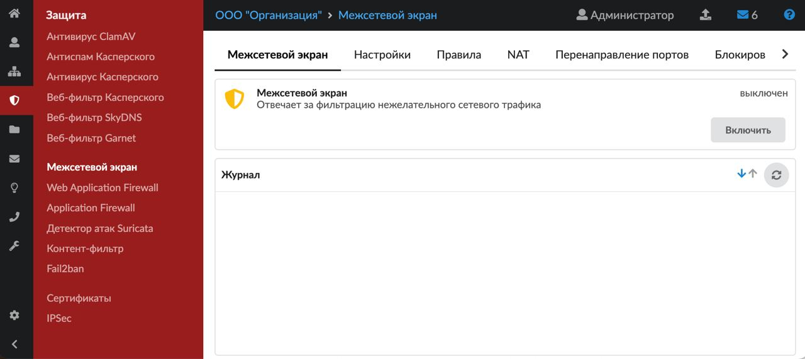

В модуле расположены следующие вкладки:

- [Межсетевой экран](#tab1)
- [Настройки](#tab2)
- [Правила](#tab3)
- [NAT](#tab4)
- [Перенаправление портов](#tab5)
- [Блокировка по геолокации](#tab6)
- [События](#tab7)

## Межсетевой экран

На данной вкладке отображаются:

- статус службы (запущен, остановлен, выключен, не настроен);
- кнопка **«Включить»** («Выключить») — позволяет запустить или остановить службу;
- журнал последних событий.

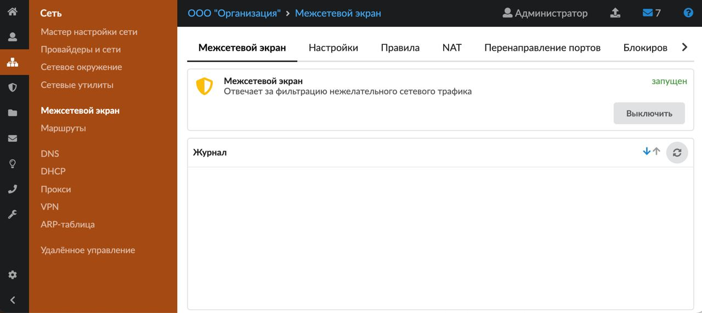

> ⚠ Внимание! Выключать межсетевой экран **не рекомендуется**. Выключая межсетевой экран, вы оставляете сервер без защиты от подключений извне. Кроме того, при включении ИКС именно межсетевой экран генерирует NAT для всех сетей, поэтому, если перезагрузить ИКС с выключенным межсетевым экраном, у всех пользователей пропадет доступ в сеть Интернет.

## Настройки

На данной вкладке можно настроить доступ к ИКС при помощи межсетевого экрана.

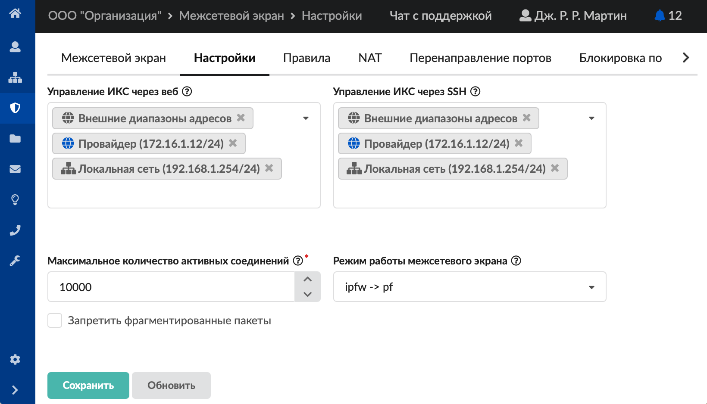

1. Если требуется, укажите:
   - **адреса** и **подсети**, с которых разрешен доступ к управлению ИКС через веб-интерфейс и к серверу ИКС по SSH;
   - **максимальное количество активных соединений** — позволяет ограничить количество подключений к ИКС;
   - **режим работы межсетевого экрана** — позволяет задать порядок запуска служб **ipfw** и **pf**, на которых основывается работа межсетевого экрана ИКС. Вариант `ipfw -> pf` является рекомендованным и выставлен по умолчанию, но может препятствовать корректной работе правил, ограничивающих скорость, а также VPN. В таком случае можно изменить режим на `pf -> ipfw`.
2. При необходимости установите флаг **«Запретить фрагментированные пакеты»**.
3. Нажмите **«Сохранить»**.

## Правила

На данной вкладке происходит основная настройка доступа.

Слева расположен список всех интерфейсов ИКС в виде дерева, справа — список правил. При нажатии на интерфейс будут показаны только те правила, которые относятся к данному интерфейсу.

Здесь можно настроить следующие **правила**:

- [разрешающие](razreshayuschee-pravilo-mezhsetevogo-ekrana-2.md) — разрешают доступ;
- [запрещающие](zapreschayuschee-pravilo-mezhsetevogo-ekrana-2.md) — запрещают, ограничивают доступ;
- [приоритеты](prioritet-mezhsetevogo-ekrana-2.md) — определяют, какой трафик будет обрабатываться в первую очередь (например, телефония), а какой — в последнюю (например, e-mail);
- [ограничения скорости](ogranichenie-skorosti-mezhsetevym-ekranom.md) — позволяют задать максимальную скорость для определенных соединений.

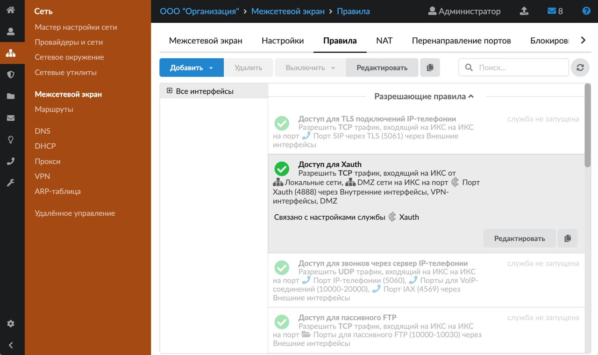

По умолчанию в ИКС всегда есть общее запрещающее правило для всего трафика. Это самая популярная политика безопасности в мире: «все, что не разрешено — запрещено».

Разрешающие правила в ИКС всегда приоритетнее запрещающих и используются для того, чтобы открывать доступ только к определенным службам. При установке в ИКС автоматически создаются разрешающие правила для самых популярных служб. Программа предоставляет возможность управлять этими правилами на свое усмотрение (оставить, удалить, модифицировать).

Для того чтобы **скопировать** созданное правило межсетевого экрана, нажмите на него в списке, а затем — на кнопку .

> ⚠ Внимание! Выключение межсетевого экрана оставит работающими только правила NAT. Все правила, ограничивающие доступ извне, будут отключены, что может негативно сказаться на безопасности системы. Отключайте межсетевой экран только при крайней необходимости.

> ⚠ Внимание! После перезагрузки системы с выключенным межсетевым экраном список правил pf, в том числе и правила NAT, будет полностью очищен и пользователи потеряют доступ во внешнюю сеть по всем протоколам, кроме HTTP.

## NAT

На данной вкладке можно добавить и настроить правила NAT.

NAT — это механизм, позволяющий преобразовывать IP-адреса транзитных пакетов.

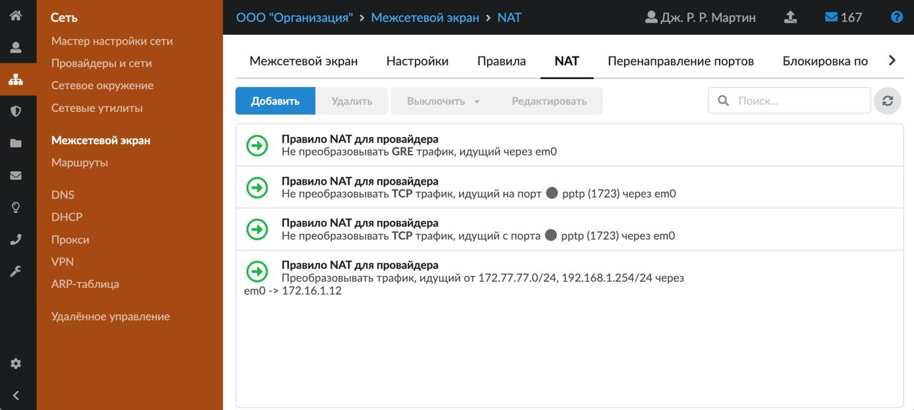

Для добавления правила NAT выполните следующие действия:

1. Нажмите **«Добавить»**.
2. Введите **название** правила.
3. Укажите **протокол** и **интерфейс**.
4. Выберите **источник** и **порт источника**, **назначение** и **порт назначения**.

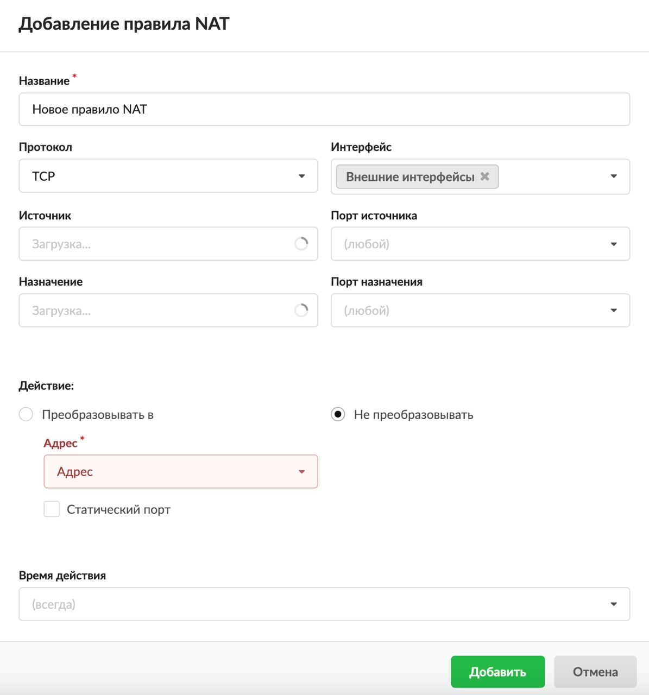

5. Выберите **действие**, которое необходимо выполнять согласно правилу:
   - Преобразовывать в (дополнительно следует выбрать адрес, которым будет заменяться IP-адрес пакета, попавшего под данное правило NAT; если установить флаг **«Статический порт»**, то номера портов источника останутся неизменными);
   - Не преобразовывать (будет создано правило исключения из трансляции при помощи ключевого слова `no`).
6. Выберите **время действия**. Это один из стандартных [элементов](../../vebinterfeys-iks/standartnye-elementy-vebinterfeysa.md) веб-интерфейса ИКС.
7. Нажмите **«Добавить»** — созданное правило NAT появится в списке.

В результате настроек, представленных в примере ниже, весь трафик, идущий из сети 10.8.0.0/24 в сеть 192.168.1.0/24, будет преобразован в адрес 192.168.1.1.

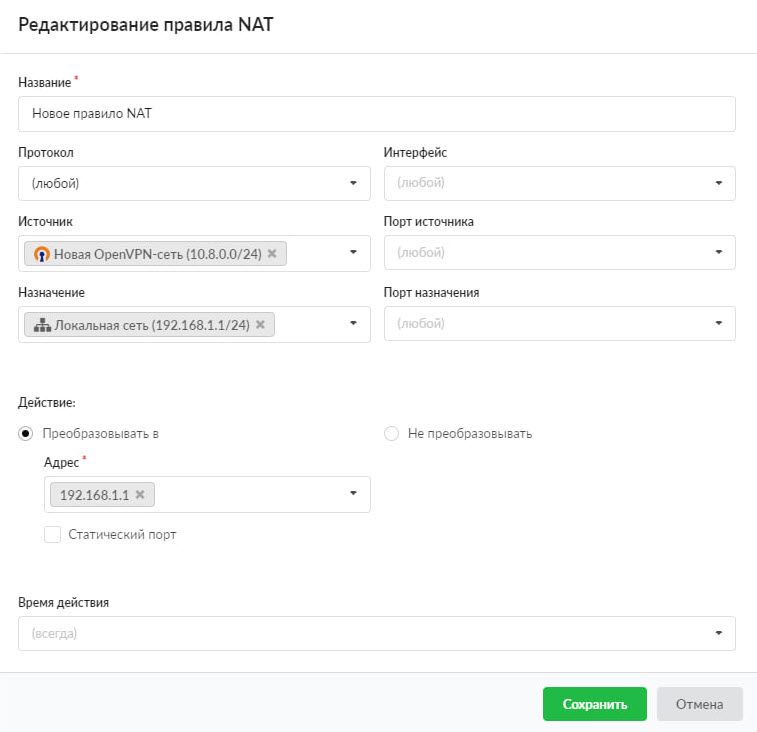

> ⚠ Внимание! Правила NAT (кроме правил NAT для перенаправлений портов) можно перемещать в списке — они соответственно будут перемещены в конфигурационном файле межсетевого экрана.

> ⚠ Внимание! Правила NAT применяются сверху вниз в том порядке, в котором они расположены на вкладке. Выполняется всегда только первое правило, для которого совпали условия, указанные в правиле. Таким образом, чем выше правило в списке, тем оно приоритетнее.

## Перенаправление портов

Перенаправление портов предназначено для того, чтобы снаружи организовать доступ к компьютеру, находящемуся в локальной сети: для подключения к Windows-серверу по RDP, для подключения к локальному веб-серверу и т. д.

На данной вкладке можно управлять перенаправлениями портов (добавлять, редактировать, удалять, выключать) при помощи соответствующих функциональных кнопок.

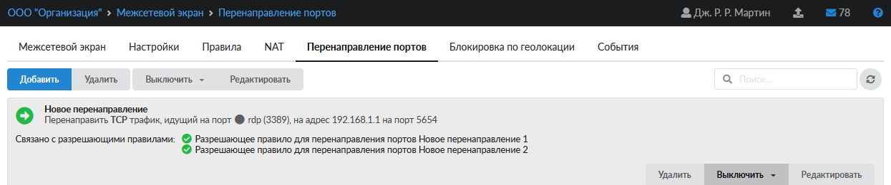

Для добавления перенаправления выполните следующие действия:

1. Нажмите **«Добавить»**.
2. Введите **название** перенаправления.
3. Укажите **порт перенаправления** — порт, который будет открыт на сервере и к которому будут подключаться компьютеры из внешней сети.
4. Выберите **протокол**.

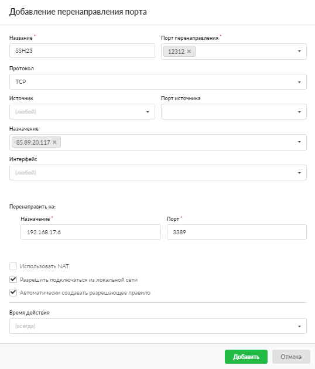

5. Укажите **источник** и **порт источника**.
6. Укажите **порт** и **хост назначения** — порт и адрес компьютера, к которому необходимо организовать доступ.

> ⚠ Внимание! IP-адрес хоста, на который организовывается проброс порта, должен быть назначен какому-либо пользователю ИКС.

В программе есть возможность перенаправлять диапазоны портов. Для этого введите номера портов через дефис (например, `10000-10100`).

7. При необходимости можно указать **интерфейс** (группу интерфейсов), на котором будет реализовано перенаправление портов.
8. Установите флаг **«Использовать NAT»**, если для хоста, на который перенаправляется запрос, ИКС не является шлюзом по умолчанию.
9. Установите флаг **«Разрешить подключаться из локальной сети»**, если требуется, чтобы устройства локальной сети при обращении на перенаправленный порт попадали на хост назначения.

> ⚠ Внимание! При этом локальные соединения будут проходить через NAT и хост назначения увидит эти подключения как инициированные ИКС.

10. При необходимости установите флаг **«Автоматически создавать разрешающее правило»**. Тогда в межсетевом экране автоматически будет создано правило, разрешающее подключение на данное перенаправление. Если требуется настроить доступ индивидуальным образом, добавьте вручную [разрешающее правило](../../polzovateli-i-statistika/polzovatelskie-pravila-dostupa/razreshayuschee-pravilo-2.md) и укажите в нем порт назначения и порт перенаправления через запятую (поле «Порт назначения»). Остальные поля заполняются в зависимости от уровня доступа, который нужно настроить.

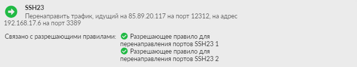

11. Выберите **время действия**. Это один из стандартных [элементов](../../vebinterfeys-iks/standartnye-elementy-vebinterfeysa.md) веб-интерфейса ИКС.
12. Нажмите **«Добавить»** — созданное перенаправление появится в списке.

Для того чтобы отключить перенаправление портов, нажмите кнопку **«Выключить»** и выберите период.

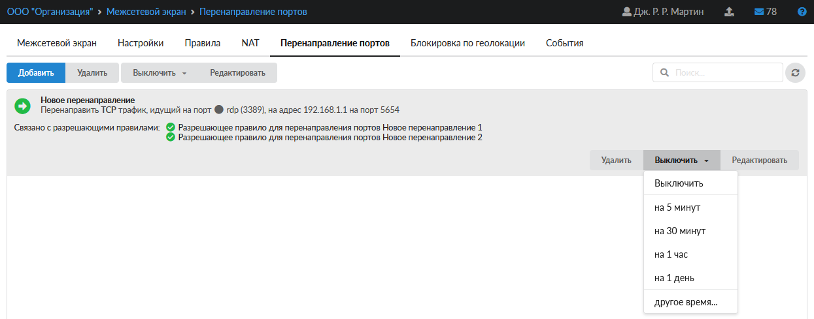

## Блокировка по геолокации

На данной вкладке можно настроить блокировку по геолокации.

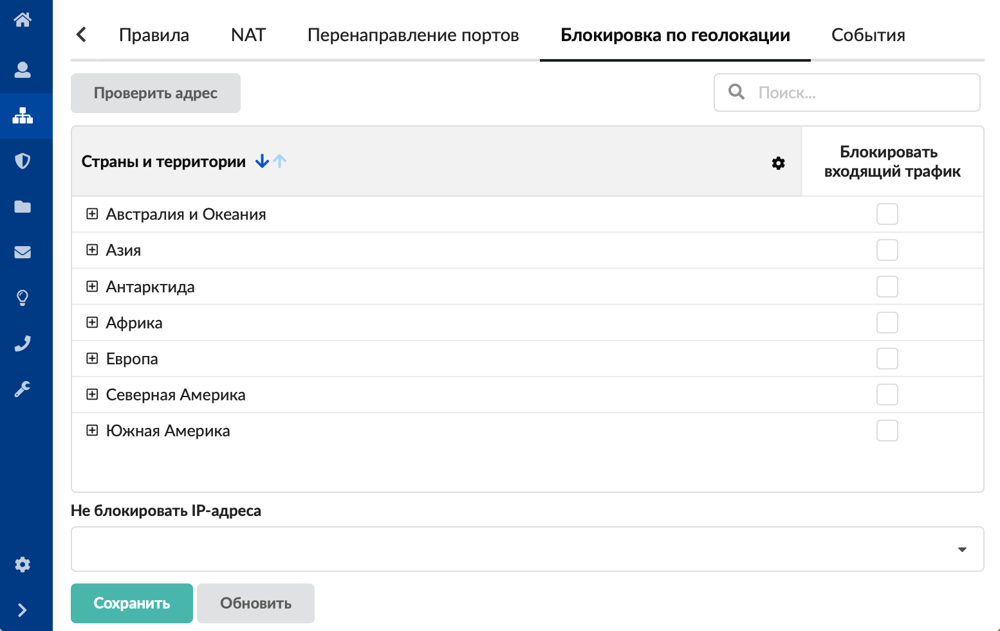

В таблице можно выбрать, какой входящий трафик блокировать. Для этого установите флаг напротив континента либо конкретных стран.

При выборе страны или части света межсетевым экраном блокируется входящий трафик с IP-адресов данной страны (стран).

При нажатии на кнопку **«Проверить адрес»** откроется окно, в котором можно проверить, к какой стране относится IP-адрес или хост.

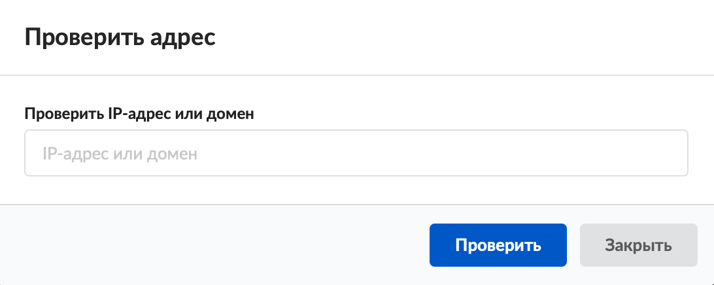

Также на вкладке предусмотрена возможность указать исключения в поле **«Не блокировать IP-адреса»**.

> ⚠ Внимание! Из блокировок по геолокации автоматически исключаются следующие объекты, созданные на ИКС: [локальная сеть](../provaydery-i-seti/lokalnaya-set-2.md), [VPN-сеть](../provaydery-i-seti/vpnset-2.md), [SSTP-сеть](../provaydery-i-seti/sstpset-2.md), [Wireguard-сеть](../provaydery-i-seti/wireguardset-2.md), [OpenVPN-сеть](../provaydery-i-seti/openvpnset-2.md), [внутренняя сеть](../provaydery-i-seti/vnutrennyaya-set-2.md). Также в исключения попадают сети из [констант](../../konstanty/konstanty-obzor-3.md), прописанные в net.nat_networks.

Для применения изменений нажмите кнопку **«Сохранить»**.

База данных блокировки по геолокации обновляется раз в месяц.

## События

На данной вкладке расположен журнал событий межсетевого экрана.

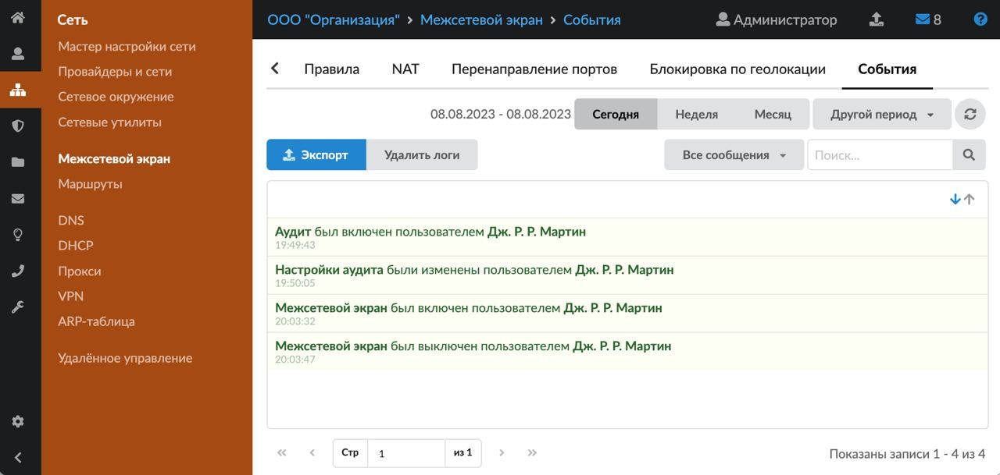

[Журнал](../../vebinterfeys-iks/standartnye-elementy-vebinterfeysa.md) является стандартным элементом веб-интерфейса ИКС.
