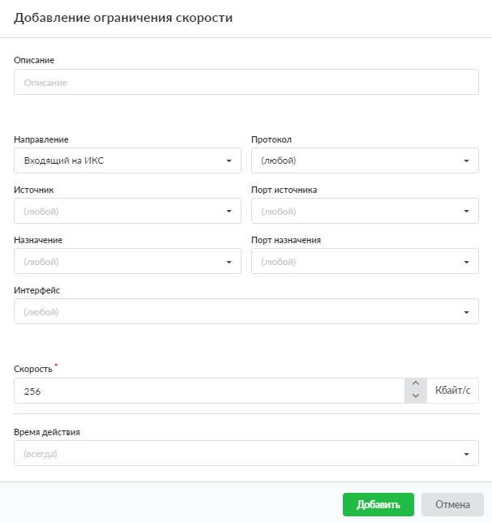

Данное правило устанавливает максимально допустимую скорость передачи данных. Это полезно, например, если интернет-провайдер предоставляет недостаточно широкий интернет-канал или требуется ограничить скорость доступа пользователя к второстепенным сетевым ресурсам.

Добавить ограничение скорости можно в меню **Сеть &gt; Межсетевой экран &gt; Правила**.

1. Нажмите **«Добавить»** и выберите **«Ограничение скорости»** — откроется окно добавления правила.

2. Если требуется, введите **описание**.

3. В раскрывающихся **списках** можно выбрать:
    - направление трафика: входящий на ИКС, исходящий с ИКС, входящий и исходящий;
    - протокол;
    - источник;
    - порт источника;
    - назначение;
    - порт назначения;
    - интерфейс.

    В ИКС можно маршрутизировать входящий и исходящий трафик и фильтровать его по перечисленным параметрам. Если поле оставить пустым, по умолчанию у него будет стоять значение «любой» (например, любой порт, любой источник).

    В полях «Источник» и «Назначение» с версии 12.3 появилась возможность добавить исключения. Исключение начинается с символа «!», например: `!5.5.5.5, !5.5.5.0/30, !5.5.5.5-5.5.5.9, !5.5.5.0:255.255.255.252, !ya.ru, !россия.рф`. Если в поле указаны одни исключения, они применяются ко всему диапазону адресов. Исключения всегда имеют приоритет над любыми записями в поле.

4. Укажите максимально допустимую **скорость** передачи данных (в Кбайт/с).

5. Выберите [время действия](../../vebinterfeys-iks/standartnye-elementy-vebinterfeysa.md) в отдельном окне.

6. Нажмите **«Добавить»** — созданное правило отобразится на вкладке.

**Полезно знать**

При использовании явного прокси исходящая скорость не ограничивается, однако есть [обходной путь](https://doc.a-real.ru/index.php?article=235).
