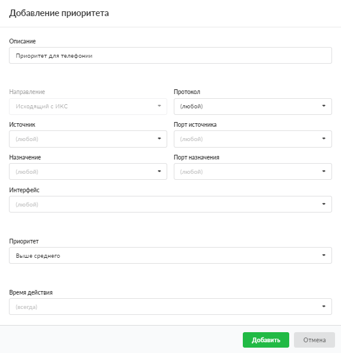

Добавление приоритета даёт возможность обеспечить определённому трафику больший или меньший приоритет. Такая функция, например, часто используется для телефонии, если интернет-соединение нестабильно: телефонии выставляется более высокий приоритет — её трафик обрабатывается в первую очередь.

---

Добавить приоритет можно в меню **Сеть > Межсетевой экран > Правила**.

1. Нажмите **«Добавить»** и выберите **«Приоритет»** — откроется окно добавления правила.
2. В качестве приоритетного **трафика** можно задать:

   - протокол;
   - источник;
   - порт источника;
   - назначение;
   - порт назначения;
   - интерфейс.

   Ни одно поле не является обязательным. Если оставить поле пустым, оно автоматически принимает значение «любой».

Начиная с версии ИКС 10.0.0 предусмотрена возможность добавлять **исключения IP-адресов** в поля «Источник» и «Назначение». Чтобы исключить из диапазона или сети какой-либо IP-адрес, необходимо указать перед ним символ «!». В версии 10.0.0 этот функционал реализован только с единичными адресами, то есть нельзя исключить целую сеть или диапазон адресов.

3. Выберите **приоритет**: высокий, выше среднего, средний, ниже среднего, низкий.
4. Выберите [время действия](../../vebinterfeys-iks/standartnye-elementy-vebinterfeysa.md) в отдельном окне.
5. Нажмите **«Добавить»** — созданное правило отобразится на вкладке.
