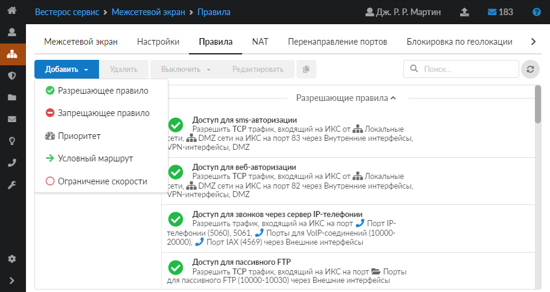
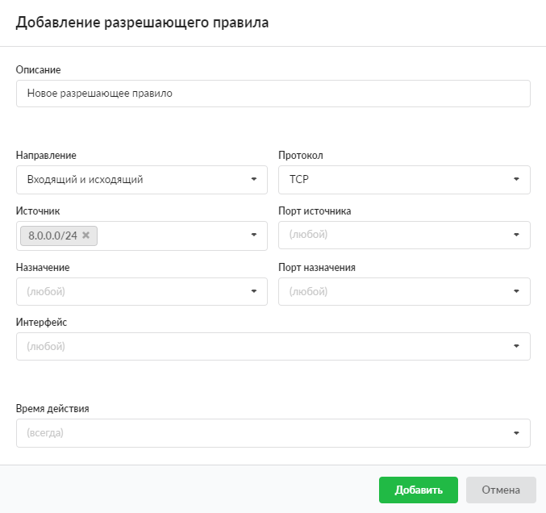

# Разрешающее правило межсетевого экрана

Разрешающее правило нужно для того, чтобы открыть доступ к какому-либо сетевому ресурсу по порту, IP-адресу или протоколу из внешней сети.

Добавить разрешающее правило можно в меню **Сеть → Межсетевой экран → Правила**.

1. Нажмите **«Добавить»** и выберите **«Разрешающее правило»** — откроется окно добавления правила.
2. Если требуется, введите **описание**.
3. В раскрывающихся **списках** можно выбрать:

   - направление трафика: входящий на ИКС, исходящий с ИКС, входящий и исходящий;
   - протокол;
   - источник;
   - порт источника;
   - назначение;
   - порт назначения;
   - интерфейс.

   В ИКС можно маршрутизировать входящий и исходящий трафик и фильтровать его по перечисленным параметрам. Если поле оставить пустым, по умолчанию у него будет стоять значение «любой» (например, любой порт, любой источник).

   Поэтому если сохранить разрешающее правило по умолчанию (все поля со значением «любой») и применить его к пользователю (группе), то **межсетевой экран разрешит все коммуникации пользователя (группы) через ИКС**.

   Например, чтобы разрешить движение HTTP/HTTPS-трафика, добавьте разрешающее правило для портов 80 и 443.

4. Выберите **время действия** в отдельном окне.
5. Нажмите **«Добавить»** — созданное правило отобразится на вкладке.

Начиная с версии ИКС 10.0.0 предусмотрена возможность добавлять **исключения IP-адресов** в поля «Источник» и «Назначение». Чтобы исключить из диапазона или сети какой-либо IP-адрес, необходимо указать перед ним символ «!». В версии 10.0.0 этот функционал реализован только с единичными адресами, то есть нельзя исключить целую сеть или диапазон адресов.

---

**Источник:** [Документация ИКС — Разрешающее правило межсетевого экрана](https://doc.a-real.ru/index.php?article=206)
