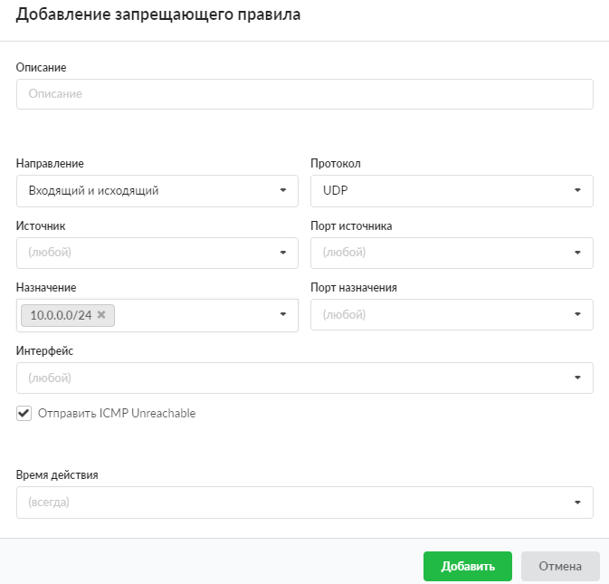

Запрещающее правило нужно для того, чтобы запретить доступ к какому-либо сервису из внешней или внутренней сети по IP-адресу, протоколу или порту.

---

Добавить запрещающее правило можно в меню **Сеть > Межсетевой экран > Правила**.

1. Нажмите **«Добавить»** и выберите **«Запрещающее правило»** — откроется окно добавления правила.
2. Если требуется, введите **описание**.
3. В раскрывающихся **списках** можно выбрать:
   - направление трафика: входящий на ИКС, исходящий с ИКС, входящий и исходящий;
   - протокол;
   - источник;
   - порт источника;
   - назначение;
   - порт назначения;
   - интерфейс.

В ИКС можно маршрутизировать входящий и исходящий трафик и фильтровать его по перечисленным параметрам. Если поле оставить пустым, по умолчанию у него будет стоять значение «любой» (например, любой порт, любой источник).

Поэтому если сохранить запрещающее правило по умолчанию (все поля со значением «любой») и применить его к пользователю (группе), то **межсетевой экран полностью заблокирует все коммуникации пользователя (группы) через ИКС**.

Начиная с версии ИКС 10.0.0 предусмотрена возможность добавлять **исключения IP-адресов** в поля **«Источник»** и **«Назначение»**. Чтобы исключить из диапазона или сети какой-либо IP-адрес, необходимо указать перед ним символ «!». В версии 10.0.0 этот функционал реализован только с единичными адресами, то есть нельзя исключить целую сеть или диапазон адресов.

В версии ИКС 10.0.0 добавлен автоматический принудительный разрыв соединений пользователя, которые соответствуют адресам в запрещающем правиле. Это действует при добавлении (редактировании) запрещающих правил, связанных с этим пользователем, а также при выключении пользователя (или группы с пользователем).

4. При необходимости установите флаг **«Отправить ICMP Unreachable»**. Тогда при попытке одной стороны выполнить команду [ping](../setevye-utility-2.md) другой стороны отправится данное сообщение и [ICMP](../../o-dokumentacii/slovar-terminov-3.md)-пакет будет заблокирован.
5. Выберите [время действия](https://doc.a-real.ru/index.php?article=196#time) в отдельном окне.
6. Нажмите **«Добавить»** — созданное правило отобразится на вкладке.

Чтобы создать исключение для запрещающего правила, используйте [разрешающее правило](razreshayuschee-pravilo-mezhsetevogo-ekrana-2.md).
