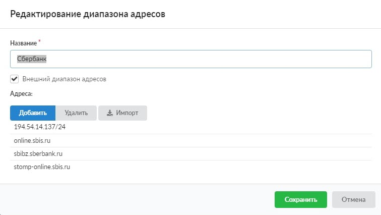
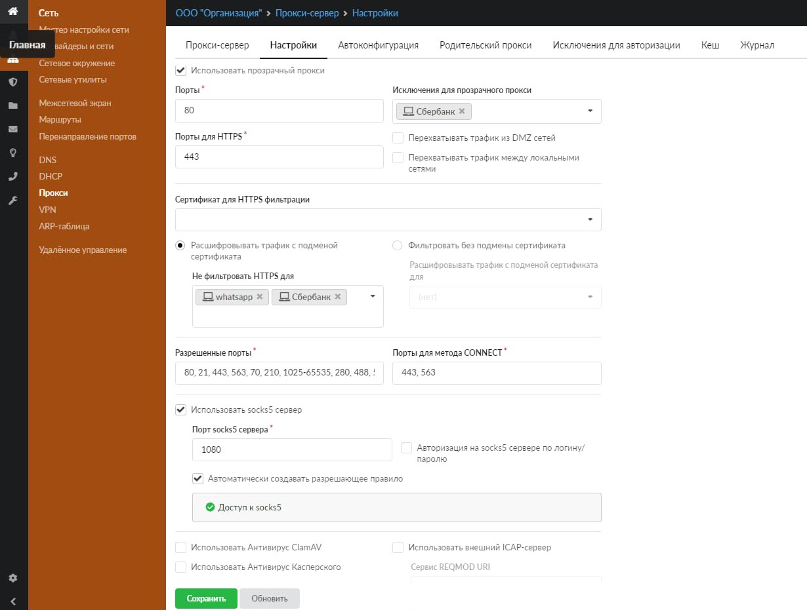

Добавление большого количества адресов в исключения «Не фильтровать HTTPS для» или в «Исключения для прозрачного прокси» может приводить к подвисанию страницы и долгому применению вносимых изменений. В этом случае корректнее использовать внешние диапазоны адресов. Для этого выполните следующие действия:

---

1. Перейдите в меню **«Пользователи и Статистика > Диапазоны адресов»**.

2. Создайте [внешний диапазон адресов](../../polzovateli-i-statistika/diapazony-adresov.md).

   

3. Теперь можно добавить созданный диапазон в исключение в [настройках прокси](proksi-obzor.md).

   
