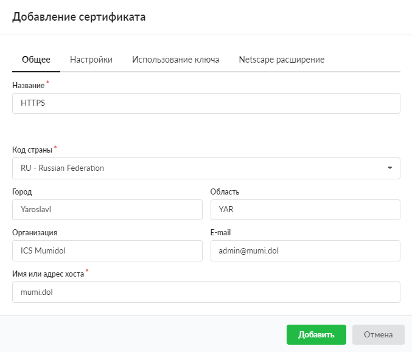
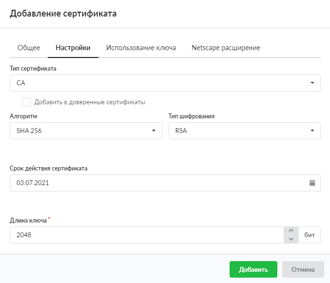
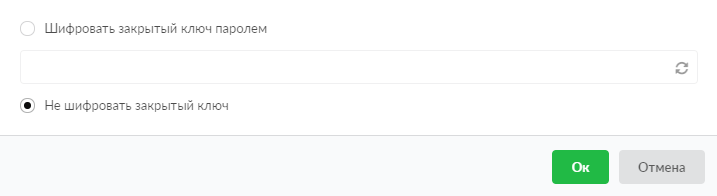

Для того чтобы получить возможность через прокси-сервер фильтровать HTTPS-трафик пользователей, выполните следующие действия:

---

1. Перейдите в меню **Защита &gt; Сертификаты**.

2. Добавьте корневой сертификат (СА) со стандартными настройками.

   

   Установите **срок действия** сертификата более чем 1 год (по умолчанию). Тогда сертификат будет работать длительное время и не возникнет необходимости менять его на конечных пользователях. Остальные параметры сертификата оставьте по умолчанию.

   

3. Нажмите **«Добавить»** и в появившемся окне укажите **«Не шифровать закрытый ключ»**.

   

4. Перейдите в меню **Сеть &gt; Прокси &gt; Настройки**.

5. Выберите созданный сертификат в поле **«Сертификат для HTTPS фильтрации»**.

   

6. Выберите режим работы фильтрации.

7. Нажмите **«Сохранить»**.
