Прокси-сервер — это служба, позволяющая клиентам выполнять косвенные запросы к другим сетевым службам. Работает по следующему принципу:

---

**Прокси-сервер** — это служба, позволяющая клиентам выполнять косвенные запросы к другим сетевым службам. Работает по следующему принципу:

- Клиент подключается к прокси-серверу и запрашивает какой-либо веб-ресурс, расположенный на другом сервере.
- Прокси-сервер либо подключается к указанному серверу и получает ресурс у него, либо возвращает ресурс из собственного [кеша](/index.php?article=24#cache) (если кто-то из клиентов уже обращался к этому ресурсу). В некоторых случаях запрос клиента или ответ сервера может быть изменен прокси-сервером в определенных целях.

Также прокси-сервер:

- позволяет анализировать проходящие через сервер [HTTP](/index.php?article=24#http)-запросы клиентов, выполнять фильтрацию и учет трафика по [URL](/index.php?article=24#url) и [MIME-типам](/index.php?article=24#mime-type);
- реализует механизм доступа в сеть Интернет по логину и паролю;
- выполняет кеширование объектов, полученных пользователями из сети Интернет, за счет чего сокращает потребление трафика и увеличивает скорость загрузки страниц.

> ⚠ Внимание! Использовать прокси-сервер для [FTP](/index.php?article=24#ftp)-соединений не рекомендуется, так как прокси-сервер поддерживает не все возможности для полноценной работы в таком режиме.

Открыть модуль **«Прокси»** можно в меню **Сеть > Прокси**.

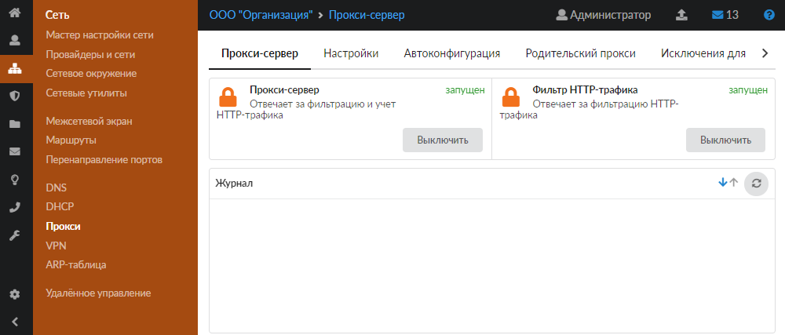

В модуле расположены следующие вкладки:

- Прокси-сервер
- Настройки
- Автоконфигурация
- Родительский прокси
- Исключения для авторизации
- Кеш
- Журнал

## Прокси-сервер

На данной вкладке отображаются:

- статус служб (запущен, остановлен, выключен, не настроен);
- кнопка **«Включить»** (**«Выключить»**) — позволяет запустить или остановить службу;
- журнал последних событий.

## Настройки

Данная вкладка предназначена для настройки службы прокси. Для получения справки по некоторым настройкам наведите курсор на значок 

- В поле **«Порт»** можно указать порт прокси-сервера (по умолчанию это 3128).
- Если требуется, установите флаг **«Автоматически создавать разрешающее правило»**. Тогда в правилах межсетевого экрана будет создано разрешающее правило для доступа на порт прокси из локальных и [DMZ](/index.php?article=24#dmz)-сетей.

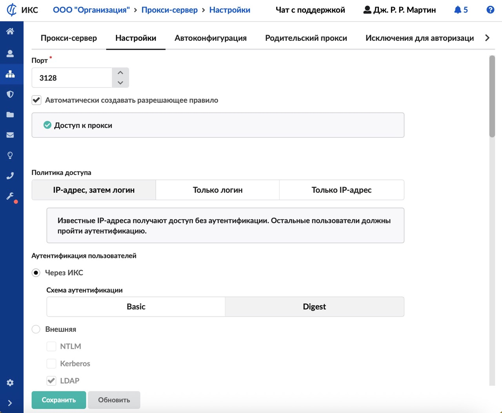
- Выберите **порядок авторизации**:

- по IP, затем по логину/паролю;
- только по логину/паролю;
- только по IP.
- В случае если выбран порядок «по IP, затем по логину/паролю» или «только по логину/паролю», выберите [**тип авторизации**](/index.php?article=137):

- Через ИКС. Выберите **схему  аутентификации**:

- Basic — позволяет авторизовать пользователей с явно указанным прокси-сервером по базе локальных пользователей, однако имя пользователя и пароль передаются по сети в открытом виде (не рекомендуется);
- Digest — выбран по умолчанию, при таком типе пароль не передается по сети в открытом виде, более защищенный метод;
- Внешняя:

- через домен ([NTLM](/index.php?article=24#ntlm)) — протокол аутентификации Microsoft, используемый для интеграции с доменами Windows. Пользователи должны быть [импортированы](/index.php?article=131) из AD, а также настроена идентификация в [сетевом окружении](/index.php?article=56);
- [Kerberos](/index.php?article=24#kerberos) — технология «сквозной» аутентификации (Single Sign-On). Пользователь, авторизованный в домене Windows/Linux, получает доступ к прокси без повторного ввода пароля. Считается наиболее безопасным методом. Пользователи должны быть [импортированы](/index.php?article=131) из LDAP-сервера.

> ⚠ Внимание! адрес прокси-сервера ИКС должен быть прописан в браузере как имя, под которым ИКС введен в домен (например, ics.company.ru).
- [LDAP](/index.php?article=24#ldap) — аутентификация через службу каталогов. Пользователи должны быть [импортированы](/index.php?article=131) из AD.

При авторизации через Kerberos или LDAP адрес прокси-сервера ИКС должен быть прописан в браузере как имя, под которым ИКС введен в домен (например, ics.company.ru). По IP данный тип авторизации работать не будет.

**Особенности типов «через домен» и «Kerberos»**

Авторизация выполняется прозрачно, без запроса логина и пароля. Также необходимо добавить перенаправление [DNS](/index.php?article=24#dns)-зоны домена на [IP-адрес](/index.php?article=24#ip-address) одного или нескольких [контроллеров домена](/index.php?article=24#domain_controller) либо ИКС должен использовать контроллер домена как единственный [DNS-сервер](/index.php?article=24#dns-server) (настройки провайдера). Недостаток данных типов: не поддерживаются прозрачным прокси, и во всех программах, обращающихся в сеть Интернет, необходимо прописывать адрес прокси-сервера либо дополнительно настраивать на каждом компьютере утилиту [авторизации Xauth](/index.php?article=51), которая позволит авторизовать пользователя через прозрачный прокси по IP-адресу.
- При необходимости установите флаг **«Скрывать IP-адрес пользователя»**, чтобы отключить указание внутреннего IP-адреса пользователя в отправляемом заголовке.
- 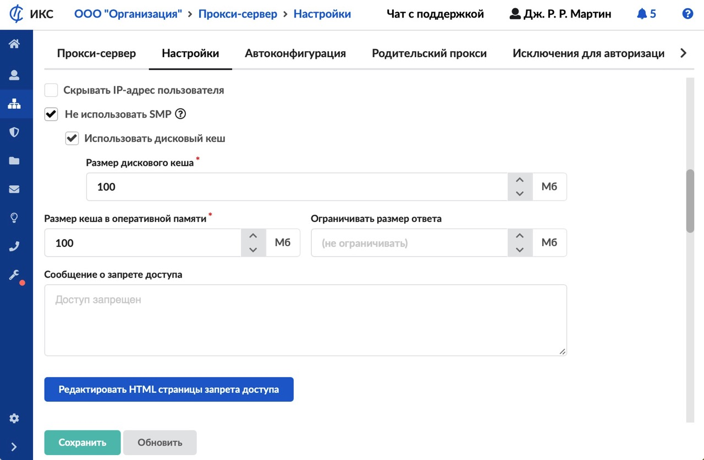
- Прокси-сервер выполняет кеширование веб-страниц и объектов, которые пользователи скачивают из сети Интернет. Таким образом экономится интернет-трафик и увеличивается скорость доступа к веб-страницам. Объекты кеша хранятся как в быстрой но более «дорогой» оперативной памяти, так и на медленном, но более доступном дисковом хранилище. Для ускорения обработки запросов прокси-сервер использует многопроцессорную архитектуру, при этом использовать дисковый кеш неэффективно, он отключается. Все объекты будут кешироваться только в оперативной памяти, отображение объектов во вкладке «Кеш» недоступно. При установке флага **«Не использовать SMP»** прокси-сервер будет работать на одном виртуальном процессоре. В этом режиме доступно использование дискового кеша. Необходимо разумно выбирать размеры кеша, от которых зависит эффективность его работы.

Укажите:

- **размер дискового кеша**не должен превышать размер доступного места на Основном системном разделе;
- **размер кеша в оперативной памяти** должен быть меньше свободной (неиспользованной системой, приложениями и системным кешем) оперативной памяти.

Содержимое кеша прокси-сервера можно посмотреть на вкладке «Кеш». Веб-интерфейс отображает не все содержимое кеша, а только некоторые элементы, такие как изображения.
- Укажите **ограничение размера** загружаемого файла (ответа), если это необходимо (в Мб).
- Введите **сообщение** о запрете доступа, которое будет показываться пользователю при блокировке трафика прокси-сервером.
- Чтобы изменить дополнительные поля страницы блокировки, нажмите **«Редактировать HTML страницы запрета доступа»** и измените необходимые поля HTML-страницы. Для вставки изображения на страницу используйте метод data:URI.
- Для включения режима прозрачного прокси установите флаг **«Использовать прозрачный прокси»**. Тогда средствами межсетевого экрана будет осуществляться перенаправление портов 80 и 443 (в случае, если указан сертификат для [HTTPS-фильтрации](/index.php?article=168)) на прокси-сервер ИКС. Преимуществом данного способа является отсутствие необходимости дополнительных настроек прокси клиентских приложений.

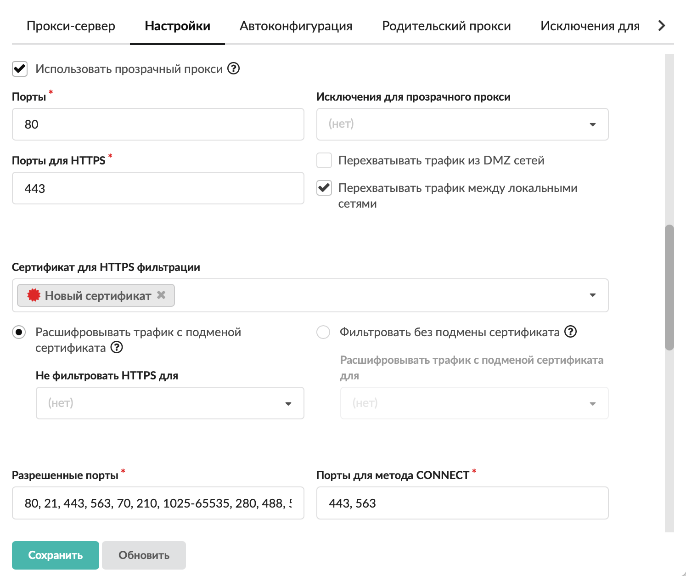

Укажите:

- **порты**, трафик на которые будет перенаправляться межсетевым экраном на прокси. По умолчанию это порт 80 (HTTP);
- **порты HTTPS**, трафик на которые будет перенаправляться межсетевым экраном на прокси. По умолчанию это порт 443;
- при необходимости установите флаги **«Перехватывать трафик из DMZ-сетей»** и **«Перехватывать трафик между локальными сетями»** (установлен по умолчанию). Снимите флаги, если требуется, чтобы трафик, который идет на порты 80 и 443 между локальными сетями, не перенаправлялся на прокси-сервер. Например, чтобы трафик на веб-ресурсы компании в локальной сети не фильтровался прокси;
- в поле **«Исключения для прозрачного прокси»** можно прописать IP-адреса или имена сайтов, пакеты до которых не будут обрабатываться прокси-сервером. Это требуется, так как некоторые ресурсы могут негативно реагировать на изменения в пакетах, которые проходят через прокси-сервер. Например, с прокси-серверами не работают клиент-банки и некоторые платформы для проведения вебинаров;
- поле **«Сертификат для HTTPS фильтрации»** позволяет задать сертификат для использования [HTTPS-фильтрации](/index.php?article=168). Адреса, для которых не нужно осуществлять подмену сертификата, могут быть добавлены в [исключения](/index.php?article=204). Это могут быть как доменные имена, так и IP-адреса.
- Укажите **разрешенные порты**. Это порты на внешних серверах, к которым можно подключаться через прокси-сервер. Список разрешенных портов для [SSL](/index.php?article=24#ssl) определяет, к каким портам разрешен доступ с использованием метода [CONNECT](/index.php?article=24#connect).

> ⚠ Важно! Длина полей **«Разрешенные порты»** и **«Порты для метода CONNECT»** имеет ограничение в 256 символов.
- Если требуется, установите флаг **«Использовать SOCKS5-сервер»**. В ИКС для авторизации протоколов, отличных от HTTP, можно использовать [SOCKS](/index.php?article=24#socks)5-сервер, который будет работать в составе прокси-сервера.

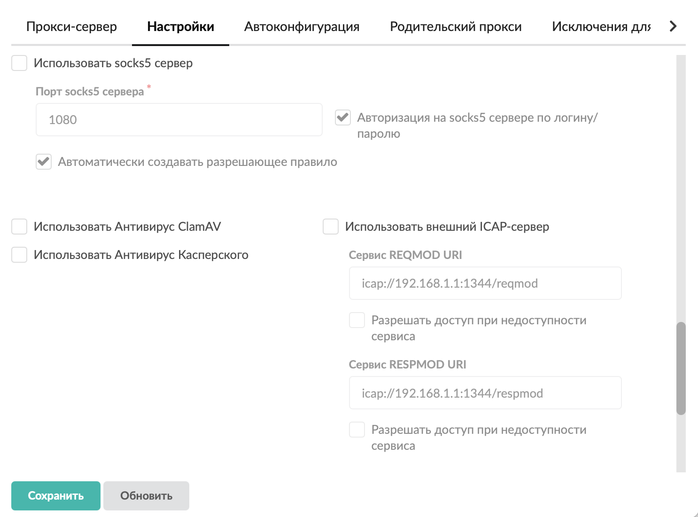

Укажите:

- **порт доступа**. По умолчанию установлен порт 1080;
- при необходимости установите флаг **«Авторизация на******SOCKS5-сервере по логину/паролю**»**. Если флаг не установлен, авторизация на сервере происходит по IP-адресу пользователя;
- чтобы разрешить доступ к порту SOCKS-сервера в межсетевом экране, установите флаг**«Автоматически создавать разрешающее правило»**.
- ИКС поддерживает сканирование трафика, который проходит через прокси-сервер, **антивирусом**. На данный момент поддерживается два антивирусных модуля: бесплатный [ClamAV](/index.php?article=66), а также платный [антивирус Касперского](/index.php?article=68). Для работы антивируса необходимо приобрести лицензию и установить ее в соответствующем модуле.

Для того чтобы включить антивирусное сканирование веб-трафика каким-либо антивирусным модулем, установите соответствующий флаг. Тогда в настройках данного антивирусного модуля автоматически установится флаг **«Использовать в прокси»**.
- Подключите к прокси-серверу ИКС сторонний [ICAP](/index.php?article=24#icap)-сервер, если это необходимо. Для этого установите флаг **«Использовать внешний ICAP-сервер»**. Укажите адреса сервисов REQMOD URI и RESPMOD URI. Для каждого сервиса также можно установить флаг **«Разрешать доступ при недоступности сервиса»**.
- Для подключения к работе прокси-сервера других модулей установите соответствующие флаги:

- **«Использовать контент-фильтр»** — подключает [модуль «Контент-фильтр»](/index.php?article=76);
- **«Использовать Garnet»** — подключает [модуль «Веб-фильтр Garnet»](/index.php?article=354).

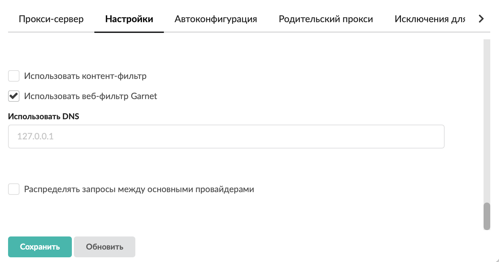
- В поле **«Использовать DNS»** можно указать адрес DNS-сервера. По умолчанию в качестве DNS прокси-сервер использует [localhost](/index.php?article=24#localhost).
- Если требуется **распределять запросы между основными провайдерами**, установите соответствующий флаг.
- Нажмите **«Сохранить»**.

## Автоконфигурация

Данная вкладка позволяет управлять автоконфигуратором. Он нужен для того, чтобы не прописывать вручную прокси-сервер на каждом клиентском устройстве. В браузере клиента должна быть выставлена опция **«Автоматическая конфигурация прокси»**, все остальные настройки определит ИКС.

- Установите флаг **«Создать скрипт автоконфигурации прокси»**.
- Отметьте флагами один или несколько **протоколов** (HTTP, HTTPS, FTP, WSS).

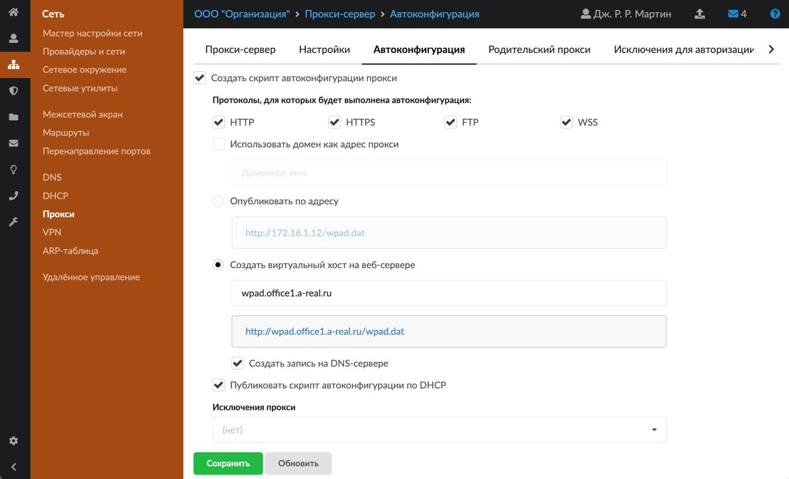
- Поставьте **переключатель**:

- использовать домен как адрес прокси — скрипт автонастройки будет создан и скачан с доменным именем;
- опубликовать по адресу — скрипт автонастройки будет доступен по IP-адресу сервера;
- создать виртуальный хост на веб-сервере — скрипт автонастройки будет доступен по созданному виртуальному хосту с доменным именем. При выборе виртуального хоста он автоматически создастся в системе. Если установлен флаг **«Создать запись на DNS-сервере»**, добавится зона с нужными записями для данного виртуального хоста.
- Если необходимо, установите флаг **«Публиковать скрипт автоконфигурации по DHCP»**. Тогда настройки прокси будут передаваться всем DHCP-клиентам сервера.
- На данной вкладке также можно установить **исключения прокси**.

Записи, указанные в исключенияx, добавляются в скрипт автоконфигурации с целью сообщить браузеру о том, что следует использовать прямое подключение (без прокси).

Можно добавить:

- Домен (например, example.org);
- Домен с точкой (например, .example.org) — сработает для всех поддоменов (например , [www.example.org](http://www.example.org/));
- Один IP-адрес — имя запрашивемого ресурса резолвится в IP, затем результат сравнивается с указанным адресом;
- Подсеть в нотации CIDR (например 10.10.1.0/24) — проверяется, попадает ли IP запрашиваемого ресурса в заданную сеть.

Также можно выбрать объект «Диапазон адресов», который может включать все вышеперечисленные записи.
- Нажмите **«Сохранить»**.

> ⚠ Внимание! Если в сети используется Captive Portal, для работы скрипта автоконфигурации необходимо создать [разрешающее правило межсетевого экрана](/index.php?article=206), которое позволит подключаться из локальной сети к ИКС по 80 порту.

## Родительский прокси

Если в организации несколько прокси-серверов, расположенных иерархично, то вышестоящий для ИКС прокси-сервер будет являться его родительским прокси.

Чтобы ИКС перенаправлял на родительский прокси запросы, которые приходят на его прокси-сервер, выполните следующие настройки:

- Установите флаг **«Использовать родительский прокси»**.
- Введите **IP-адрес** родительского прокси и **порт** назначения.

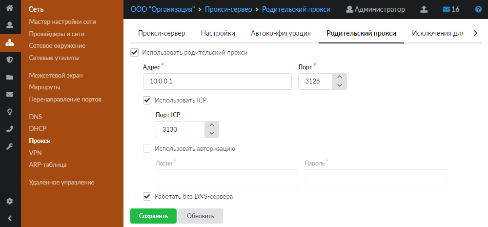
- Установите флаг **«Использовать ICP»** (если родительский прокси поддерживает работу протокола [ICP](/index.php?article=24#icp)) и укажите **порт** работы службы (по умолчанию 3130). Тогда прокси-серверы смогут обмениваться данными своих кешей по протоколу ICP. В случае работы сети через несколько прокси это может значительно ускорить передачу данных.
- Если родительский прокси работает с авторизацией, установите флаг **«Использовать авторизацию»**, укажите **логин** и **пароль** для подключения.
- При необходимости установите флаг **«Работать без DNS-сервера»**.
- Нажмите **«Сохранить»**.

## Исключения для авторизации

Данная вкладка служит для настройки прокси-сервера таким образом, чтобы он не требовал авторизации при обработке запросов с определенного хоста в сети и (или) при обращении на определенный хост.

На вкладке можно добавить информацию об исключениях для авторизации в прокси-сервере, а также просмотреть таблицу наборов исключений.

- Нажмите **«Добавить»**.

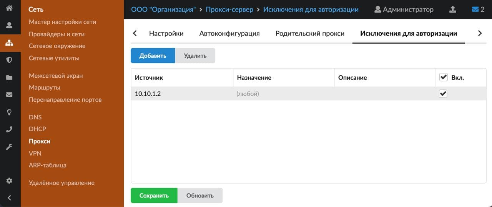
- Заполните следующие поля таблицы:

- **«Источник»** — позволяет задать в качестве источника трафика IP-адрес или сеть, для которых не будет производиться аутентификация в прокси-сервере. Тогда трафик, идущий с указанного IP-адреса или сети не будет учитываться в статистике за определенными пользователями, но будет учитываться в общей статистике.
- **«Назначение»** — правила для заполнения данного поля также распространяются на поля, содержащие URL, при создании [запрещающего](/index.php?article=150), [разрешающего](/index.php?article=153) правила или [исключения прокси](/index.php?article=160). В качестве назначения можно указывать: IP-адрес, IP/маску, имя домена (например, ya.ru), поддомены, кроме основного домена (например, .google.com — при обращении на drive.google.com авторизация не будет запрошена, но при обращении на google.com авторизация запрошена будет), регулярное выражение в формате /regex/gi (например, выражение /.*.ai.\.ru/gi разрешит домен mail.ru и его поддомены).
- **«Описание»** — позволяет задать произвольное описание для создаваемого правила.
- **«Вкл.»** — позволяет включить созданное правило. По умолчанию правило выключено.
- Нажмите **«Сохранить»**.

**Удалить** информацию об исключениях можно по одноименной кнопке.

## Кеш

На данной вкладке можно просмотреть некоторые элементы веб-страниц (в основном изображения), которые сохранились в кеше. Чтобы удалить содержимое кеша, нажмите кнопку **«Очистить кеш»**.

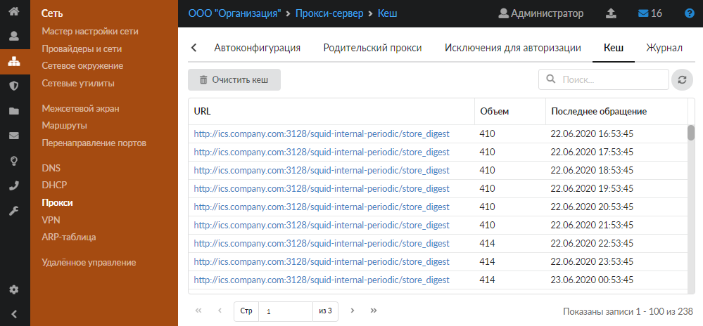

## Журнал

На данной вкладке отображается сводка всех системных сообщений от прокси-сервера с указанием даты и времени.

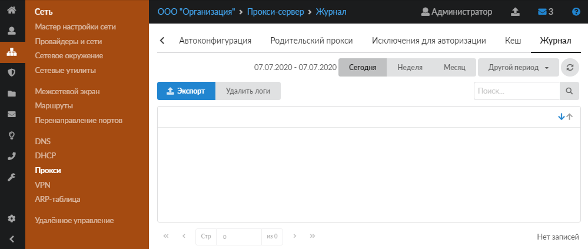

[Журнал](/index.php?article=196#summary) является стандартным элементом веб-интерфейса ИКС.
