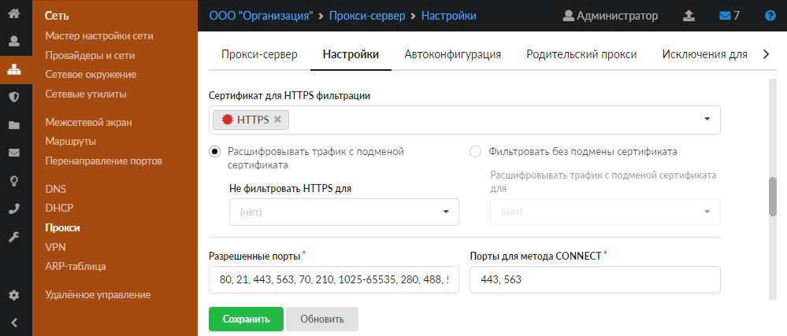
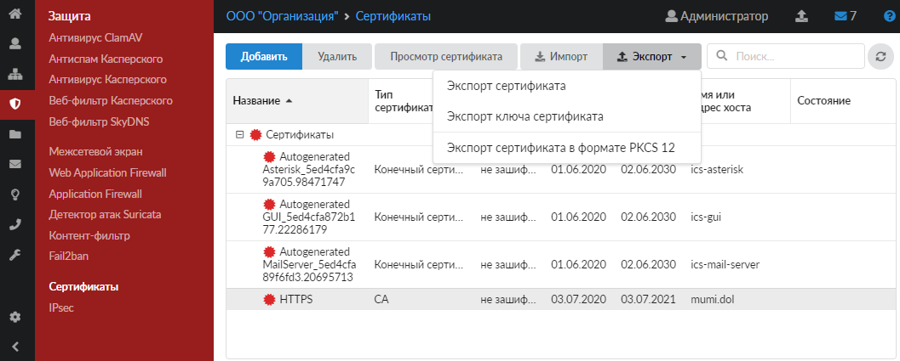
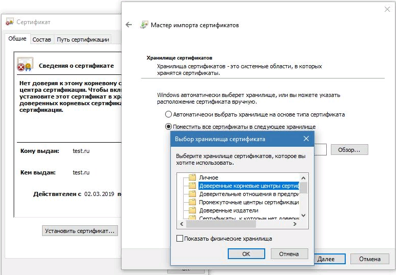
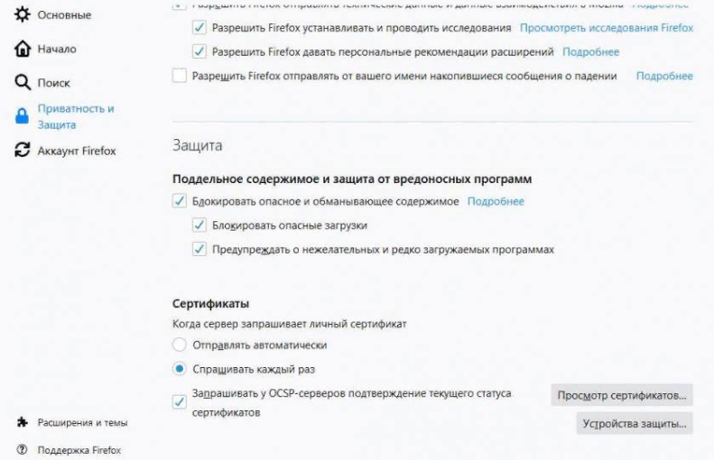
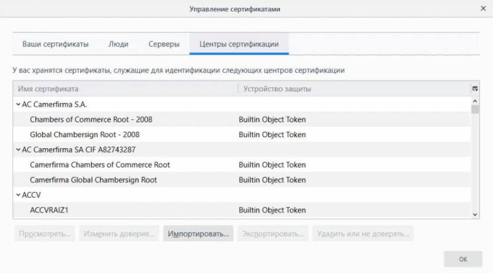
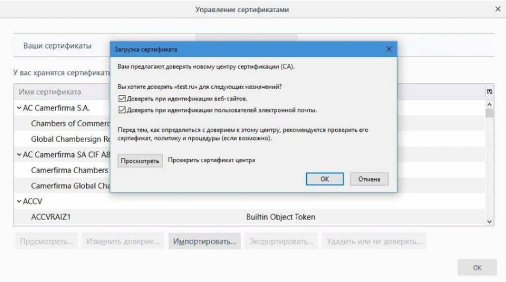
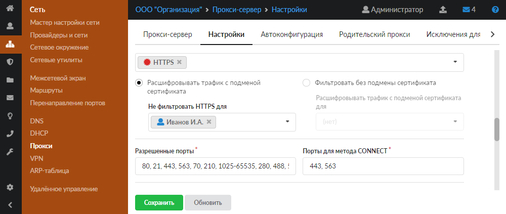
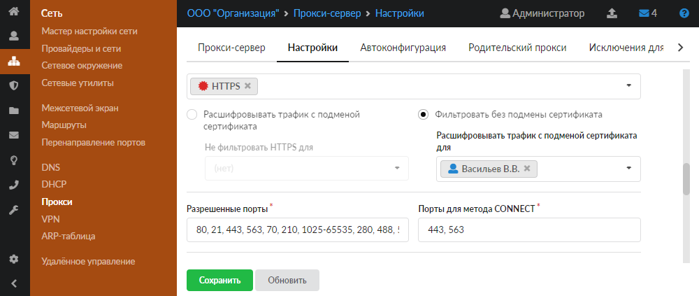

# Режимы работы HTTPS-фильтрации

В ИКС HTTPS-фильтрацию можно настроить в одном из двух режимов: расшифровывать трафик с подменой сертификата или фильтровать без подмены сертификата. В каждом из этих режимов можно добавлять исключения.

---

В каждом из этих режимов можно добавлять исключения:

- Если для большинства пользователей организации требуется фильтрация с подменой сертификата, выберите режим **«Расшифровывать трафик с подменой сертификата»** и добавьте исключения в поле **«Не фильтровать HTTPS для»** — введенные IP-адреса будут фильтроваться без подмены сертификата.

- Если для большинства пользователей организации требуется фильтрация без подмены сертификата, выберите режим **«Фильтровать без подмены сертификата»** и добавьте исключения в поле **«Расшифровывать трафик с подменой сертификата для»** — введенные IP-адреса будут фильтроваться с подменой сертификата.

## Расшифровывать трафик с подменой сертификата

В данном режиме весь проходящий трафик будет расшифровываться при помощи подмены сертификата. Подмена сертификата позволит прокси-серверу работать с полными URL-адресами страниц, к которым обращается пользователь, и полным содержимым этих страниц.

Этот режим следует выбрать, например, если вы планируете использовать контент-фильтр (фильтрацию по словам на странице). Тогда прокси-сервер ИКС сможет обрабатывать слова на страницах сайтов и сравнивать их с запрещенными.

> ⚠ **Внимание!** Без полной расшифровки трафика с подменой сертификата лента поисковиков не будет отображаться.

После этого правила фильтрации начнут работать, однако в связи с подменой сертификата при запросе браузер пользователя будет сообщать о некорректном сертификате. Это ожидаемое поведение браузера, так как для подмены сертификата используется самоподписной сертификат, созданный при настройке [HTTPS-фильтрации](https://doc.a-real.ru/index.php?article=168) (пункт 2). Чтобы исключить данное предупреждение, выполните следующие действия:

1. В модуле **«Сертификаты»** [экспортируйте](https://doc.a-real.ru/index.php?article=78) данный сертификат на устройство конечного пользователя. Экспорт ключа сертификата не требуется.

   

2. На каждом клиентском компьютере добавьте **сертификат** в доверенные корневые центры сертификации. Рассмотрим, как это сделать, на примере Windows:

   1) дважды нажмите левой кнопкой мыши на сертификат;

   2) нажмите кнопку **«Установить сертификат...»** — откроется мастер импорта сертификата;

   3) в качестве места хранения сертификата выберите **«Поместить все сертификаты в следующее хранилище»**, нажмите кнопку **«Обзор...»** и выберите **«Доверенные корневые центры сертификации»**. Сертификат будет импортирован в глобальное хранилище системы и будет работать для тех браузеров, которые используют системные хранилища сертификатов (например, Internet Explorer, Chrome, Yandex).

   

   Если браузер использует собственное хранилище (например, Firefox), то импорт сертификата необходимо произвести непосредственно в настройках данного браузера. Рассмотрим, как это сделать, на примере Mozilla Firefox:

   1) откройте настройки браузера и перейдите в **Дополнительные > Сертификаты > Просмотр сертификатов > Центры сертификации > Импортировать**;

   

   2) нажмите **«Импортировать...»** и выберите сертификат, скачанный с ИКС;

   

   3) установите флаги **«Доверять при идентификации веб-сайтов»** и **«Доверять при идентификации пользователей электронной почты»**;

   4) нажмите **«Ок»**.

   

3. Заполните поле **«Не фильтровать HTTPS для»**, если требуется исключить определенных пользователей или отдельные домены. Соединения пользователей (доменов), указанных в этом поле, не будут расшифровываться и, соответственно, импортировать сертификат для них нет необходимости. Добавление доменов в исключения может потребоваться для корректной работы безопасных сервисов с проверкой [MITM-атак](https://doc.a-real.ru/index.php?article=24#mitm), таких как почтовые или банковские сервисы.

   

## Фильтровать без подмены сертификата

В данном режиме установка сертификата в систему конечного пользователя не требуется. Однако ИКС будет знать только о домене, к которому обращается пользователь. Информация о конкретной странице, к которой обращается пользователь, и о содержимом данной страницы не будет доступна прокси-серверу ИКС.

Этот режим фильтрации подходит, если достаточно фильтрации по домену: например, если нужно заблокировать весь домен `yandex.ru`. Если же требуется заблокировать домен `yandex.ru`, но при этом разрешить адрес `yandex.ru/video`, то необходимо настроить [полную подмену сертификата](#mode1) для расшифровки URL-назначения.

Также в данном режиме работы можно настроить отдельные домены либо отдельных пользователей на полную расшифровку в поле **«Расшифровать трафик с подменой сертификата для»**. В этом случае импортировать сертификат нужно либо для тех пользователей, которые указаны в поле, либо для всех пользователей, которые будут обращаться к прописанному доменному имени (например, `vk.com`).

> ⚠ **Внимание!** Данный режим не подходит для настройки контентной фильтрации, так как она осуществляется по словам на странице, а в этом режиме ИКС не обрабатывает содержимое страниц и, соответственно, не сможет произвести блокировку.

<iframe allowfullscreen="" frameborder="0" height="480" src="https://vk.com/video_ext.php?oid=-18503994&amp;id=456239326&amp;hd=2" width="853"></iframe>

---

**Источник:** [Документация ИКС — Режимы работы HTTPS-фильтрации](https://doc.a-real.ru/index.php?article=204)
