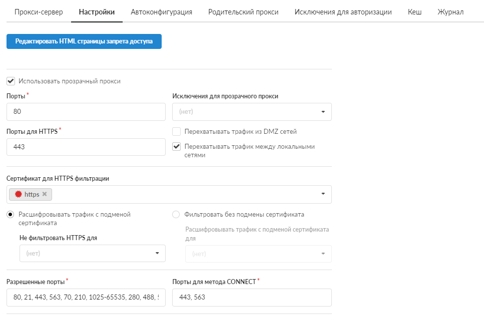
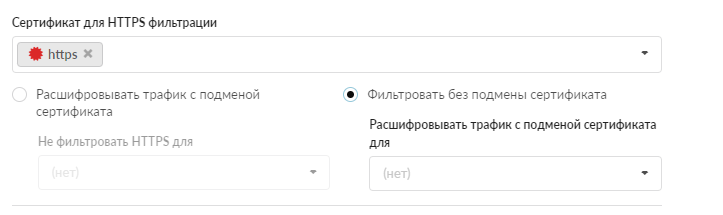
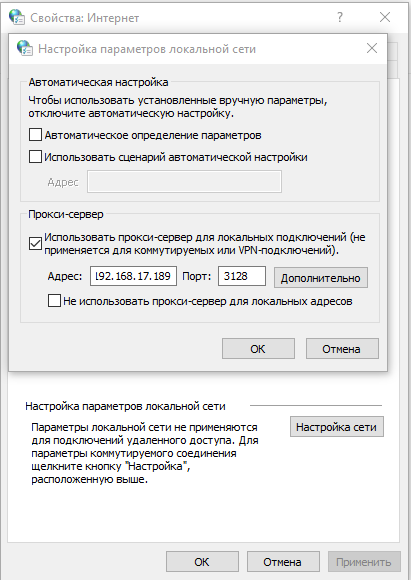
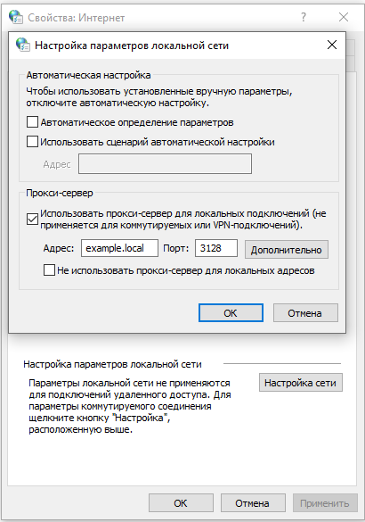
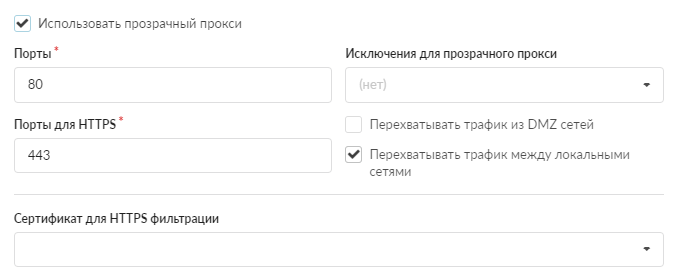

# Режимы работы прокси-сервера

Прокси-сервер ИКС может работать как прозрачный либо как явный прокси. Каждый режим имеет свои особенности настройки и применения.

---

Прокси-сервер может работать как [прозрачный](#transparent) либо как [явный](#explicit) прокси.

## Прозрачный прокси

При использовании прозрачного прокси ИКС не прописывается прокси-сервером явно и весь трафик идет на шлюз. В настройках сети IPv4 прописывается шлюзом адрес ИКС. Далее настройки производятся на ИКС в меню **Сеть > Прокси > Настройки**.

Когда трафик приходит на шлюз ИКС с портами назначения 80 и 443, межсетевой экран делает перенаправление на прокси (squid). Если прописать домен, IP-адрес или сеть в поле **«Исключения для прозрачного прокси»**, то трафик с указанных ресурсов, идущий как от, так и на них, не будет перенаправляться на прокси (squid), а пойдет сразу на провайдера.

Если не указать [сертификаты](/index.php?article=78) в поле **«Сертификат для HTTPS фильтрации»**, то в статистике будут видны только HTTP-запросы.

Если указать [сертификаты](/index.php?article=78) в поле **«Сертификат для HTTPS фильтрации»** и в настройках установить переключатель **«Фильтровать без подмены сертификата»**, то будут видны запросы HTTP и HTTPS и будет возможность блокировать ресурсы только по домену.

Если выбрана опция **«Расшифровывать трафик с подменой сертификата»**, весь трафик HTTP и HTTPS будет полностью расшифровываться. Таким образом прокси-сервер сможет работать с URL-адресами страниц и ему будет доступно их содержимое. Эта настройка требуется, например, для контентной фильтрации, работы категорий трафика и антивируса.

В поле **«Не фильтровать HTTPS для»** можно добавить сайты (домены), пользователей, IP-адреса или сети, которые будут иметь связь с интернетом через прокси-сервер, но их HTTPS-трафик не будет расшифровываться, так как не будет подменяться сертификат. В это поле чаще всего требуется добавлять адреса таких сервисов, как teams, edu, zoom, microsoft, whatsapp, а также некоторых интернет-банков.

> Если пользователь добавлен в исключение **«Не фильтровать HTTPS для»**, то установка сертификата для расшифровки трафика на ПК пользователя не требуется.

Прозрачный прокси реализован при помощи межсетевого экрана. Он перехватывает трафик, который идет на ИКС на порты 80 и 443, и перенаправляет трафик на порт прокси squid (по умолчанию 3128).

Прозрачный прокси не требует никаких дополнительных настроек на клиентском компьютере. Является сервером, который перехватывает исходящую информацию до того, как она пропадает в интернет.

## Явный прокси

Данный вариант настройки прокси-сервера менее гибкий и в большей степени зависит от настроек конечного устройства, чем при использовании прозрачного прокси.

Подойдет для пользователей, которые пользуются доменной авторизацией на ИКС, так как для нее необходимо использовать явный прокси или [утилиту Xauth](/index.php?article=187).

В свойствах браузера необходимо прописать адрес ИКС и порт прокси, который указан в меню **Сеть > Прокси > Настройки**.

Если используется [тип авторизации](/index.php?article=190) Kerberos/LDAP, необходимо прописать доменное имя ИКС, которое будет резолвиться (отвечать) в его IP-адрес.

- В случае использования явного прокси эти поля применяться не будут.
- Для хостов, у которых прописан явный прокси, исключения для прозрачного прокси работать не будут.

---

**Источник:** [Документация ИКС — Режимы работы прокси-сервера](https://doc.a-real.ru/index.php?article=408)
