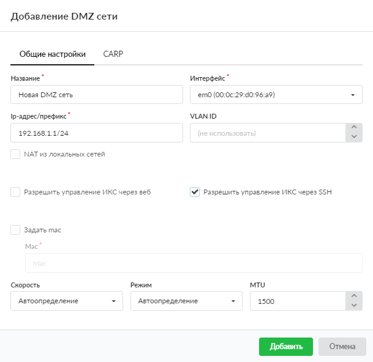
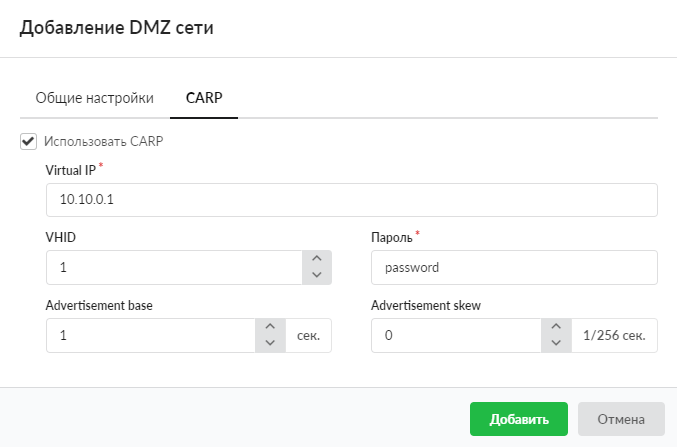

# DMZ-сеть

Добавить DMZ-сеть можно в меню **Сеть &gt; Провайдеры и сети**. Для этого выполните следующие действия:

1. Нажмите кнопку **«Добавить»** и выберите **«Сети &gt; DMZ-сеть»**.

   

2. На вкладке **«Общие настройки»** введите **название** сети.

3. Выберите сетевой **интерфейс** для DMZ. Из соображений безопасности для DMZ обычно используют отдельный сетевой интерфейс.

4. Укажите **диапазон адресов** в виде IP-адрес/префикс либо адрес:маска.

   

   &gt; ⚠ По умолчанию серверы, находящиеся в DMZ, не имеют доступа в Интернет и локальную сеть, поэтому доступ для них необходимо настраивать правилами межсетевого экрана.

5. Чтобы создать VLAN-сеть, укажите значение параметра **VLAN ID** (по умолчанию он не используется).

6. Если требуется, установите флаг **«NAT из локальных сетей»**. Он позволяет управлять трансляцией локальных адресов в DMZ-сеть. По умолчанию флаг снят, т. е. сервис NAT для интерфейса DMZ-сети не работает, адреса транслируются без изменений.

   &gt; ⚠ Внимание! NAT для DMZ-сети на внешних интерфейсах ИКС отключен, поэтому для ее адресации должны использоваться белые IP-адреса. Настраивать DMZ-сеть есть смысл, если требуется управлять доступом извне к серверам в локальной сети, имеющим белые IP-адреса. Во всех остальных случаях следует настроить обычную локальную сеть.

7. Если требуется, установите флаги:
   - «Разрешить управление ИКС через веб»;
   - «Разрешить управление ИКС через SSH».

8. На вкладке можно задать MAC-адрес интерфейса, а также **скорость**, **режим работы** и **MTU**.

9. При необходимости настройте CARP на одноименной вкладке.

   

10. Нажмите **«Добавить»** — новая сеть появится в списке.

---

**Источник:** [Документация ИКС — DMZ-сеть](https://doc.a-real.ru/index.php?article=203)
