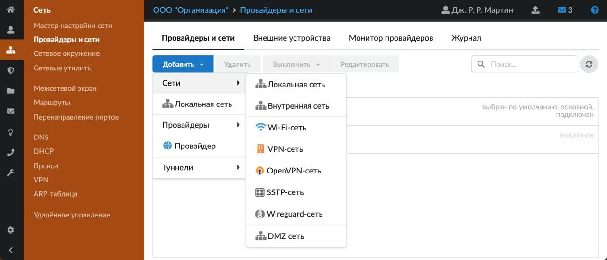
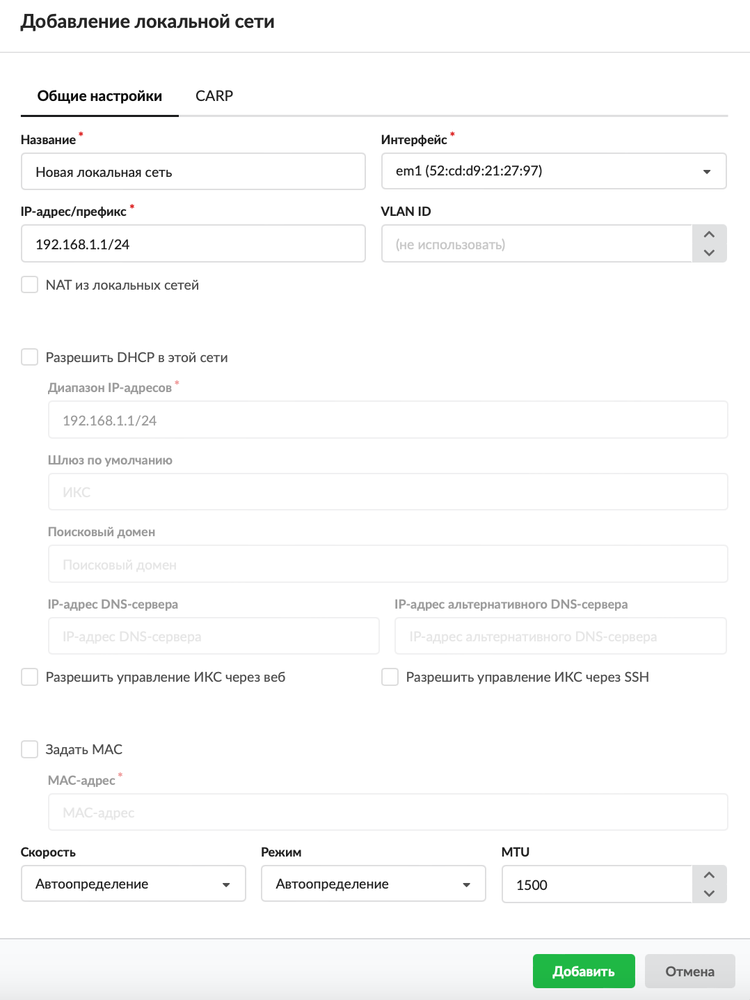
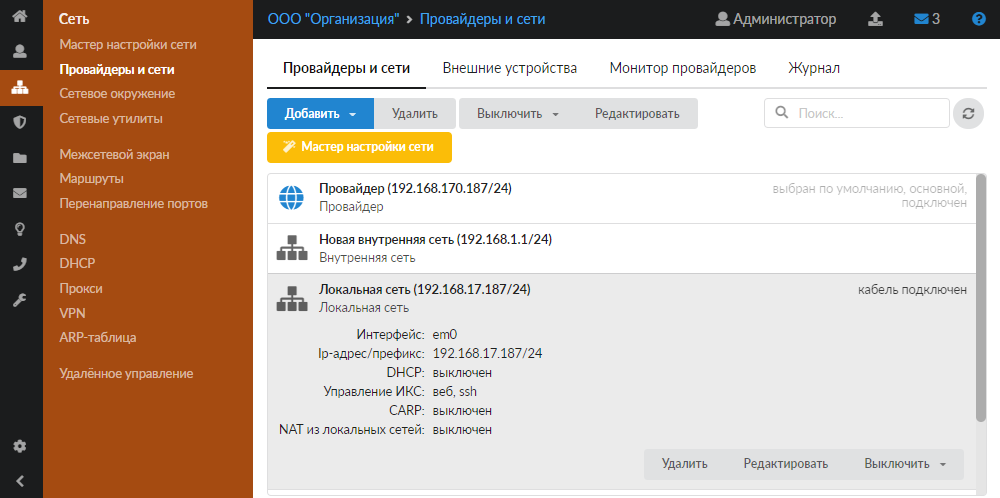

# Локальная сеть

Добавить локальную сеть можно в меню **Сеть &gt; Провайдеры и сети**.

---

Добавить [локальную сеть](https://doc.a-real.ru/index.php?article=24#local) можно в меню **Сеть &gt; Провайдеры и сети**. Для этого выполните следующие действия:

1. Нажмите кнопку **«Добавить»** и выберите **«Сети &gt; Локальная сеть»**.

2. На вкладке **«Общие настройки»** введите **название** сети.

3. Выберите физический **интерфейс**, на который будет назначен [IP-адрес](https://doc.a-real.ru/index.php?article=24#ip-address).

4. Укажите **диапазон адресов** в виде IP-адрес/префикс либо адрес:маска. Адреса из данного диапазона будут выдаваться пользователям локальной сети.

5. Чтобы создать [VLAN](https://doc.a-real.ru/index.php?article=24#vlan)-сеть, укажите значение параметра **VLAN ID** (по умолчанию он не используется). Для создания VLAN-сети необходимо выбрать физический интерфейс.

6. Если требуется, установите флаг **«[NAT](https://doc.a-real.ru/index.php?article=24#nat) из локальных сетей»**. NAT обеспечивает трансляцию адресов из локальной адресации в глобальную и наоборот. При установке флага NAT каждый пакет, проходящий через ИКС, будет менять IP-адрес в заголовке с адресации одной сети на адресацию другой. По умолчанию флаг снят, то есть сервис NAT для интерфейса не включен.

7. При установке флага **«Разрешить DHCP в этой сети»** данный интерфейс назначается раздающим адреса локальным компьютерам из задаваемого диапазона, по протоколу [DHCP](https://doc.a-real.ru/index.php?article=61). Укажите диапазон адресом сети с маской либо интервалом IP-адресов (например, 192.168.1.10-192.168.1.250).

8. При необходимости укажите IP-адрес **шлюза по умолчанию**.

9. Если требуется, укажите **поисковый домен**. Это DNS-зона, которая будет автоматически подставляться к запросам на имена первого уровня.

10. При необходимости введите **IP-адрес DNS-сервера** и (или) **IP-адрес альтернативного DNS-сервера**. Они будут выданы подключенным к данной сети хостам по [DHCP](https://doc.a-real.ru/index.php?article=24#dhcp).

11. При необходимости установите **флаги**:

    - «Разрешить управление ИКС через веб» — позволяет подключаться к веб-интерфейсу ИКС из данной сети;
    - «Разрешить управление ИКС через [SSH](https://doc.a-real.ru/index.php?article=24#ssh)» — позволяет подключаться по SSH из данной сети.

12. На вкладке можно задать [**MAC-адрес**](https://doc.a-real.ru/index.php?article=24#mac-address) интерфейса, а также **скорость**, **режим работы** и [**MTU**](https://doc.a-real.ru/index.php?article=24#mtu).

13. При необходимости настройте [CARP](https://doc.a-real.ru/index.php?article=384) на одноименной вкладке.

14. Нажмите **«Добавить»** — новая сеть появится в списке.

---

**Источник:** [Документация ИКС — Локальная сеть](https://doc.a-real.ru/index.php?article=200)
