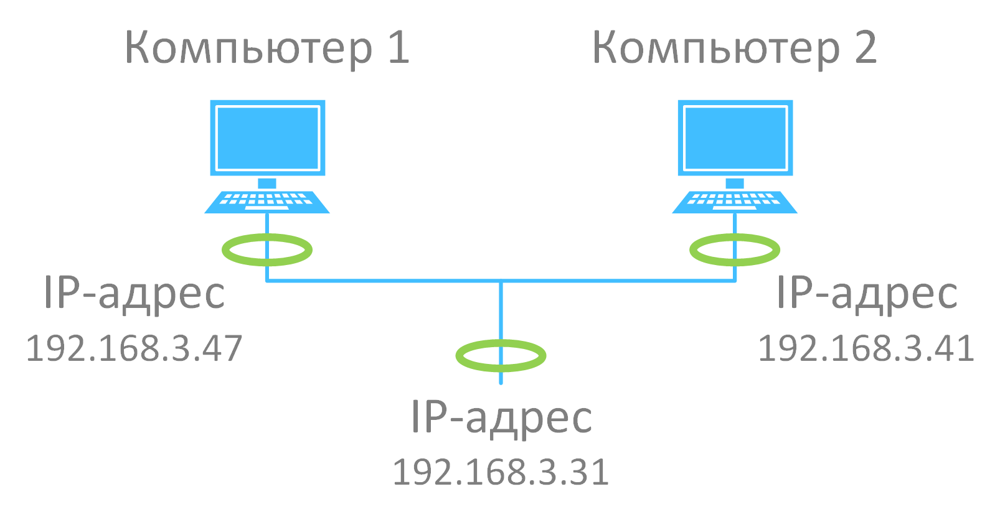
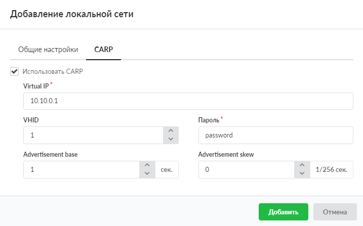

При создании локальной сети, Wi-Fi-сети либо DMZ-сети можно активировать и настроить CARP. Это сетевой протокол, предназначенный для организации работы отказоустойчивых маршрутизаторов и межсетевых экранов при помощи назначения группе хостов общего IP-адреса.

CARP позволяет сделать так, чтобы у нескольких хостов в одной локальной сети был общий IP-адрес. Эта группа хостов называется группой избыточности (redundancy group). Группе назначается один IP-адрес, который используется совместно (но не одновременно!) всеми членами этой группы. Внутри группы есть один основной хост (master) и остальные — запасные (backups). IP-адрес в один момент времени есть только у основного хоста (master host), он отвечает на все ARP-запросы по этому адресу. В случае отказа сервера, выполняющего роль мастера, среди резервных серверов будет выбран новый мастер, который примет виртуальный IP-адрес и продолжит обслуживание клиентов.

Для активации и настройки CARP в окне добавления сети перейдите на одноименную вкладку и выполните следующие действия.

1. Установите флаг **«Использовать CARP»**.

2. В поле **«Virtual IP»** введите IP-адрес виртуальной группы. Адрес должен быть уникальным и входить в ту же сеть, которая задана в настройках локальной сети.

3. Укажите VHID (любое значение от 1 до 254). В пределах одного сервера на разных интерфейсах должны использоваться разные VHID, чтобы избежать конфликта виртуальных MAC-адресов.

> Виртуальный MAC-адрес создается автоматически следующим образом: `00:00:5e:00:XX`, где XX — VHID, записанный в шестнадцатеричной системе счисления (например, VHID=1, MAC — 00:00:5e:00:01, VHID=254, MAC — 00:00:5e:00:FE).

4. Введите **пароль**. Он используется для аутентификации сервера в виртуальной группе. На всех серверах в одной группе должен быть указан одинаковый пароль.

5. **«Advertisement base»** и **«Advertisement skew»** — параметры, которые используются для определения, как часто сервер рассылает CARP-сообщения. Advertisement base измеряется в секундах и указывает основной интервал между анонсами CARP-сообщений. Advertisement skew измеряется в 1/256 секунды, это значение прибавляется к основному интервалу анонсов и используется, чтобы сделать рассылку CARP-сообщений чуть медленнее, чем на других серверах.

С помощью данных параметров можно указать, какой сервер будет мастером в виртуальной группе.

> Пример.
>
> Есть два сервера: A (VHID 1) и B (VHID 1). Чтобы сервер A по умолчанию был мастером, необходимо выполнить следующие настройки:
>
> - сервер A: Advertisement base = 1, Advertisement skew = 100
> - сервер B: Advertisement base = 1, Advertisement skew = 200
>
> Сервер A будет быстрее рассылать CARP-сообщения, поэтому первым станет мастером.
