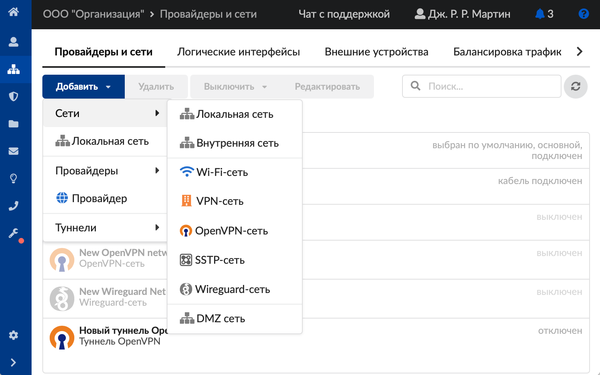
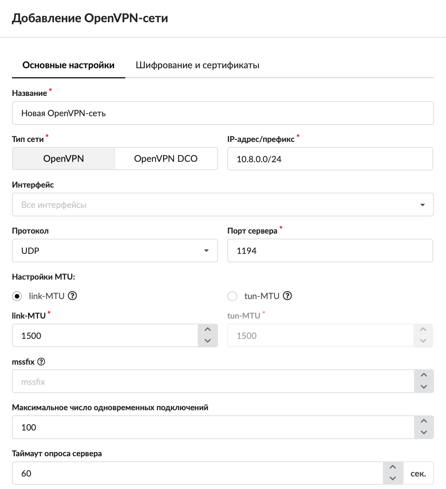
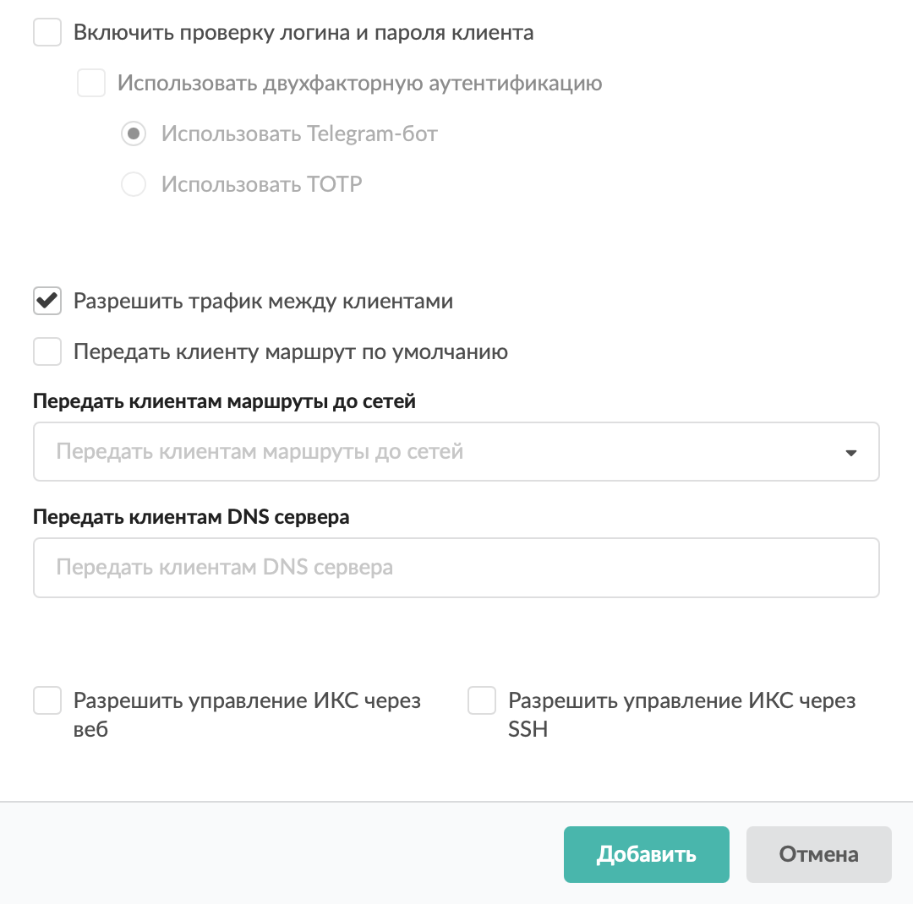
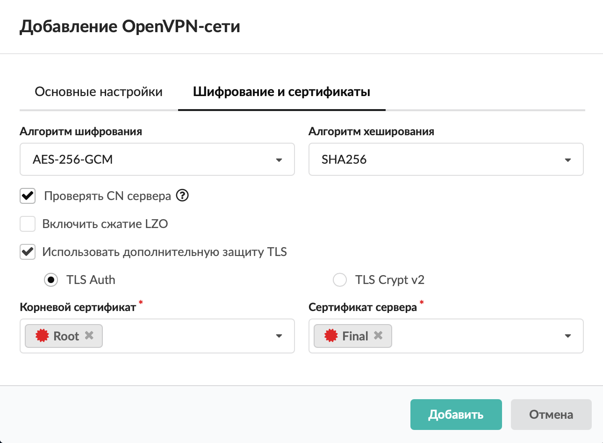
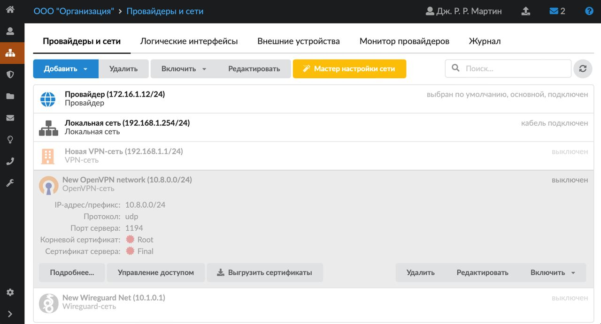
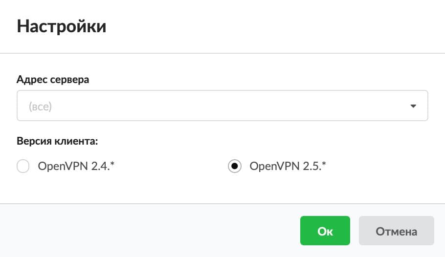
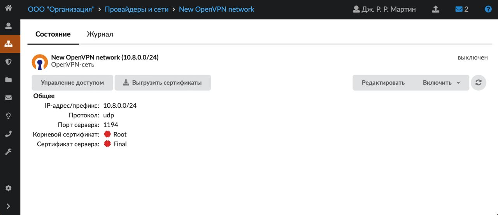
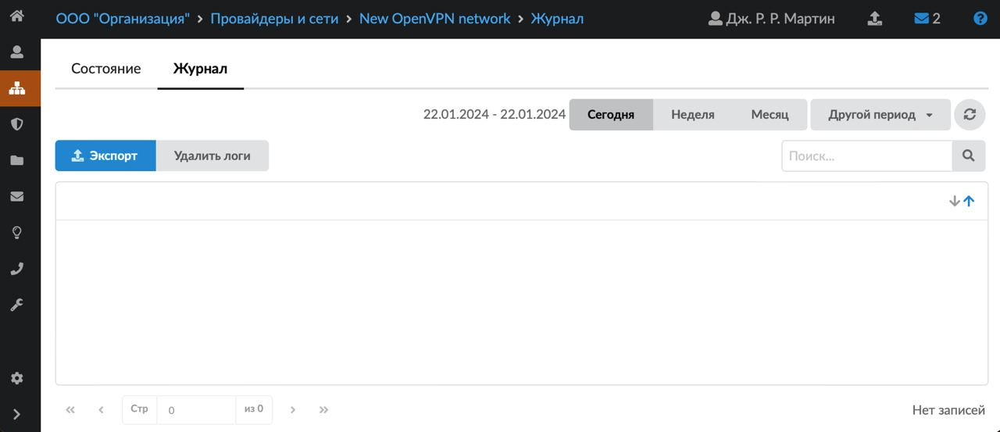

OpenVPN-сеть создаётся для множественных клиентских подключений к ИКС. Добавить её можно в меню **Сеть > Провайдеры и сети**. Для этого выполните следующие действия:

1. Создайте [сертификаты](index.php?article=78#add) для OpenVPN.

   1.1. Добавьте сертификат CA. Нажмите кнопку **«Добавить»**. В открывшемся окне укажите название (например, OpenVPN_CA), срок действия больше года, нажмите **«Добавить»**.

   1.2. Создайте конечный сертификат. Для этого **выделите только что созданный сертификат**, нажмите на кнопку **«Добавить»**. В открывшемся окне укажите название (например, OpenVPN_Serv), на вкладке «Настройки» выберите вариант «Конечный сертификат», на вкладке «Использование ключа» в поле «Шаблон» выберите «VPN-сервер». Нажмите кнопку **«Добавить»**.

2. Нажмите кнопку **«Добавить»** и выберите **«Сети > OpenVPN-сеть»**.

   

3. На вкладке **«Основные настройки»** введите **название** сети.

4. Выберите **тип сети**: OpenVPN либо OpenVPN DCO.

   > ⚠ При использовании типа сети OpenVPN DCO обеспечивается значительно более высокая производительность за счёт переноса операций шифрования данных из пространства пользователя в пространство ядра.
   >
   > Однако есть ряд ограничений по сравнению со стандартным режимом: протокол только UDP, количество доступных видов шифрования значительно сокращено, недоступно использование сжатия LZO, а также использование mssfix.

5. Укажите **диапазон адресов** в виде IP-адрес/префикс либо адрес:маска. Адреса из данного диапазона будут выдаваться пользователям, которые подключаются через OpenVPN.

   

6. Выберите **интерфейс**. Можно выбрать из существующих объектов ИКС или прописать необходимый IP-адрес. Если поле заполнено, подключение по OpenVPN будет осуществляться через указанный интерфейс. Например, можно прописать 127.0.0.1 и создать для нескольких провайдеров правила проброса порта OpenVPN на 127.0.0.1. В таком случае по OpenVPN можно будет подключиться через любой провайдер.

7. При необходимости измените **протокол**. По умолчанию установлен протокол UDP.

8. Укажите **порт сервера**.

9. Установите переключатель:

   - **link-[MTU](index.php?article=24#mtu)** (в байтах). Это объем передаваемых данных, при превышении которого информация будет разбиваться на небольшие блоки перед отправкой по сети. По умолчанию установлено значение 1500 байт;
   - **tun-MTU** (в байтах). Это максимальный объем данных, который может быть передан протоколом за одну итерацию. По умолчанию установлено значение 1500 байт.

10. Если требуется, укажите значение **mssfix**. Данный параметр нужен для того, чтобы сеансы TCP, работающие через туннель, ограничили размеры отправляемых пакетов таким образом, чтобы после их инкапсуляции OpenVPN размер результирующего пакета UDP, который OpenVPN отправляет своему партнеру, не превышал максимальное количество байт. Имеет смысл использовать при работе OpenVPN по протоколу UDP.

11. Установите **максимальное число одновременных подключений**. По умолчанию установлено значение «100».

12. Укажите значение **таймаута опроса сервера**. Эта опция прописывается в конфигурационный файл пользователя и позволяет быстрее перебирать адреса серверов для подключения. По умолчанию установлено 60 секунд.

13. При необходимости можно **включить проверку логина и пароля клиента**, установив соответствующий флаг.

14. Если проверка логина и пароля клиента включена, то можно также включить **использование [двухфакторной аутентификации](index.php?article=63#two-factor)** через Telegram-бот или с использованием ТОТР-кода.

    

15. Если требуется, установите **флаги**:

    - «Разрешить трафик между клиентами» — предоставляет возможность взаимодействия (прохождения трафика) между OpenVPN-клиентами. Например, Клиент 1, подключенный к OpenVPN-сети, будет иметь доступ к хосту Клиента 2, подключенного к этой же OpenVPN-сети;
    - «Передать клиенту маршрут по умолчанию» — направляет весь трафик с устройства клиента через OpenVPN-сеть ИКС.

16. На вкладке можно выбрать **сети**, маршруты до которых будут передаваться клиентам, а также указать **DNS-серверы**, которые будут передаваться клиентам.

17. При необходимости установите **флаги**:

    - «Разрешить управление ИКС через веб» — позволяет подключаться к веб-интерфейсу ИКС из данной сети;
    - «Разрешить управление ИКС через [SSH](index.php?article=24#ssh)» — позволяет подключаться по SSH из данной сети.

18. На вкладке **«Шифрование и сертификаты»** выберите **алгоритм шифрования** и **алгоритм хеширования**.

19. При необходимости установите **флаги**:

    - «Проверять CN сервера» — при установке флага CN (common name) сервера добавляется в конфигурационные файлы пользователей при их экспорте, и в дальнейшем при подключении таких пользователей проверяется соответствие CN из конфигурационного файла и CN сервера, к которому они подключается, что увеличивает уровень безопасности;
    - «Включить сжатие [LZO](index.php?article=24#lzo)»;
    - «Использовать дополнительную защиту [TLS](index.php?article=24#tls)» (TLS Auth либо TLS Crypt v2).

    

20. Укажите **корневой сертификат** и **сертификат сервера**.

    При создании корневого сертификата и конечного сертификата сервера необходимо указать следующие параметры:

    - Алгоритм: SHA 256
    - Тип шифрования: RSA

21. Нажмите **«Добавить»** — новая сеть появится в списке.

22. Для более детальных настроек OpenVPN-сети откройте специальный [модуль](index.php?article=63) в меню **Сеть > VPN** либо нажмите кнопку **«Настройки авторизации»**.

    

    Чтобы скачать сертификаты на компьютер, нажмите **«Выгрузить сертификаты»**, укажите адреса серверов и выберите, для какой версии OpenVPN-клиента выгрузить сертификаты (2.4\* либо 2.5\*).

    

    > ⚠ Внимание! Чтобы увеличить скорость при использовании версии 2.5.\* и установленном драйвере wintun, рекомендуется вручную добавить в конфигурационный файл клиента опцию `windows-driver wintun`.
    >
    > Если вы подключаетесь по OpenVPN не к провайдеру по умолчанию, подключение будет возможно только при выборе Протокола TCP.

23. В модуле **«VPN»** укажите, какие пользователи могут подключаться к ИКС по OpenVPN.

## Индивидуальный модуль OpenVPN-сети

Для перехода в индивидуальный модуль OpenVPN-сети нажмите на нее, а затем — на кнопку **«Подробнее...»**.

В данном модуле можно посмотреть состояние сети и журнал.

**Состояние**

На данной вкладке отображается состояние OpenVPN-сети и основная информация о ней. Также здесь можно перейти к **настройкам авторизации** или **выгрузить сертификаты**. Сертификаты можно выгрузить только после указания пользователей, которые могут подключаться к ИКС по OpenVPN. Скачается архив, который содержит конфигурационные файлы и сертификаты для каждого разрешенного пользователя ИКС.

**Журнал**

На данной вкладке отображается сводка всех системных сообщений модуля с указанием даты и времени.

[Журнал](index.php?article=196#summary) является стандартным элементом веб-интерфейса ИКС.

<iframe allowfullscreen="" frameborder="0" height="480" src="https://vk.com/video_ext.php?oid=-18503994&amp;id=456239333&amp;hd=2" width="853"></iframe>
